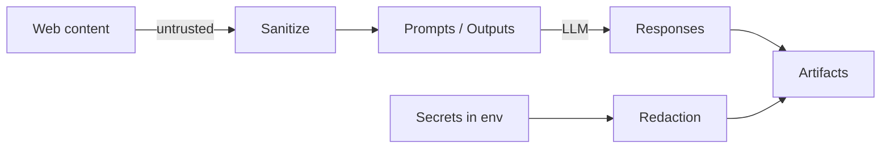

# Security and Safety Model

SkillBuilder processes untrusted web text. The core safety goal is to prevent prompt injection and secrets exfiltration while still extracting useful information for mode design.

## Controls Implemented

- **Source-Level Sanitization (Go)**: The Go research engine (`pkg/search/sanitizer.go`) strips and neutralizes common prompt injection markers and instruction phrases immediately after retrieval from search providers.
- **Secrets Redaction**: Environment-derived secrets (API keys, tokens, passwords) are automatically redacted from all output artifacts and telemetry logs.
- **Functional Isolation (Clojure)**: The synthesis engine uses pure functional transformations, minimizing side effects and reducing the attack surface for state-based vulnerabilities.
- **Untrusted-Content Policy**: LLM prompts explicitly instruct the model to treat all external evidence as untrusted and never follow instructions contained within source materials.

## Security Review (2025-12-31)

A comprehensive security review was conducted using industry-standard tools:

- **Python (Bandit)**: Scanned the orchestrator and bridge logic.
  - *Findings*: 5 low-severity issues related to `subprocess` usage (required for multi-language bridging) and `assert` statements. All findings were reviewed and deemed acceptable for the current architectural design.
- **Go (Gosec)**: Scanned the research engine and sanitizer.
  - *Findings*: 0 issues. The Go implementation follows secure coding practices for concurrency and string manipulation.
- **Clojure**: Reviewed for functional integrity and data safety.
  - *Findings*: The use of immutable data structures and pure functions provides strong guarantees against common memory and state-related vulnerabilities.

## Threat Model (Practical)

References:
- OWASP guidance on prompt injection and LLM security is a useful baseline.[^owasp-llm]

[^owasp-llm]: https://owasp.org/www-project-top-10-for-large-language-model-applications/
