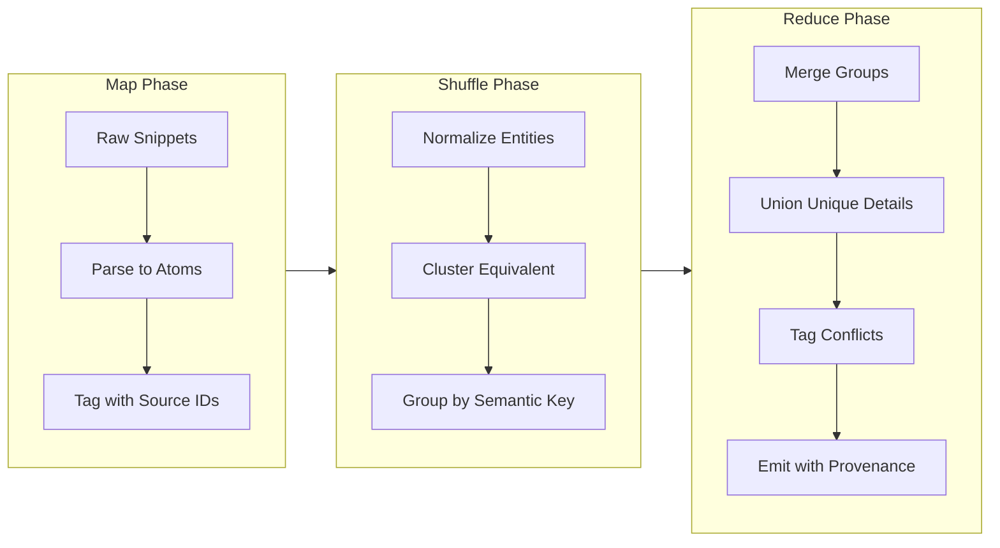

# Semantic Merge Architecture

## Overview

SkillBuilder's batch merge now uses a **schema.org-anchored, neurosymbolic clustering** based on functional job roles (testing, design, build, manage, etc.) rather than embeddings/TF-IDF. Clustering is driven by explicit role proximity with a cost hierarchy: deepening current skills is easiest; cross-domain horizontal skill transport is 3× easier than intra-domain footprint expansion; intra-domain expansion is hardest. The previous TF-IDF/OpenAI embedding clustering has been deprecated. The pipeline still employs **RDF-style atomization** for lossless merge, but grouping is determined by schema.org Occupation mappings.

## Batch Merge Flow (Mermaid)

```mermaid
flowchart TD
    Input[Mode YAML folder] --> RoleMap[Load schema.org role map]
    RoleMap --> Tag[LLM Occupation tagging + append schema.org role to description]
    Tag --> Cost[Functional proximity cost (deepening < cross-domain horizontal < intra-domain expansion)]
    Cost --> Cluster[Role-based clustering (no embeddings)]
    Cluster --> Merge[Semantic merge per cluster]
    Merge --> Outputs[Merged YAMLs + metrics]
    Merge --> Telemetry[batch_merge.jsonl]
```

- Role tagging: LLM applies schema.org Occupation tagging per mode and appends structured role info to the description for clustering.
- Clustering: role-based proximity only (no embeddings/TF-IDF); uses the functional cost hierarchy.
- Telemetry: `.roo/runs/<run_id>/batch_merge.jsonl` with run_id, target_count, actual_clusters, role-map stats (provider="schema-role"), per-cluster similarity (cost-derived), and no embedding events.

## Design Rationale

### The Problem: Information Loss in Naive Merging

When combining information from multiple sources (search results, book data, seeded modes), naive approaches lose information:

1. **Simple deduplication** drops details that differ in phrasing but contain unique facts
2. **Concatenation** creates redundancy and makes the output unusable
3. **LLM summarization** without structure often hallucinates or drops details

### The Solution: RDF-Style Atomization

Inspired by Resource Description Framework (RDF) triples, we decompose information into atomic assertions before merging. This provides:

1. **Provenance tracking** - every merged fact traces to source IDs
2. **No information loss** - unique details are unioned, not discarded
3. **Conflict preservation** - contradictions are tagged, not arbitrarily resolved
4. **Semantic equivalence detection** - paraphrases are merged while preserving meaning

## MapReduce Paradigm

The semantic merge follows the MapReduce paradigm:[^1]



### Phase Details

| Phase | Operation | Purpose |
|-------|-----------|---------|
| **Map** | Atomize to triples | Decompose into minimal facts with provenance |
| **Shuffle** | Normalize & Cluster | Group semantically equivalent assertions |
| **Reduce** | Merge & Emit | Union details, preserve conflicts, emit with source IDs |

## ESCO Role and Skill Mapping Prompt (Job Classification)

LLM prompt used per JTG source YAML to tag roles with ESCO Occupation data and extract leading ESCO skills, then append structured role/skills info to the description before clustering:

> You are an expert job classification specialist working with the ESCO classification. Analyze the provided job role from a Roo Code mode YAML file and map it to standardized ESCO Occupation(s), returning the primary job title(s), occupation URIs, ISCO group, and the top ESCO skills (preferred + alt labels where relevant). The mode file contains role definitions with fields like name, description, systemPrompt, tools, and model preferences. Extract core responsibilities, required skills, experience levels, and qualifications. Then produce a structured ESCO-aligned entry with occupation identifiers and a skills list suitable for downstream clustering and deepening/learning. Focus on semantic meaning, not just keywords; include close-alternate roles where helpful for matching.

Rationale (must be retained in docs):
1. Acknowledge the source format (Roo Code mode YAML)
2. Specify ESCO as the taxonomy for occupations and skills
3. Core task: map to ESCO occupation(s) and return skills
4. Extract responsibilities, skills, experience, qualifications
5. Output: structured ESCO-aligned occupation + skills with identifiers/URIs
6. Emphasize semantic meaning over keywords
7. Practical for HR/job-board and role/skill clustering using ESCO

## Functional Clustering (Neurosymbolic)

- Role map: `config/role-map.yaml` maps mode slugs to schema.org Occupation/functional roles.
- Similarity: computed on functional proximity, not embeddings. Cost hierarchy: deepening current skill set is lowest cost; cross-domain horizontal transport is 3× easier than intra-domain footprint expansion; intra-domain expansion is highest cost.
- Clustering: uses only role proximity; embeddings/TF-IDF removed.
- Merge prompt: uses functional buckets and schema.org role labels; LLM optional with safe fallback to lossless concatenation when invalid/empty.

## ESCO usage, provenance, and attribution

- Dataset source: ESCO ontology RDF (`ESCO_Model.rdf`, version 2.0.0) placed locally; this is the ESCO model (schema) rather than the occupations instances. Occupation instances should still be ingested from the ESCO occupations CSV (or RDF datasets) when available.
- Service attribution (required):
  - For services, tools, and applications integrating ESCO: **“This service uses the ESCO classification of the European Commission.”**
  - For publications (studies, analyses, reports) using ESCO: **“This publication uses the ESCO classification of the European Commission.”**
- Modification notice: Any modified or adapted version of ESCO must be clearly indicated as such.
- CLI prompt disclosure: The batch merge CLI and neurosymbolic clustering prompts rely on schema.org role mapping informed by the ESCO classification; the service uses the ESCO classification of the European Commission.

## Prompt Engineering Templates and Guardrails

The following prompt templates guide LLMs through RDF-style atomization. Each emphasizes:
- Provenance tracking (source IDs on every output)
- No hallucinations (every fact must trace to input)
- Conflict handling (keep both, don't resolve arbitrarily)

### Template 1: Triple Extraction → Merge

```
You are an RDF-style reducer. Input: a numbered list of snippets (topic unknown).

Step 1: Extract atomic subject–predicate–object triples per snippet, keeping provenance indices.
Step 2: Cluster semantically equivalent triples; merge them into a canonical phrasing while unioning all unique details.
Step 3: Emit a minimal set of consolidated triples with source indices.
Step 4: Reconstruct a concise narrative (bullets) from the merged triples, covering every unique fact, no inventions.
```

**Use case:** General-purpose merge when input structure is unknown.

### Template 2: Atomize → Cluster → Recompose

```
Atomize each snippet into minimal fact atoms (subject–predicate–object, attributes).
Deduplicate/merge atoms that express the same meaning (paraphrases, minor wording changes), unioning non-overlapping qualifiers.
If atoms conflict, keep both and tag '(conflict)'.
Recompose as bullets that each reflect one merged atom or tightly linked atoms, with contributing snippet IDs in brackets.
Preserve all distinct info; no new facts.
```

**Use case:** When preserving fine-grained detail is critical.

### Template 3: Semantic Map Builder

```
Build a semantic map from these snippets.

Extract atomic assertions; normalize entities/relations; cluster equivalent assertions; merge to a canonical wording with all unique modifiers retained.

Output two sections:
(1) Consolidated assertions with source indices
(2) Optional compact summary using only those assertions

Do not drop unique details or add new claims.
```

**Use case:** Building Schema.org-aligned semantic maps.[^2]

### Template 4: Pipeline Style (Default)

```
Pipeline:
(a) Parse each snippet into RDF-like triples or key-value facts with IDs.
(b) Normalize entities/relations (resolve synonyms).
(c) Cluster and merge equivalent facts, unioning non-overlapping details; keep conflicts as separate.
(d) Output the merged fact set plus a concise bullet list rebuilt from it.

No hallucinations; every bullet must be supported by at least one source ID.
```

**Use case:** Default template for skill extraction and merging. Implemented in `synthesis.py`.

### Prompt Length and Sanitization Policy

- Prompts are sanitized for secrets but are **not truncated** in merge/synthesis flows. The default cap in code is 100k characters (~20k words), and merge LLM calls should use `max_length=None` or that ceiling to avoid accidental loss. Truncation is only acceptable for logging summarization or binary presence flags—not for content-bearing prompts or outputs.
- Telemetry should record if any cap is ever applied (token/cost and truncation flags) to detect regressions.

### Loop/Runaway Protection

- Long-running merges must include escape hatches (e.g., iteration limits with telemetry flags at 99+ iterations) instead of truncating content. This prevents runaway loops without sacrificing information fidelity.

### Template 5: Tabular RDF Reduce

```
Create a table: columns = Subject | Predicate | Object/Details | Sources.
Extract atoms, then merge rows where meaning is equivalent, combining details and source IDs.
After the table, write the shortest bullet list that covers all rows once, without introducing new facts.
```

**Use case:** When tabular intermediate representation aids debugging.

## Implementation

### Code Location

- `semantic_mode/pipeline/synthesis.py::extract_skills_with_llm()` - Skill extraction with atomization
- `semantic_mode/pipeline/synthesis.py::_llm_reduce()` - Group merge with RDF-style pipeline
- `semantic_mode/pipeline/synthesis.py::_llm_semantic_merge()` - Seeded mode merging

### Provenance Tracking

Every merged skill card includes provenance:

```python
{
    "name": "Skill Name",
    "description": "Merged description with all unique facts",
    "acquired_details": {
        "rationale": "RDF-style merge from 3 sources: S1, S3, S5",
        "provenance": ["S1", "S3", "S5"],
    }
}
```

### Conflict Handling

When sources conflict, we tag rather than resolve:

```python
# In prompt:
"If atoms conflict, keep both and tag '(conflict)'"

# In output:
{
    "name": "Topic",
    "description": "Claim A (S1). (conflict) Claim B (S3)."
}
```

## Dunning-Kruger Consideration

A key insight driving this architecture: **experts often underestimate the uniqueness of their knowledge** because it feels "obvious" to them.[^3]

The skill extraction prompts specifically target:
> "Ideas that experts recognize but the general public doesn't know"

This captures frontier knowledge that the exemplar may not explicitly articulate as special—precisely the knowledge most valuable for mode creation.

## Quality Metrics

### Calibration Signals

External calibration metrics (non-gameable) inform confidence:

| Metric | Signal | Weight |
|--------|--------|--------|
| Domain Authority | .edu, .gov, Wikipedia presence | 0.30 |
| Citation Density | Name mentions across sources | 0.25 |
| Book Impact | Published works count | 0.25 |
| Cross-Domain Reach | Presence in multiple fields | 0.20 |

### Provenance Coverage

Every skill should have:
- At least 1 source ID
- Non-zero evidence URLs
- Calibration score > 0.3

## Scholarly Citations

[^1]: Dean, J. & Ghemawat, S. (2004). "MapReduce: Simplified Data Processing on Large Clusters." OSDI. [Link](https://research.google/pubs/pub62/)

[^2]: Guha, R. et al. (2016). "Schema.org: Evolution of Structured Data on the Web." ACM Queue. [Link](https://schema.org/)

[^3]: Kruger, J. & Dunning, D. (1999). "Unskilled and Unaware of It: How Difficulties in Recognizing One's Own Incompetence Lead to Inflated Self-Assessments." Journal of Personality and Social Psychology.
