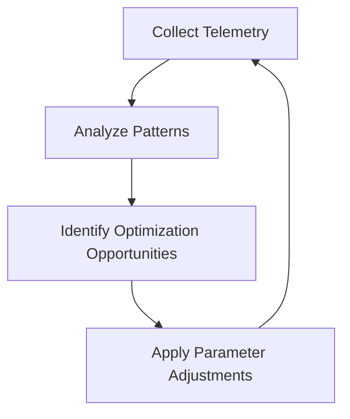

# SkillBuilder Observability-Driven ML Enhancement Plan

## Executive Summary

This plan provides a structured approach to enhance SkillBuilder with robust telemetry, empirical metrics, and ML-driven continuous learning capabilities. The focus is on creating an observability-driven system that can self-calibrate and adapt based on external validation signals that are difficult to game.

## Current Architecture Analysis

### System Components Identified
1. **Search Pipeline** (Go-based): Multi-provider search with RRF fusion
2. **Synthesis Engine** (Python-based): LLM-driven skill extraction and semantic analysis
3. **Mode Management** (Python): Kilocode integration and transformation
4. **Telemetry System** (Python): JSONL-based event streaming
5. **Batch Merge** (Python): Schema.org-based clustering and merging

### Current Telemetry Infrastructure
- **Event Types**: run lifecycle, search tracing, synthesis metrics, artifact tracking
- **Storage**: JSONL files per run with structured events
- **Analysis**: Basic summary functions in `telemetry.py`
- **Gaps**: Limited ML-driven insights, no adaptive parameter tuning

## ML-Driven Enhancement Strategy

### Core Design Principle: Observability-Driven Continuous Learning

Every component should:
1. **Collect meaningful signals** beyond basic metrics
2. **Validate against trustworthy benchmarks** using external sources
3. **Close the loop** via automated parameter adjustments
4. **Learn from operation** through pattern recognition and adaptation

## Detailed Implementation Plan

### Phase 1: Enhanced Telemetry Infrastructure

#### 1.1 Expand Metrics Collection
**Current State**: Basic event tracking (duration, counts, errors)
**Enhancements Needed**:
- **Quality Metrics**: Skill confidence distributions, semantic coherence scores
- **User Outcome Signals**: Mode adoption rates, usage patterns, success indicators
- **External Validation**: Cross-reference with authoritative sources (HuggingFace, academic databases)
- **Performance Patterns**: Query effectiveness, provider reliability, fusion efficiency

#### 1.2 External Validation Signals
**Non-Gameable Metrics**:
- **Domain Authority**: .edu/.gov presence, citation density across academic sources
- **Cross-Reference Validation**: Skill overlap with established taxonomies (ESCO, O*NET)
- **Temporal Consistency**: Result stability across multiple runs with same inputs
- **Peer Validation**: Community feedback loops through mode usage statistics

#### 1.3 Telemetry Schema Enhancement
```yaml
enhanced_events:
  quality_metrics:
    - skill_confidence_distribution
    - semantic_coherence_score
    - citation_quality_index
  user_outcomes:
    - mode_adoption_rate
    - task_success_rate
    - user_satisfaction_signals
  external_validation:
    - domain_authority_score
    - cross_reference_validation
    - temporal_consistency_metric
  ml_feedback:
    - parameter_effectiveness
    - prediction_accuracy
    - adaptation_success_rate
```

### Phase 2: ML-Driven Calibration Framework

#### 2.1 Calibration Data Pipeline
**Components**:
- **Feature Extraction**: From telemetry events and external validation
- **Model Training**: Online learning for parameter optimization
- **Feedback Integration**: Real-time adjustment based on performance

#### 2.2 Adaptive Parameter System
**Parameters to Calibrate**:
- **Search Query Templates**: Optimize based on domain and exemplar type
- **RRF Fusion Weights**: Adjust k parameter per provider performance
- **LLM Prompts**: Optimize for skill extraction accuracy
- **Clustering Thresholds**: Dynamic adjustment based on mode characteristics

#### 2.3 External Benchmark Integration
**Validation Sources**:
- **HuggingFace Hub**: Model performance benchmarks
- **Academic Databases**: Citation impact and authority scoring
- **Industry Standards**: Skill taxonomy alignment (ESCO, O*NET)
- **Community Usage**: Mode adoption and effectiveness patterns

### Phase 3: Continuous Learning Loops

#### 3.1 OODA Integration


**Implementation Points**:
- **Observe**: Enhanced telemetry collection with quality metrics
- **Orient**: ML analysis of performance patterns and external validation
- **Decide**: Automated parameter adjustment recommendations
- **Act**: Safe parameter deployment with rollback capability

#### 3.2 Code-Act Loops
**Automated Improvement Cycles**:
- **Performance Regression Detection**: Identify degradations automatically
- **A/B Testing Framework**: Compare parameter configurations
- **Rollback Mechanisms**: Safe parameter reversion on failures
- **Progressive Enhancement**: Gradual improvement deployment

### Phase 4: Architectural Refactoring

#### 4.1 Search Pipeline Enhancements
**Current State**: Go-based concurrent search with basic fusion
**ML Opportunities**:
- **Query Optimization**: ML-based query template selection
- **Provider Performance Learning**: Adaptive provider weighting
- **Result Quality Prediction**: Pre-filter low-quality results
- **Dynamic Fusion**: RRF parameter optimization per query type

#### 4.2 Synthesis Engine Improvements
**Current State**: Python-based LLM skill extraction
**Enhancement Areas**:
- **Skill Quality Prediction**: ML model for confidence calibration
- **Semantic Consistency**: Cross-run skill overlap analysis
- **Evidence Quality Scoring**: Automated source reliability assessment
- **Adaptive Prompting**: Context-aware prompt optimization

#### 4.3 Mode Management Optimization
**Current State**: YAML-based mode storage and transformation
**Improvement Opportunities**:
- **Usage Pattern Analysis**: ML-driven mode recommendation
- **Quality Assessment**: Automated mode effectiveness scoring
- **Merge Optimization**: ML-based clustering parameter tuning
- **Transformation Enhancement**: Adaptive format selection

### Phase 5: Implementation Roadmap

#### 5.1 Priority Implementation Order
1. **Enhanced Telemetry Collection** (Foundation)
2. **External Validation Integration** (Trustworthiness)
3. **ML Calibration Framework** (Adaptation Core)
4. **OODA Loop Implementation** (Continuous Improvement)
5. **Architectural Refactoring** (Efficiency & Elegance)

#### 5.2 Success Metrics
**Quantitative Measures**:
- **Telemetry Coverage**: % of components with enhanced metrics
- **ML Model Accuracy**: Prediction vs. actual performance
- **Adaptation Effectiveness**: Parameter improvement success rate
- **System Performance**: Latency, throughput, quality improvements

**Qualitative Measures**:
- **Observability**: Ease of debugging and analysis
- **Adaptability**: System responsiveness to changing conditions
- **Maintainability**: Code clarity and modularity improvements
- **Reliability**: System stability and error reduction

## Technical Implementation Details

### Enhanced Telemetry Events
```python
# New event types to add
class EnhancedTelemetryEvents:
    QUALITY_SKILL_DISTRIBUTION = "quality.skill.distribution"
    QUALITY_SEMANTIC_COHERENCE = "quality.semantic.coherence"
    VALIDATION_DOMAIN_AUTHORITY = "validation.domain.authority"
    VALIDATION_CROSS_REFERENCE = "validation.cross.reference"
    ML_CALIBRATION_ADJUSTMENT = "ml.calibration.adjustment"
    ML_PREDICTION_ACCURACY = "ml.prediction.accuracy"
    USER_OUTCOME_ADOPTION = "user.outcome.adoption"
```

### ML Model Integration Points
```python
# Calibration model interfaces
class CalibrationModel:
    def predict_optimal_parameters(self, context: dict) -> dict:
        """Predict optimal parameters based on historical performance"""
        pass
    
    def validate_prediction(self, prediction: dict, actual: dict) -> float:
        """Validate prediction accuracy against actual outcomes"""
        pass
    
    def update_model(self, feedback: dict) -> None:
        """Update model with new performance data"""
        pass
```

### External Validation Framework
```python
# External validation sources
class ExternalValidation:
    def validate_domain_authority(self, urls: list[str]) -> float:
        """Score domain authority based on .edu/.gov presence"""
        pass
    
    def cross_reference_skills(self, skills: list[dict]) -> float:
        """Validate skills against external taxonomies"""
        pass
    
    def check_temporal_consistency(self, runs: list[dict]) -> float:
        """Check result consistency across time"""
        pass
```

## Conclusion

This plan establishes a comprehensive framework for transforming SkillBuilder into an observability-driven, self-improving system. The focus on external validation signals ensures the system can calibrate against trustworthy benchmarks rather than internal metrics that could be gamed. The ML-driven feedback loops enable continuous adaptation and improvement based on real-world performance data.

The implementation prioritizes:
1. **Robust telemetry** as the foundation for all improvements
2. **External validation** for trustworthy, non-gameable metrics
3. **ML-driven adaptation** for continuous parameter optimization
4. **Architectural elegance** through systematic refactoring
5. **Continuous learning** through OODA/code-act loops

This approach ensures SkillBuilder can evolve and improve autonomously while maintaining high quality and reliability standards.