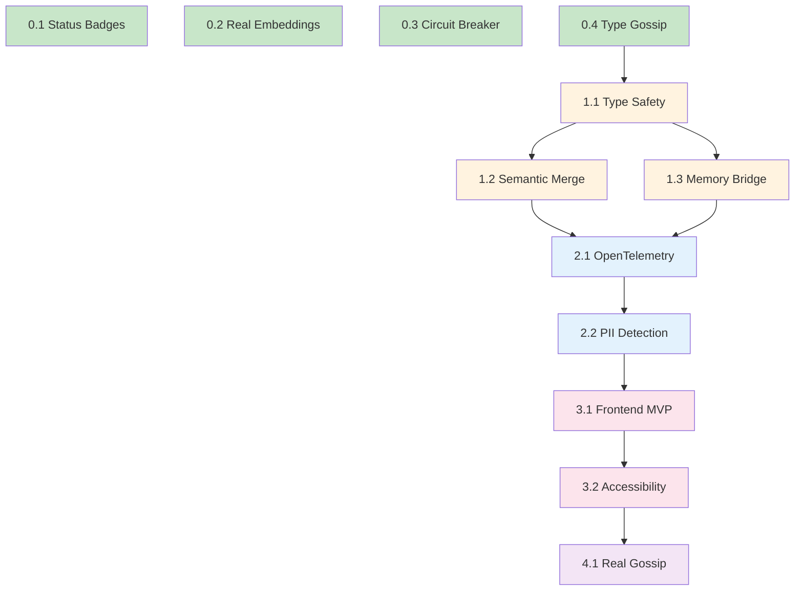

# Chrysalis Implementation Plan

**Phased Remediation Roadmap**  
**Date:** January 6, 2026  
**Version:** 1.0.0

---

## Overview

This plan sequences the remediation work identified in the comprehensive code review, organizing fixes into phases with explicit dependencies, effort estimates, and verification criteria.

### Guiding Principles

1. **User Value First:** Every fix traces to elder/caregiver benefit
2. **Foundation Before Features:** Type safety and embeddings before frontend
3. **Small Batches:** Verifiable progress every 2-3 days
4. **Backward Compatible:** No breaking changes without migration path
5. **Test-Driven:** Every fix accompanied by tests

---

## Phase 0: Immediate Fixes (Week 1)

**Duration:** 5 days  
**Team Size:** 1 engineer  
**Risk Level:** Low

### 0.1 Documentation Status Badges

**Issue:** CRIT-ARCH-001  
**Effort:** 2 days  
**Dependencies:** None

**Tasks:**
- [ ] Create badge convention document
- [ ] Add status badges to UNIFIED_SPEC_V3.1.md
- [ ] Add status badges to COMPLETE_SPEC.md
- [ ] Add status badges to memory documentation
- [ ] Update MASTER_INDEX.md with legend

**Acceptance Criteria:**
- Every feature has ✅/📋/🔮/⚠️ badge
- No feature claims "implemented" without test link

**Verification:**
```bash
# Verify all features have badges
grep -c "✅\|📋\|🔮\|⚠️" docs/current/*.md
```

### 0.2 Switch Default Embedding Service

**Issue:** CRIT-AI-001  
**Effort:** 1 day  
**Dependencies:** None

**Tasks:**
- [ ] Change factory default from 'mock' to 'transformer'
- [ ] Add @xenova/transformers to production dependencies
- [ ] Update initialization to lazy-load model
- [ ] Add fallback chain: transformer → API → mock (dev-only)

**File Changes:**

```typescript
// src/memory/EmbeddingService.ts - Line 219-232
export function createEmbeddingService(
  type: 'mock' | 'transformer' = 'transformer',  // ← Changed default
  config?: Partial<EmbeddingConfig>
): EmbeddingService {
  switch (type) {
    case 'transformer':
      return new TransformerEmbeddingService(config);
    case 'mock':
      if (process.env.NODE_ENV !== 'development') {
        console.warn('Mock embeddings should only be used in development');
      }
      return new MockEmbeddingService(config);
    default:
      return new TransformerEmbeddingService(config);
  }
}
```

**Acceptance Criteria:**
- `npm run test:unit` passes with transformer service
- Cosine similarity returns semantically meaningful scores
- "love grandchildren" NOT similar to "tax deadline"

**Verification:**
```typescript
// New test case
it('should return semantic similarity', async () => {
  const service = createEmbeddingService('transformer');
  await service.initialize();
  
  const emb1 = await service.embed('I love my grandchildren');
  const emb2 = await service.embed('My family means everything to me');
  const emb3 = await service.embed('Tax return deadline approaching');
  
  const sim12 = service.cosineSimilarity(emb1, emb2);
  const sim13 = service.cosineSimilarity(emb1, emb3);
  
  expect(sim12).toBeGreaterThan(0.5);  // Related
  expect(sim13).toBeLessThan(0.3);      // Unrelated
});
```

### 0.3 Add Circuit Breaker to Pattern Resolver

**Issue:** HIGH-ARCH-001  
**Effort:** 1 day  
**Dependencies:** None

**Tasks:**
- [ ] Create CircuitBreaker utility class
- [ ] Wrap MCP client calls with circuit breaker
- [ ] Add timeout configuration (default 5s)
- [ ] Add fallback to embedded on timeout

**File Changes:**

```typescript
// NEW: src/utils/CircuitBreaker.ts
export class CircuitBreaker<T> {
  private failures = 0;
  private lastFailure = 0;
  private state: 'closed' | 'open' | 'half-open' = 'closed';
  
  constructor(
    private readonly threshold: number = 5,
    private readonly timeout: number = 5000,
    private readonly resetTime: number = 30000
  ) {}
  
  async execute(
    operation: () => Promise<T>,
    fallback: () => T | Promise<T>
  ): Promise<T> {
    if (this.state === 'open') {
      if (Date.now() - this.lastFailure > this.resetTime) {
        this.state = 'half-open';
      } else {
        return fallback();
      }
    }
    
    try {
      const result = await Promise.race([
        operation(),
        this.timeoutPromise()
      ]);
      this.onSuccess();
      return result;
    } catch (error) {
      this.onFailure();
      return fallback();
    }
  }
  
  private timeoutPromise(): Promise<never> {
    return new Promise((_, reject) => 
      setTimeout(() => reject(new Error('Timeout')), this.timeout)
    );
  }
  
  private onSuccess(): void {
    this.failures = 0;
    this.state = 'closed';
  }
  
  private onFailure(): void {
    this.failures++;
    this.lastFailure = Date.now();
    if (this.failures >= this.threshold) {
      this.state = 'open';
    }
  }
}
```

**Acceptance Criteria:**
- MCP calls timeout after 5 seconds
- System falls back to embedded patterns on timeout
- Circuit opens after 5 consecutive failures

### 0.4 Type Gossip Message Data

**Issue:** CRIT-LOG-001 (partial)  
**Effort:** 1 day  
**Dependencies:** None

**Tasks:**
- [ ] Define typed payload interfaces for each message type
- [ ] Update GossipMessage interface
- [ ] Add runtime validation

**File Changes:**

```typescript
// src/core/patterns/Gossip.ts - Add new interfaces
export interface ExperiencePayload {
  experiences: {
    episode_id: string;
    timestamp: string;
    content: string;
    effectiveness: number;
  }[];
}

export interface StatePayload {
  nodeId: string;
  version: number;
  skills: Record<string, number>;
  lastUpdate: string;
}

export interface KnowledgePayload {
  concepts: {
    concept_id: string;
    definition: string;
    confidence: number;
    sources: string[];
  }[];
}

export interface MemoriesPayload {
  memories: {
    id: string;
    content: string;
    type: 'episodic' | 'semantic';
    timestamp: string;
  }[];
}

export type GossipPayload = 
  | { type: 'experiences'; data: ExperiencePayload }
  | { type: 'state'; data: StatePayload }
  | { type: 'knowledge'; data: KnowledgePayload }
  | { type: 'memories'; data: MemoriesPayload };

export interface GossipMessage {
  id: string;
  nodeId: string;
  timestamp: number;
  payload: GossipPayload;  // ← Replaces untyped 'data: any'
  signature: string;
  logicalClock: number;
}
```

**Acceptance Criteria:**
- TypeScript compiler catches invalid payloads
- Runtime validation rejects malformed messages

---

## Phase 1: Foundation (Weeks 2-3)

**Duration:** 10 days  
**Team Size:** 2 engineers  
**Risk Level:** Medium

### 1.1 Complete Type Safety Refactor

**Issue:** CRIT-LOG-001  
**Effort:** 8 days  
**Dependencies:** Phase 0.4 (typed gossip)

**Tasks:**
- [ ] Audit all `any` types in src/
- [ ] Define typed interfaces for each
- [ ] Update function signatures
- [ ] Add Zod schemas for runtime validation
- [ ] Update tests for type coverage

**Files Requiring Changes:**

| File | `any` Count | Priority |
|------|-------------|----------|
| UniformSemanticAgentV2.ts | 12 | High |
| CRDTs.ts | 8 | High |
| PatternResolver.ts | 4 | Medium |
| Gossip.ts | 3 | Done in 0.4 |

**Acceptance Criteria:**
- `npm run build` with `"strict": true` passes
- Zero `any` types in core modules
- Zod validation on all external inputs

### 1.2 Semantic Knowledge Merge

**Issue:** CRIT-LOG-002  
**Effort:** 5 days  
**Dependencies:** 1.1 (type safety)

**Tasks:**
- [ ] Define knowledge conflict resolution strategy
- [ ] Implement confidence-weighted merge
- [ ] Add source attribution tracking
- [ ] Handle contradictory facts

**Algorithm:**

```typescript
// src/core/patterns/CRDTs.ts - Add to AgentStateCRDT
interface KnowledgeItem {
  value: string;
  confidence: number;
  sources: string[];
  timestamp: number;
}

mergeKnowledge(other: AgentStateCRDT): void {
  for (const [key, otherItem] of Object.entries(other.state.knowledge)) {
    const thisItem = this.state.knowledge[key] as KnowledgeItem | undefined;
    
    if (!thisItem) {
      // New knowledge - accept
      this.state.knowledge[key] = otherItem;
    } else if (this.areCompatible(thisItem, otherItem)) {
      // Compatible - merge sources, boost confidence
      this.state.knowledge[key] = {
        value: thisItem.value,
        confidence: Math.min(1.0, thisItem.confidence + 0.1),
        sources: [...new Set([...thisItem.sources, ...otherItem.sources])],
        timestamp: Math.max(thisItem.timestamp, otherItem.timestamp)
      };
    } else {
      // Conflict - keep higher confidence, log conflict
      if (otherItem.confidence > thisItem.confidence) {
        this.conflicts.push({
          key,
          kept: otherItem,
          discarded: thisItem,
          reason: 'confidence_priority'
        });
        this.state.knowledge[key] = otherItem;
      } else {
        this.conflicts.push({
          key,
          kept: thisItem,
          discarded: otherItem,
          reason: 'confidence_priority'
        });
      }
    }
  }
}

private areCompatible(a: KnowledgeItem, b: KnowledgeItem): boolean {
  // Same value = compatible
  return a.value === b.value;
}
```

**Acceptance Criteria:**
- Knowledge merge never silently overwrites
- Conflicts logged with resolution reason
- Higher confidence knowledge wins conflicts

### 1.3 Memory System Bridge

**Issue:** CRIT-ARCH-002  
**Effort:** 5 days  
**Dependencies:** 1.1 (type safety)

**Tasks:**
- [ ] Define canonical memory schema (JSON)
- [ ] Implement Python → JSON export
- [ ] Implement TypeScript → JSON export
- [ ] Implement bidirectional import
- [ ] Add version/migration support

**Schema:**

```json
{
  "$schema": "http://json-schema.org/draft-07/schema#",
  "type": "object",
  "properties": {
    "version": { "type": "string", "const": "1.0.0" },
    "exported": { "type": "string", "format": "date-time" },
    "source": { "enum": ["python", "typescript"] },
    "memories": {
      "type": "array",
      "items": {
        "type": "object",
        "required": ["id", "content", "type", "timestamp"],
        "properties": {
          "id": { "type": "string" },
          "content": { "type": "string" },
          "type": { "enum": ["episodic", "semantic", "working", "core"] },
          "timestamp": { "type": "string", "format": "date-time" },
          "embedding": { 
            "type": "array", 
            "items": { "type": "number" }
          },
          "metadata": { "type": "object" }
        }
      }
    }
  }
}
```

**Acceptance Criteria:**
- Round-trip Python → JSON → TypeScript → JSON → Python preserves data
- Embedding vectors transferred if dimensions match
- Version mismatch triggers migration

---

## Phase 2: Observability & Safety (Weeks 4-5)

**Duration:** 10 days  
**Team Size:** 2 engineers  
**Risk Level:** Medium

### 2.1 OpenTelemetry Integration

**Issue:** HIGH-ARCH-002  
**Effort:** 5 days  
**Dependencies:** Phase 1 complete

**Tasks:**
- [ ] Add @opentelemetry/sdk-node
- [ ] Instrument pattern resolver
- [ ] Instrument memory operations
- [ ] Instrument gossip protocol
- [ ] Configure Jaeger exporter

**Instrumentation Points:**

```typescript
// src/fabric/PatternResolver.ts
import { trace, context, SpanStatusCode } from '@opentelemetry/api';

const tracer = trace.getTracer('chrysalis-pattern-resolver');

async resolveHash(): Promise<PatternResolution<HashImplementation>> {
  return tracer.startActiveSpan('resolveHash', async (span) => {
    try {
      span.setAttribute('deployment.distributed', this.context.distributed);
      span.setAttribute('deployment.mcp_available', this.context.mcp_available);
      
      const result = await this._resolveHashInternal();
      
      span.setAttribute('resolution.source', result.source);
      span.setAttribute('resolution.latency_ms', result.latency_estimate_ms);
      span.setStatus({ code: SpanStatusCode.OK });
      
      return result;
    } catch (error) {
      span.setStatus({ code: SpanStatusCode.ERROR, message: error.message });
      throw error;
    } finally {
      span.end();
    }
  });
}
```

**Acceptance Criteria:**
- All pattern resolutions traced
- Span hierarchy shows call tree
- Errors annotated with context

### 2.2 PII Detection Pipeline

**Issue:** HIGH-ARCH-003  
**Effort:** 5 days  
**Dependencies:** 2.1 (for metrics)

**Tasks:**
- [ ] Integrate PII detection library (Presidio or similar)
- [ ] Create sanitization middleware
- [ ] Add configurable allowlist
- [ ] Implement audit logging
- [ ] Add rate limiting per source

**Implementation:**

```typescript
// NEW: src/safety/PIIDetector.ts
import { AnalyzerEngine, RecognizerResult } from '@microsoft/presidio-analyzer';

export interface PIIDetectionResult {
  hasPII: boolean;
  findings: {
    type: string;
    start: number;
    end: number;
    score: number;
  }[];
  sanitized: string;
}

export class PIIDetector {
  private analyzer: AnalyzerEngine;
  private allowedTypes: Set<string>;
  
  constructor(config: {
    allowedTypes?: string[];
    scoreThreshold?: number;
  } = {}) {
    this.analyzer = new AnalyzerEngine();
    this.allowedTypes = new Set(config.allowedTypes || []);
  }
  
  async detect(text: string): Promise<PIIDetectionResult> {
    const results = await this.analyzer.analyze(text, 'en');
    
    const findings = results
      .filter(r => !this.allowedTypes.has(r.entity_type))
      .filter(r => r.score >= 0.7)
      .map(r => ({
        type: r.entity_type,
        start: r.start,
        end: r.end,
        score: r.score
      }));
    
    const sanitized = this.redact(text, findings);
    
    return {
      hasPII: findings.length > 0,
      findings,
      sanitized
    };
  }
  
  private redact(text: string, findings: PIIDetectionResult['findings']): string {
    let result = text;
    // Redact in reverse order to preserve positions
    for (const finding of findings.sort((a, b) => b.start - a.start)) {
      const placeholder = `[${finding.type}]`;
      result = result.slice(0, finding.start) + placeholder + result.slice(finding.end);
    }
    return result;
  }
}
```

**Acceptance Criteria:**
- SSN, phone, email detected with >90% accuracy
- Detected PII redacted before embedding
- Audit log records all detections

---

## Phase 3: User Experience (Weeks 6-8)

**Duration:** 15 days  
**Team Size:** 2 engineers + 1 designer  
**Risk Level:** High

### 3.1 Frontend MVP Skeleton

**Issue:** CRIT-UX-001  
**Effort:** 10 days  
**Dependencies:** Phase 2 complete

**Tasks:**
- [ ] Set up React + Vite project
- [ ] Implement core layout components
- [ ] Create memory display component
- [ ] Create memory input component
- [ ] Implement sync status indicator
- [ ] Add trust signal components

**Component Structure:**

```
src/frontend/
├── App.tsx
├── components/
│   ├── Layout/
│   │   ├── Header.tsx
│   │   ├── Navigation.tsx
│   │   └── Footer.tsx
│   ├── Memory/
│   │   ├── MemoryCard.tsx
│   │   ├── MemoryList.tsx
│   │   ├── MemoryInput.tsx
│   │   └── MemorySearch.tsx
│   ├── Trust/
│   │   ├── ConfidenceIndicator.tsx
│   │   ├── SourceAttribution.tsx
│   │   └── AILabel.tsx
│   └── Sync/
│       ├── SyncStatus.tsx
│       └── OfflineIndicator.tsx
├── hooks/
│   ├── useMemory.ts
│   ├── useSync.ts
│   └── useAccessibility.ts
├── services/
│   ├── memoryService.ts
│   └── syncService.ts
└── styles/
    ├── accessibility.css
    └── elder-friendly.css
```

**Acceptance Criteria:**
- Renders on mobile and desktop
- Keyboard navigable
- Screen reader compatible
- Large touch targets (44px minimum)

### 3.2 Accessibility Compliance

**Issue:** HIGH-UX-003  
**Effort:** 5 days  
**Dependencies:** 3.1 (frontend exists)

**Tasks:**
- [ ] WCAG 2.1 AA audit
- [ ] Fix contrast issues
- [ ] Add ARIA labels
- [ ] Implement focus management
- [ ] Add skip links
- [ ] Test with screen readers

**Accessibility Checklist:**

| Criterion | Status | Notes |
|-----------|--------|-------|
| 1.4.3 Contrast (Minimum) | [ ] | 4.5:1 for normal text |
| 1.4.4 Resize Text | [ ] | 200% zoom support |
| 2.1.1 Keyboard | [ ] | All functions keyboard accessible |
| 2.4.7 Focus Visible | [ ] | Clear focus indicators |
| 3.3.2 Labels or Instructions | [ ] | All inputs labeled |
| 4.1.2 Name, Role, Value | [ ] | ARIA attributes correct |

**Acceptance Criteria:**
- axe-core reports zero critical/serious issues
- VoiceOver/NVDA can navigate all features
- Font scales to 200% without horizontal scroll

---

## Phase 4: Distributed Features (Weeks 9-10)

**Duration:** 10 days  
**Team Size:** 2 engineers  
**Risk Level:** High

### 4.1 Real Gossip Protocol

**Issue:** CRIT-ARCH-001 (gossip simulation)  
**Effort:** 10 days  
**Dependencies:** Phase 1-3 complete

**Tasks:**
- [ ] Implement WebSocket transport
- [ ] Replace simulation with real network calls
- [ ] Add peer discovery mechanism
- [ ] Implement NAT traversal (WebRTC data channels)
- [ ] Add message batching for efficiency

**Architecture:**

```
┌─────────────────────────────────────────────────────────────┐
│                     Gossip Layer                             │
├─────────────────────────────────────────────────────────────┤
│                                                              │
│  ┌─────────┐    WebSocket    ┌─────────┐                   │
│  │ Node A  │◄──────────────►│ Node B  │                   │
│  └────┬────┘                 └────┬────┘                   │
│       │                           │                         │
│       │    WebRTC DataChannel     │                         │
│       └───────────────────────────┘                         │
│                                                              │
│  Peer Discovery: DHT or Signaling Server                    │
│  Message Format: Protobuf (efficient binary)                │
│  Encryption: TLS 1.3 (WebSocket) / DTLS (WebRTC)           │
│                                                              │
└─────────────────────────────────────────────────────────────┘
```

**Acceptance Criteria:**
- Two nodes on different machines can sync
- Message delivery within 5 seconds
- Reconnection after network interruption

---

## Dependency Graph



---

## Effort Summary

| Phase | Duration | Person-Days | Risk |
|-------|----------|-------------|------|
| Phase 0: Immediate | 5 days | 5 | Low |
| Phase 1: Foundation | 10 days | 20 | Medium |
| Phase 2: Observability | 10 days | 20 | Medium |
| Phase 3: UX | 15 days | 30 | High |
| Phase 4: Distributed | 10 days | 20 | High |
| **Total** | **50 days** | **95** | - |

**Calendar Duration:** ~10 weeks (with buffer)

---

## Verification Plan

### Continuous Integration

```yaml
# .github/workflows/ci.yml
name: Chrysalis CI

on: [push, pull_request]

jobs:
  type-check:
    runs-on: ubuntu-latest
    steps:
      - uses: actions/checkout@v4
      - run: npm ci
      - run: npm run build  # TypeScript strict mode
      
  test:
    runs-on: ubuntu-latest
    steps:
      - uses: actions/checkout@v4
      - run: npm ci
      - run: npm run test:unit
      - run: npm run test:integration
      
  accessibility:
    runs-on: ubuntu-latest
    needs: [type-check, test]
    steps:
      - uses: actions/checkout@v4
      - run: npm ci
      - run: npm run build:frontend
      - run: npx axe-core-cli http://localhost:3000
```

### Manual Verification Checkpoints

| Checkpoint | When | Criteria |
|------------|------|----------|
| Phase 0 Review | End of Week 1 | All quick wins verified |
| Phase 1 Review | End of Week 3 | Type safety 100%, merge tests pass |
| Phase 2 Review | End of Week 5 | Traces visible in Jaeger |
| Phase 3 Review | End of Week 8 | Elder can use MVP |
| Phase 4 Review | End of Week 10 | Two-node sync works |

---

## Rollback Strategy

### Per-Phase Rollback

| Phase | Rollback Method | Data Impact |
|-------|-----------------|-------------|
| 0 | Git revert | None |
| 1 | Feature flag disable | None |
| 2 | Disable OTel collector | None |
| 3 | Redirect to old UI (N/A) | None |
| 4 | Disable gossip, local-only mode | None |

### Breaking Change Protocol

1. Announce in CHANGELOG.md with migration guide
2. Provide migration script
3. Support old format for 2 releases
4. Remove deprecated code after migration period

---

## Success Metrics

### Technical Metrics

| Metric | Baseline | Target | Phase |
|--------|----------|--------|-------|
| Type coverage | 60% | 100% | 1 |
| Test coverage | 50% | 80% | 2 |
| P95 latency | Unknown | <500ms | 2 |
| Embedding accuracy | 0% | 85% | 0 |
| WCAG compliance | N/A | AA | 3 |

### User Metrics

| Metric | Baseline | Target | Phase |
|--------|----------|--------|-------|
| Elder can complete onboarding | N/A | 80% | 3 |
| Memory retrieval relevance | 0% | 80% | 0+3 |
| Sync success rate | N/A | 95% | 4 |
| Support tickets per user | N/A | <1/month | 2 |

---

## Next Steps

1. **Day 1:** Begin Phase 0.1 (Status Badges)
2. **Day 1:** Begin Phase 0.2 (Real Embeddings) in parallel
3. **Day 3:** Complete Phase 0.3 (Circuit Breaker)
4. **Day 5:** Phase 0 review and Phase 1 kickoff
5. **Week 3:** Phase 1 review and Phase 2 kickoff

---

**Plan Prepared By:** Technical Architecture Team  
**Approved By:** [Pending]  
**Effective Date:** January 7, 2026
