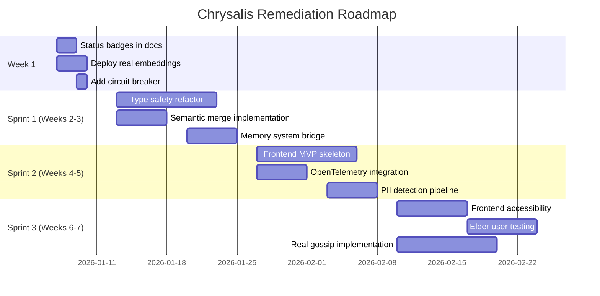

# Chrysalis Review Summary

**Executive Summary for Stakeholders**  
**Date:** January 6, 2026  
**Review Version:** 1.0.0

---

## Mission Alignment Statement

Chrysalis aims to build **services of specific value for creative aging adults** through AI agents operating as self-evolving information entities with persistent memory, inter-agent communication, and distributed computing fabric.

**Current Status:** The architectural vision is sound but implementation gaps prevent production deployment.

---

## Priority Matrix

### Critical Issues (Must Fix Before Production)

| ID | Issue | Team | User Impact | Effort | Fix Sprint |
|----|-------|------|-------------|--------|------------|
| CRIT-ARCH-001 | Documentation claims unimplemented features | Arch | False expectations, trust damage | 2d | Week 1 |
| CRIT-ARCH-002 | Dual memory systems (Python/TS) with no bridge | Arch | Data loss during migration | 2w | Sprint 1-2 |
| CRIT-AI-001 | Mock embeddings return random vectors | AI/ML | Semantic search broken | 3d | Week 1 |
| CRIT-UX-001 | No frontend application exists | UX | System unusable by elders | 4w | Sprint 1-3 |
| CRIT-LOG-001 | Type safety violations (`any` types) | Logic | Data corruption risk | 2w | Sprint 1 |
| CRIT-LOG-002 | Knowledge merge overwrites without conflict resolution | Logic | Elder's facts overwritten | 1w | Sprint 1 |

### Quick Wins (High Impact, Low Effort)

| ID | Issue | Effort | Impact | Action |
|----|-------|--------|--------|--------|
| QW-001 | Add status badges to docs | 2d | High | Mark implemented vs. designed |
| QW-002 | Remove mock as default embedding | 1d | Critical | Switch factory default |
| QW-003 | Add circuit breaker timeout | 1d | High | 5-second MCP timeout |
| QW-004 | Type gossip message data | 2d | Medium | Define payload schemas |
| QW-005 | Add runtime invariant checks | 1d | Medium | Proficiency bounds |

### Strategic Investments (High Impact, High Effort)

| ID | Issue | Effort | Impact | ROI |
|----|-------|--------|--------|-----|
| SI-001 | Unify memory systems | 3w | Critical | Foundation for all features |
| SI-002 | Build MVP frontend | 4w | Critical | Enables user testing |
| SI-003 | Implement real gossip protocol | 2w | High | Multi-instance sync |
| SI-004 | Create TLA+ formal model | 3w | Medium | Proves correctness |
| SI-005 | RAG pipeline integration | 2w | High | Contextual responses |

---

## Risk Assessment

```
┌────────────────────────────────────────────────────────────┐
│                    RISK MATRIX                              │
├────────────────────────────────────────────────────────────┤
│                                                             │
│  Impact │                                                   │
│    ↑    │                                                   │
│  High   │  [Mock Embeddings]    [No Frontend]              │
│         │  [Data Corruption]    [Memory Fragmentation]     │
│         │                                                   │
│  Med    │  [No Circuit Breaker] [No Observability]         │
│         │  [No PII Detection]   [Schema Drift]             │
│         │                                                   │
│  Low    │  [Log Rotation]       [Config Sprawl]            │
│         │                                                   │
│         └────────────────────────────────────────────────→ │
│              Low              Med              High          │
│                         Likelihood                          │
└────────────────────────────────────────────────────────────┘
```

### Top 5 Risks to User Value

1. **Elder receives wrong memories** (Mock embeddings)
   - Likelihood: High (current default)
   - Impact: High (trust destroyed)
   - Mitigation: Deploy real embeddings

2. **Memory loss during sync** (No conflict resolution)
   - Likelihood: Medium (requires multi-device)
   - Impact: High (irreplaceable stories)
   - Mitigation: CRDT-based merge

3. **System unusable** (No frontend)
   - Likelihood: Certain
   - Impact: Critical (blocks all users)
   - Mitigation: MVP frontend

4. **Support can't diagnose issues** (No observability)
   - Likelihood: High (in production)
   - Impact: Medium (frustrated users)
   - Mitigation: OpenTelemetry integration

5. **PII leakage** (No sanitization)
   - Likelihood: Medium
   - Impact: High (privacy violation)
   - Mitigation: PII detection pipeline

---

## Findings by Team

### Team 1: Architecture and Systems Design

**Grade: B-**

| Category | Score | Notes |
|----------|-------|-------|
| Design Quality | A | Fractal architecture excellent |
| Implementation Completeness | C | Many features simulated |
| Fault Tolerance | D | No circuit breakers |
| Observability | C | Event bus exists, no tracing |
| Security | C | Policies defined, not enforced |

**Key Finding:** Beautiful architecture, incomplete implementation.

### Team 2: AI and ML Engineering

**Grade: C+**

| Category | Score | Notes |
|----------|-------|-------|
| Embedding Quality | F | Mock returns random vectors |
| LLM Integration | B | Good abstraction, no cost control |
| Safety | D | No prompt injection protection |
| Adaptability | A | Provider-agnostic design |

**Key Finding:** Ready for AI evolution, not for current production.

### Team 3: UI/UX Design

**Grade: D**

| Category | Score | Notes |
|----------|-------|-------|
| Frontend Existence | F | None implemented |
| Accessibility | N/A | Cannot evaluate |
| Elder Focus | B | Good sync options in spec |
| Trust Signals | D | Designed but not built |

**Key Finding:** No interface means no users.

### Team 4: Logic and Semantics

**Grade: B**

| Category | Score | Notes |
|----------|-------|-------|
| Mathematical Foundations | A | CRDT/Byzantine correct |
| Type Safety | C | Many `any` types |
| Invariant Maintenance | C | No runtime checks |
| Formal Verification | D | No TLA+/Alloy models |

**Key Finding:** Theoretically sound, practically leaky.

---

## Implementation Sequence



---

## Cost-Benefit Analysis

### Investment Required

| Category | Effort (Person-Weeks) | Cost Estimate |
|----------|----------------------|---------------|
| Critical Fixes | 8 | $40,000 |
| Quick Wins | 2 | $10,000 |
| Strategic Investments | 12 | $60,000 |
| **Total Phase 1** | **22** | **$110,000** |

### Value Delivered

| Milestone | User Value | Business Value |
|-----------|-----------|----------------|
| Real Embeddings | Accurate memory retrieval | Trust foundation |
| Frontend MVP | Usable by elders | Beta launch possible |
| Memory Unification | Cross-device sync | Platform stickiness |
| Full Observability | Reliable support | Reduced churn |

### ROI Projection

- **Without fixes:** Cannot launch; $0 revenue
- **With fixes:** Beta-ready in 7 weeks; potential $50K MRR at 500 users

---

## Documentation Restructuring Recommendations

### Current State (Problematic)

```
docs/current/
├── UNIFIED_SPEC_V3.1.md      # Mixes implemented + aspirational
├── COMPLETE_SPEC.md          # Overlaps with UNIFIED
├── USA_PROFILE_V0.1.md       # Good - focused proposal
├── IMPLEMENTATION_SUMMARY.md # Python-only, contradicts TS
├── STATUS.md                 # Outdated
└── 20+ more files            # Redundant, conflicting
```

### Proposed Structure (Clear)

```
docs/
├── README.md                 # Quick start
├── architecture/
│   ├── overview.md           # System diagram + layers
│   ├── patterns.md           # 10 universal patterns
│   └── decisions/            # ADRs (Architecture Decision Records)
├── specifications/
│   ├── usa-profile.md        # Canonical uSA spec
│   ├── sync-protocol.md      # Experience sync
│   └── memory-schema.md      # Memory type definitions
├── implementation/
│   ├── typescript/           # TS implementation notes
│   ├── python/               # Python implementation notes
│   └── status.md             # What's implemented (with badges)
├── guides/
│   ├── quickstart.md         # 5-minute setup
│   ├── elder-testing.md      # User testing protocol
│   └── deployment.md         # Production checklist
└── api/
    ├── typescript/           # TSDoc generated
    └── python/               # Sphinx generated
```

### Status Badge Convention

Every feature should be marked:

- ✅ **Implemented** - Working with tests
- 📋 **Designed** - Spec exists, code in progress
- 🔮 **Planned** - On roadmap
- ⚠️ **Deprecated** - Being replaced

---

## Success Criteria Checklist

### For Production Readiness

- [ ] All `any` types replaced with typed interfaces
- [ ] Real embeddings deployed (Xenova transformers)
- [ ] Memory systems unified or bridged
- [ ] Circuit breaker on all external calls
- [ ] PII detection before embedding storage
- [ ] Frontend MVP accessible to elders
- [ ] Trust signals on all AI output
- [ ] OpenTelemetry tracing enabled
- [ ] Elder user testing completed (5+ users)
- [ ] Documentation restructured with status badges

### For Mission Alignment

- [ ] Creative aging adult can use system without technical help
- [ ] Memories are never lost during sync
- [ ] AI responses include confidence and source
- [ ] System works offline with graceful sync
- [ ] Family members can share memories with permission

---

## Stakeholder Actions Required

### Engineering Leadership

1. **Approve remediation roadmap** (this week)
2. **Allocate 2 engineers** for 7-week sprint
3. **Defer new features** until critical fixes complete

### Product Leadership

1. **Recruit elder beta testers** (5 minimum)
2. **Define MVP scope** for frontend
3. **Approve documentation restructure**

### Executive Leadership

1. **Approve $110K budget** for Phase 1
2. **Accept 7-week delay** to production
3. **Communicate status** to stakeholders

---

## Next Steps

| # | Action | Owner | Due |
|---|--------|-------|-----|
| 1 | Review COMPREHENSIVE_CODE_REVIEW.md | Tech Lead | Jan 8 |
| 2 | Approve IMPLEMENTATION_PLAN.md | PM | Jan 10 |
| 3 | Begin Week 1 quick wins | Dev Team | Jan 13 |
| 4 | Schedule elder user research | UX Lead | Jan 15 |
| 5 | First sprint retrospective | All | Jan 24 |

---

## Appendix: Metric Targets

| Metric | Current | Target | Timeline |
|--------|---------|--------|----------|
| Test Coverage | ~50% | 80% | Sprint 2 |
| Type Safety | ~60% | 100% | Sprint 1 |
| Embedding Accuracy | 0% | 85%+ | Week 1 |
| WCAG Compliance | N/A | AA | Sprint 3 |
| P95 Latency | Unknown | <500ms | Sprint 2 |
| Error Rate | Unknown | <1% | Sprint 2 |

---

**Document Prepared By:** Four-Team Review Coalition  
**Review Period:** January 6, 2026  
**Next Review:** After Sprint 1 completion
