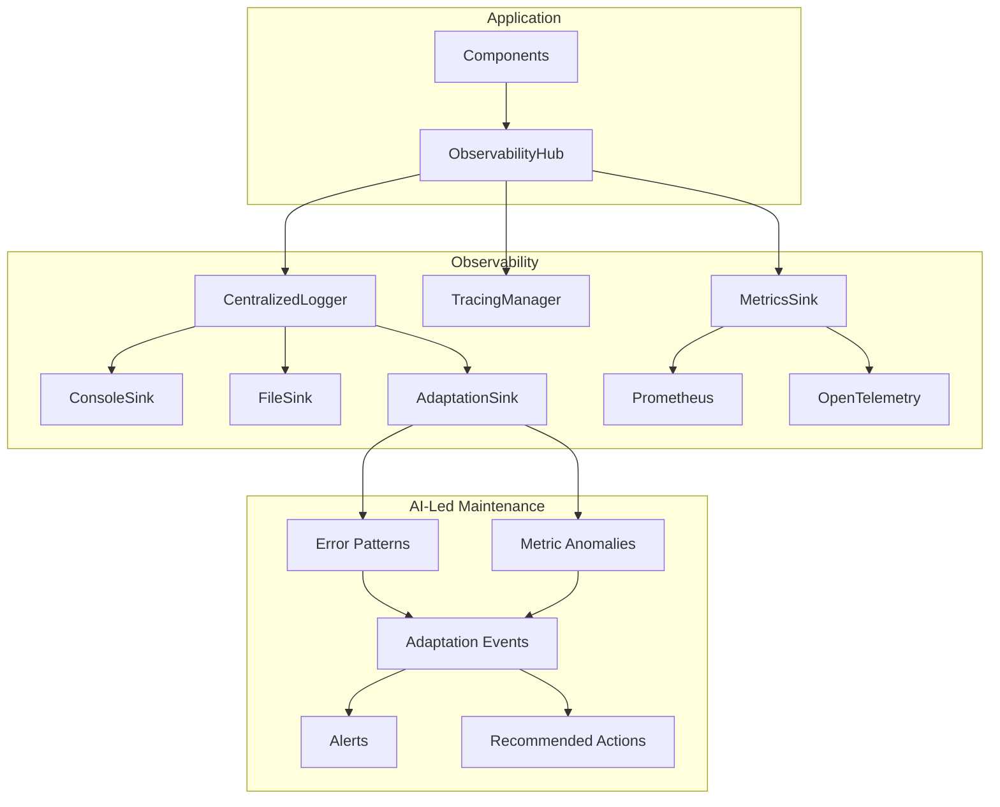

# Observability Infrastructure

Unified observability system for the Chrysalis project, providing centralized logging, distributed tracing, metrics collection, and AI-led adaptation hooks.

## Architecture



## Components

### CentralizedLogger

Structured logging with correlation IDs and multiple output sinks.

```typescript
import { logger } from './observability';

const log = logger('my-component');
log.setCorrelationId('req-123');

log.info('Processing request', { userId: 'user-1' });
log.error('Failed to process', new Error('timeout'), { retries: 3 });

// Timed operations
const endTimer = log.startTimer('database-query');
// ... do work
endTimer(); // Logs duration automatically

// Async with timing
const result = await log.withTiming('api-call', async () => {
  return await fetch('/api/data');
});
```

### TracingManager

Distributed tracing with span management.

```typescript
import { tracer } from './observability';

// Start a trace
const span = tracer().startTrace('process-order', { orderId: '123' });

try {
  // Create child spans
  const dbSpan = tracer().startSpan(span, 'database-lookup');
  // ... database work
  tracer().endSpan(dbSpan);
  
  tracer().setStatus(span, 'ok');
} catch (error) {
  tracer().setStatus(span, 'error', error.message);
  throw error;
} finally {
  tracer().endSpan(span);
}

// Or use the helper
const result = await tracer().withSpan(null, 'operation', async (span) => {
  tracer().addEvent(span, 'checkpoint', { step: 1 });
  return await doWork();
});
```

### ObservabilityHub

Unified API for all observability concerns.

```typescript
import { initializeObservability, getObservabilityHub } from './observability';

// Initialize with configuration
const hub = initializeObservability({
  enableAdaptation: true,
  enablePrometheus: true,
  healthCheckIntervalMs: 60000,
});

// Register health checks
hub.registerHealthCheck('database', async () => ({
  component: 'database',
  status: 'healthy',
  lastCheck: new Date().toISOString(),
}));

// Create alerts
hub.createAlert({
  severity: 'warning',
  title: 'High memory usage',
  message: 'Memory usage exceeded 80%',
  source: 'resource-monitor',
});

// Listen for adaptation events
hub.on('adaptation:event', (event) => {
  console.log('Adaptation needed:', event.type);
  console.log('Recommended actions:', event.recommendedActions);
});

// Get system health
const health = await hub.runHealthChecks();
console.log('System status:', health.status);
```

### Metrics

Prometheus and OpenTelemetry integration.

```typescript
import { getObservabilityHub } from './observability';

const hub = getObservabilityHub();

// Record vector operations
hub.recordVectorOp({
  kind: 'vector.query',
  backend: 'lance',
  latencyMs: 45,
  size: 100,
});

// Record custom metrics
hub.recordMetric('cache.hit_rate', 0.85, { cache: 'embeddings' });
```

## Configuration

### Environment Variables

| Variable | Description | Default |
|----------|-------------|---------|
| `LOG_LEVEL` | Minimum log level | `info` |
| `METRICS_PROMETHEUS` | Enable Prometheus | `false` |
| `METRICS_PROM_PORT` | Prometheus port | `9464` |
| `METRICS_OTEL` | Enable OpenTelemetry | `false` |

### Programmatic Configuration

```typescript
initializeObservability({
  logger: {
    level: 'debug',
    name: 'my-app',
    captureSource: true,
  },
  enablePrometheus: true,
  prometheusPort: 9464,
  enableOtel: true,
  healthCheckIntervalMs: 60000,
  enableAdaptation: true,
  adaptationIntervalMs: 60000,
});
```

## AI-Led Adaptation Integration

The observability system feeds the AI-Led Adaptive Maintenance System through:

### Error Pattern Detection

```typescript
// AdaptationSink automatically detects recurring errors
hub.on('adaptation:event', (event) => {
  if (event.type === 'error-patterns') {
    console.log('Detected patterns:', event.data.patterns);
    // [{ pattern: 'TimeoutError:api-client', count: 15, severity: 'high' }]
  }
});
```

### Metric Anomaly Detection

```typescript
// Z-score based anomaly detection
hub.on('adaptation:event', (event) => {
  if (event.type === 'metric-anomalies') {
    console.log('Anomalies:', event.data.anomalies);
    // [{ metric: 'duration.database', value: 500, threshold: 100, type: 'spike' }]
  }
});
```

### Health Degradation

```typescript
hub.on('adaptation:event', (event) => {
  if (event.type === 'health-degradation') {
    console.log('Health changed:', event.data.previousStatus, '->', event.data.currentStatus);
    console.log('Actions:', event.recommendedActions);
  }
});
```

### Getting Insights

```typescript
const insights = hub.getAdaptationInsights();
console.log('Error patterns:', insights.errorPatterns);
console.log('Recent errors:', insights.recentErrors);
console.log('Metrics summary:', insights.metricsSummary);
```

## Log Entry Structure

```typescript
interface LogEntry {
  id: string;              // Unique entry ID
  timestamp: string;       // ISO timestamp
  level: LogLevel;         // trace|debug|info|warn|error|fatal
  message: string;         // Log message
  logger: string;          // Logger name
  correlationId?: string;  // Request correlation
  traceId?: string;        // Distributed trace ID
  spanId?: string;         // Current span ID
  parentSpanId?: string;   // Parent span ID
  context?: object;        // Additional context
  error?: ErrorDetails;    // Error information
  durationMs?: number;     // Operation duration
  source?: SourceLocation; // Code location
  tags?: string[];         // Filtering tags
  metrics?: object;        // Associated metrics
}
```

## Best Practices

1. **Use correlation IDs** for request tracing across services
2. **Create child loggers** for components with `logger('component-name')`
3. **Use structured context** instead of string interpolation
4. **Register health checks** for all critical dependencies
5. **Set appropriate log levels** per environment
6. **Enable adaptation** in production for proactive maintenance

## Quick Start

```typescript
import { 
  initializeObservability, 
  logger, 
  tracer,
  getObservabilityHub 
} from './observability';

// Initialize once at startup
initializeObservability({
  enableAdaptation: true,
});

// Use throughout application
const log = logger('my-service');
log.info('Service started');

// Trace operations
await tracer().withSpan(null, 'startup', async (span) => {
  await initializeDatabase();
  await loadConfiguration();
});

// Monitor health
const hub = getObservabilityHub();
hub.registerHealthCheck('database', checkDatabase);
hub.registerHealthCheck('cache', checkCache);
```

## References

- [OpenTelemetry Specification](https://opentelemetry.io/docs/specs/)
- [Prometheus Exposition Format](https://prometheus.io/docs/instrumenting/exposition_formats/)
- [AI-Led Adaptive Maintenance Spec](../../plans/ai-led-adaptive-maintenance-system-spec.md)
