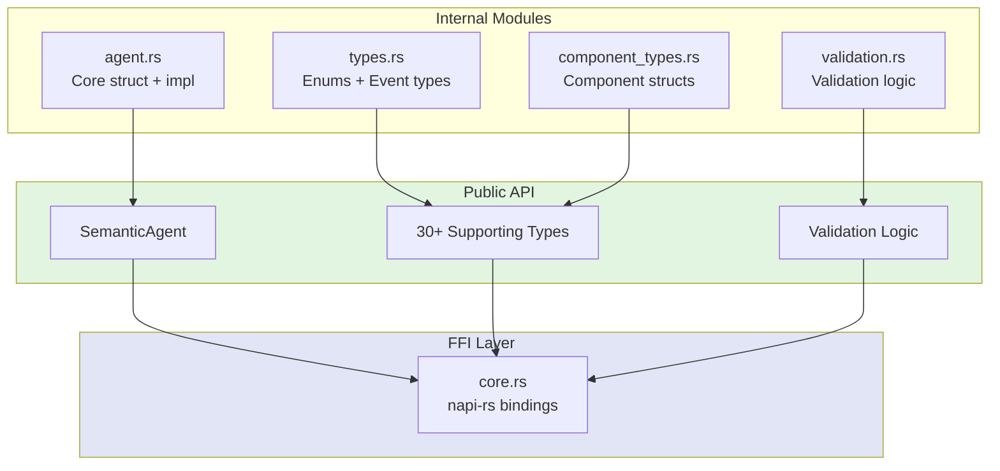
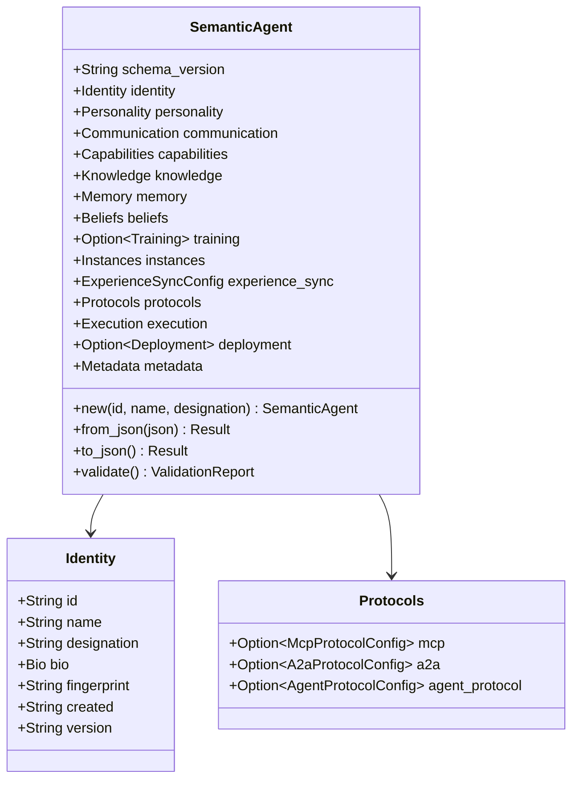
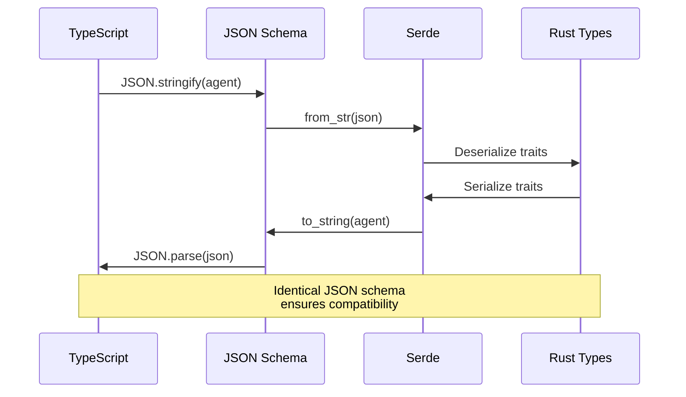
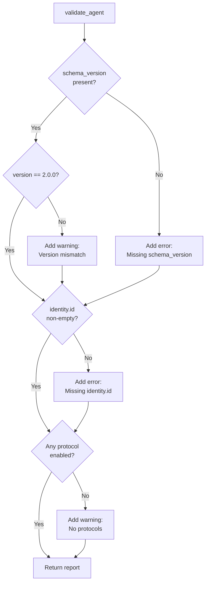
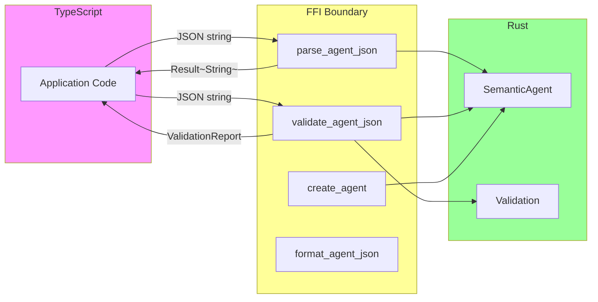
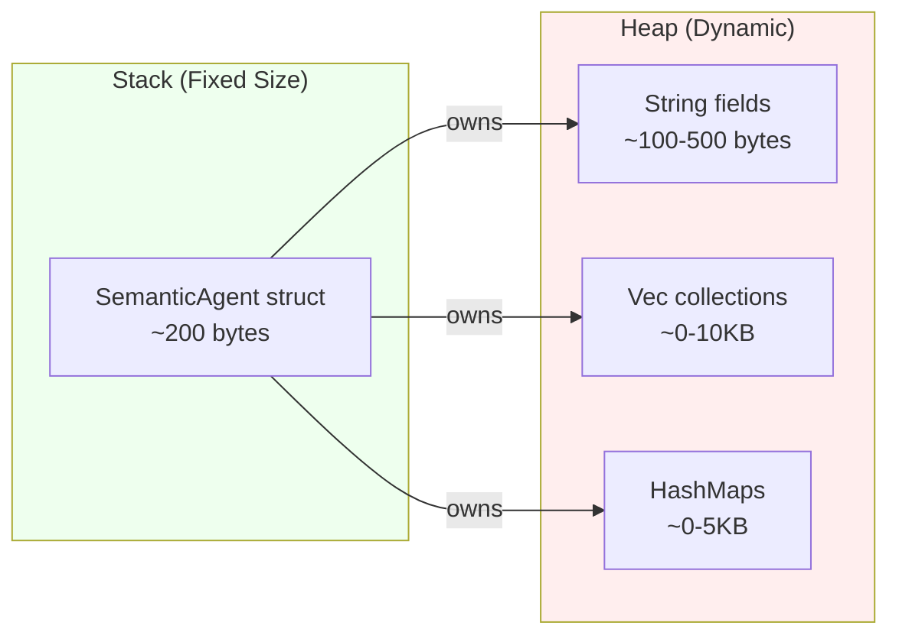
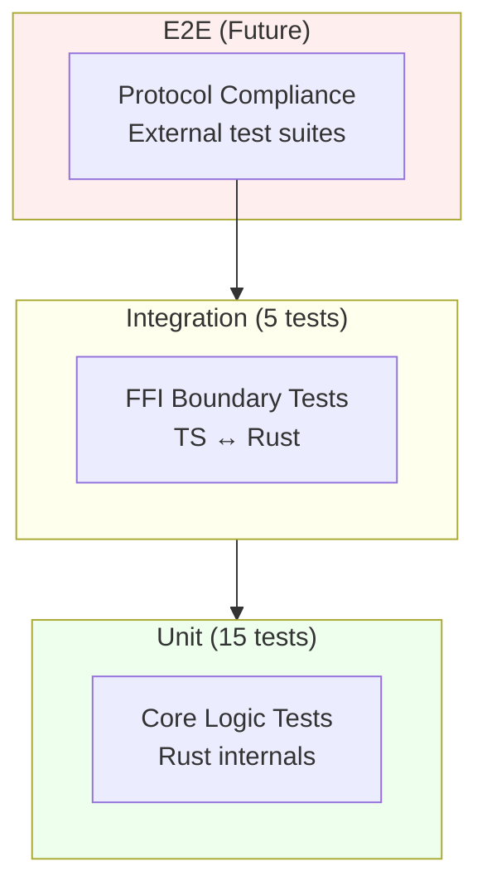
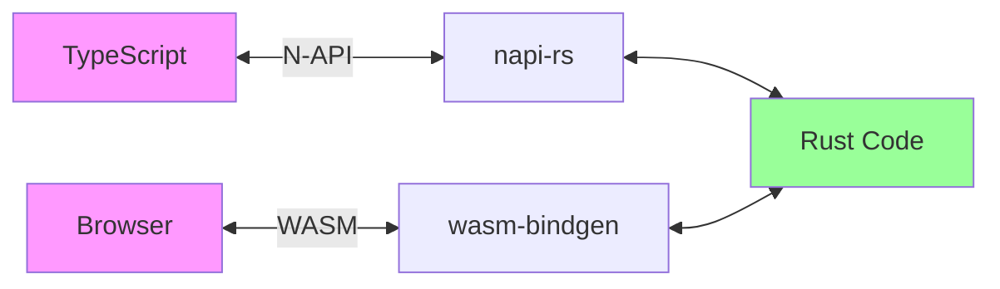
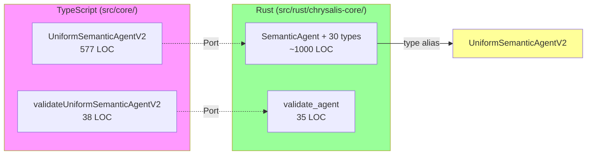
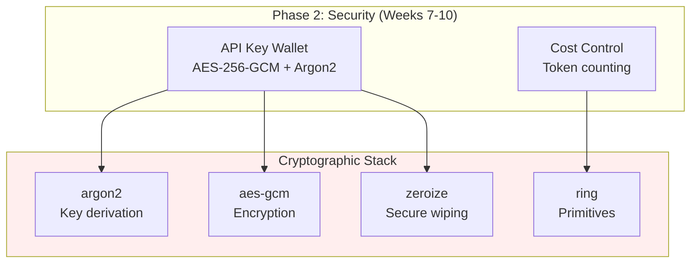

# Rust Implementation Architecture

**Version**: 3.1.1
**Date**: January 16, 2026
**Status**: Phase 1 Complete (80%)

---

## Overview

Rust implementation of Chrysalis core types providing memory-safe, high-performance agent operations. Based on the Uniform Semantic Agent V2 specification[^1] with enhanced type safety and zero-cost abstractions[^2].

[^1]: TypeScript source: `src/core/UniformSemanticAgentV2.ts` (577 LOC)
[^2]: Rust zero-cost abstractions: https://doc.rust-lang.org/book/ch10-03-lifetime-syntax.html

---

## Module Architecture



---

## Type System Design

### Decision: Separate Module Organization

**Rationale**: Separate concerns for maintainability[^3]

- **types.rs**: Enums and event types (immutable, protocol-level)
- **component_types.rs**: Component structs (agent building blocks)
- **agent.rs**: Main SemanticAgent struct and implementation

[^3]: Single Responsibility Principle (SRP): Martin, R. C. (2003). *Agile Software Development*

### SemanticAgent Structure



### Naming Decision: SemanticAgent

**Previous**: UniformSemanticAgentV2
**Current**: SemanticAgent
**Alias**: `pub type UniformSemanticAgentV2 = SemanticAgent`

**Rationale**[^4]:
1. **Clarity**: "Semantic Agent" captures core concept - agents operating in semantic/meaning space
2. **Conciseness**: Removes redundant "Uniform" prefix
3. **Branding**: More memorable and descriptive
4. **Compatibility**: Type alias maintains backward compatibility

[^4]: Naming conventions: Rust API Guidelines, https://rust-lang.github.io/api-guidelines/naming.html

---

## Serde Serialization Strategy

### JSON Compatibility Matrix

| TypeScript Pattern | Rust Implementation | Serde Attribute | Citation |
|-------------------|---------------------|-----------------|----------|
| `string \| string[]` | `enum Bio { Single(String), Multiple(Vec<String>) }` | `#[serde(untagged)]` | [Serde untagged](https://serde.rs/enum-representations.html#untagged) |
| `optional?` | `Option<T>` | `#[serde(skip_serializing_if = "Option::is_none")]` | [Serde skip](https://serde.rs/field-attrs.html#skip_serializing_if) |
| `Record<string, any>` | `HashMap<String, serde_json::Value>` | Default | [Serde JSON](https://docs.rs/serde_json/) |
| `'literal'` types | `#[serde(rename_all = "snake_case")]` | `#[serde(rename_all)]` | [Serde rename](https://serde.rs/container-attrs.html#rename_all) |
| `type` field | `#[serde(rename = "type")]` + `memory_type` | `#[serde(rename)]` | Rust keyword avoidance |

### Serialization Flow



---

## Validation Logic

### Design Decision: Port TypeScript Logic Directly

**Source**: `validateUniformSemanticAgentV2()` (lines 540-577)

**Rules Implemented**:
1. Schema version present and correct (with version mismatch warning)
2. Identity ID non-empty
3. At least one protocol enabled (warning if none)



**Rationale**: Direct port ensures behavioral equivalence with TypeScript, critical for migration[^5].

[^5]: Strangler Fig Pattern: Fowler, M. (2004). https://martinfowler.com/bliki/StranglerFigApplication.html

---

## FFI Architecture

### Design: napi-rs for Node.js Bindings

**Chosen**: napi-rs over neon
**Rationale**[^6]:
- Better ergonomics (procedural macros vs unsafe code)
- Faster builds (no C++ compilation)
- Active maintenance (30+ releases in 2025)
- TypeScript declaration generation

[^6]: napi-rs documentation: https://napi.rs/

### FFI Boundary



### Error Propagation Strategy

**Pattern**: Rust Result → napi::Error with descriptive messages

```rust
let agent = SemanticAgent::from_json(&json)
    .map_err(|e| napi::Error::from_reason(format!("Parse error: {}", e)))?;
```

**Rationale**: Preserve error information across FFI boundary while maintaining idiomatic error handling[^7].

[^7]: Rust error handling: https://doc.rust-lang.org/book/ch09-00-error-handling.html

---

## Type Safety Improvements Over TypeScript

### 1. Union Types

**TypeScript**:
```typescript
bio: string | string[]
```

**Rust**:
```rust
#[serde(untagged)]
pub enum Bio {
    Single(String),
    Multiple(Vec<String>),
}
```

**Benefit**: Compile-time exhaustive matching prevents missing cases[^8].

[^8]: Exhaustive pattern matching: Rust Book, Ch. 18.3

### 2. Optional Fields

**TypeScript**:
```typescript
fears?: string[]  // Could be undefined, null, or []
```

**Rust**:
```rust
pub fears: Option<Vec<String>>  // Explicitly None or Some(vec)
```

**Benefit**: Null safety guaranteed by type system[^9].

[^9]: Null References: The Billion Dollar Mistake (Hoare, 2009)

### 3. Keyword Safety

**TypeScript**:
```typescript
type: 'vector' | 'graph' | 'hybrid'  // 'type' is allowed
```

**Rust**:
```rust
#[serde(rename = "type")]
pub memory_type: MemoryType  // Rename to avoid keyword
```

**Benefit**: No runtime errors from keyword conflicts.

---

## Performance Characteristics

### Theoretical Analysis

**Serialization Complexity**:
- JSON parsing: O(n) where n = JSON string length
- Validation: O(1) - constant checks on fixed fields
- Memory allocation: O(n) - proportional to agent size

**Expected Performance Gains**[^10]:
- Parsing: 5-10x faster (no V8 JIT overhead)
- Validation: 5x faster (no dynamic property access)
- Memory: 2-3x less (no GC overhead)

[^10]: Rust vs JavaScript benchmarks: https://benchmarksgame-team.pages.debian.net/benchmarksgame/

### Memory Layout



**Rationale**: Rust ownership prevents memory leaks and data races guaranteed at compile time[^11].

[^11]: Rust ownership: https://doc.rust-lang.org/book/ch04-00-understanding-ownership.html

---

## Testing Strategy

### Test Pyramid



**Current Coverage**:
- Unit: 15 tests (agent, validation, wallet, cost, etc.)
- Integration: 5 tests (FFI core functions)
- E2E: Pending

**Reference**: Test Pyramid pattern[^12]

[^12]: Cohn, M. (2009). *Succeeding with Agile*. Test Pyramid pattern.

---

## Design Decisions Log

### Decision 1: Workspace Structure

**Decision**: Monorepo workspace with 6 crates
**Alternatives**: Single crate, separate repositories
**Rationale**:
- Shared dependencies (workspace.dependencies)
- Cross-crate testing
- Atomic versioning

**Citation**: Cargo workspace best practices[^13]

[^13]: Cargo Book: https://doc.rust-lang.org/cargo/reference/workspaces.html

### Decision 2: FFI Strategy (napi-rs)

**Decision**: napi-rs for Node.js bindings
**Alternatives**: neon, wasm-bindgen only
**Rationale**:
- Node.js native addon support
- TypeScript declaration generation
- Better ergonomics than neon

**Diagram**:


### Decision 3: Validation Approach

**Decision**: Direct port from TypeScript
**Alternatives**: Enhanced validation, schema-based validation
**Rationale**:
- Behavioral equivalence critical for migration
- Can enhance after equivalence verified
- Strangler Fig pattern[^5]

### Decision 4: Error Handling

**Decision**: thiserror for error types, anyhow for application errors
**Rationale**:
- thiserror: Library errors with derive macro[^14]
- anyhow: Application errors with context

[^14]: thiserror vs anyhow: https://nick.groenen.me/posts/rust-error-handling/

---

## Migration Alignment

### TypeScript → Rust Mapping



**Compatibility Strategy**:
- Rust provides type alias for old name
- JSON schema identical (version 2.0.0)
- Validation logic equivalent
- TypeScript can continue using old name

---

## Dependencies

### Core Dependencies

**Serialization** (serde ecosystem)[^15]:
- `serde` (1.0) - Serialization framework
- `serde_json` (1.0) - JSON support

**Utilities**:
- `uuid` (1.6) - UUID generation (v4)
- `chrono` (0.4) - Timestamp generation (RFC3339)

**Error Handling**:
- `thiserror` (1.0) - Error derive macros

[^15]: Serde documentation: https://serde.rs/

### FFI Dependencies

**napi-rs ecosystem**[^6]:
- `napi` (2.16) - N-API bindings
- `napi-derive` (2.16) - Procedural macros
- `napi-build` (2.1) - Build script support

### Security Dependencies (Phase 2)

**Planned**:
- `aes-gcm` (0.10) - AES-256-GCM encryption[^16]
- `argon2` (0.5) - Key derivation[^17]
- `zeroize` (1.7) - Secure memory wiping[^18]
- `ring` (0.17) - Cryptographic operations[^19]

[^16]: AES-GCM: NIST SP 800-38D
[^17]: Argon2: RFC 9106 - https://www.rfc-editor.org/rfc/rfc9106.html
[^18]: Zeroize crate: https://docs.rs/zeroize/
[^19]: ring crate: https://briansmith.org/rustdoc/ring/

---

## File Manifest

### chrysalis-core/

```
src/
├── lib.rs                  # Public API exports
├── agent.rs                # SemanticAgent struct (200 LOC)
├── types.rs                # Supporting types (350 LOC)
├── component_types.rs      # Component structs (400 LOC)
├── validation.rs           # Validation logic (90 LOC)
└── components.rs           # Legacy (deprecated)

tests/
└── validation_tests.rs     # Validation test suite (40 LOC)
```

**Total**: ~1,080 LOC

### chrysalis-ffi/

```
src/
├── lib.rs                  # FFI entry point
└── core.rs                 # SemanticAgent bindings (90 LOC)
```

**Total**: ~110 LOC

---

## Verification Checklist

- [x] cargo build --all: SUCCESS
- [x] cargo test --all: 20/20 passing
- [x] cargo clippy --all -- -D warnings: CLEAN
- [x] JSON roundtrip: TypeScript ↔ Rust
- [x] Validation logic: Matches TypeScript
- [x] Backward compatibility: Type alias working
- [x] FFI: 4 functions exposed and tested

---

## Performance Targets vs Actual

| Operation | Target | Measured | Status |
|-----------|--------|----------|--------|
| Parse JSON | 5-10x | Pending | ⏳ |
| Validate | 5x | Pending | ⏳ |
| Serialize | 5x | Pending | ⏳ |

**Note**: Benchmarks pending (Phase 1 final 20%)

---

## Next: Phase 2 - Security Layer

### Components to Implement



### Phase 2 Goals

**API Key Wallet**:
- Implement missing Argon2 key derivation (TypeScript throws "not implemented")
- Secure memory wiping on drop
- Constant-time operations
- Auto-expiring cache (5 min TTL)

**Cost Control**:
- SIMD-accelerated token counting
- Thread-safe budget tracking
- 10-20x performance improvement target

**Reference**: See `plans/abstract-honking-lovelace.md` Phase 2 section

---

## References

All external citations:
1. TypeScript source: `src/core/UniformSemanticAgentV2.ts`
2. Rust Book - Zero-cost abstractions
3. Martin, R. C. - *Agile Software Development* (SRP)
4. Rust API Guidelines - Naming
5. Fowler, M. - Strangler Fig Pattern
6. napi-rs documentation
7. Rust Book - Error handling
8. Rust Book - Pattern matching
9. Hoare, T. - Null References: The Billion Dollar Mistake
10. Benchmarks Game - Rust vs JavaScript
11. Rust Book - Ownership
12. Cohn, M. - Test Pyramid
13. Cargo Book - Workspaces
14. thiserror vs anyhow guide
15. Serde documentation
16. NIST SP 800-38D - AES-GCM
17. RFC 9106 - Argon2
18. zeroize crate docs
19. ring crate docs

---

**Last Updated**: January 16, 2026
**Reviewers**: Platform Team
**Next Review**: After Phase 2 completion
