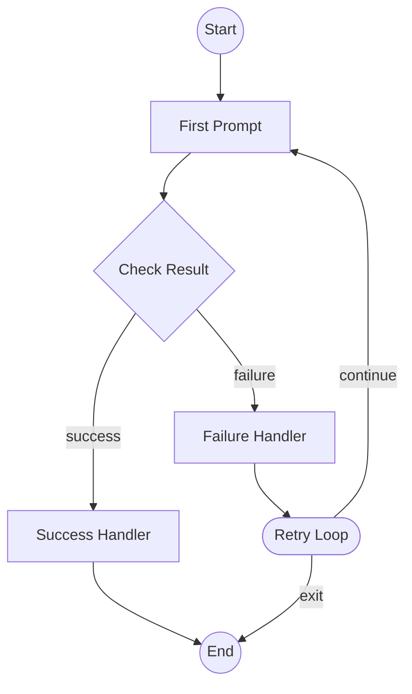

# Universal Adapter

A general-purpose JSON-driven logic processor for orchestrating LLM-based task execution.

## Table of Contents

- [Overview](#overview)
- [Architecture](#architecture)
- [Security](#security)
- [Installation](#installation)
- [Quick Start](#quick-start)
- [CLI Reference](#cli-reference)
- [Slash Commands](#slash-commands)
- [Programmatic API](#programmatic-api)
- [Task Schema](#task-schema)
- [Examples](#examples)
- [Integration Guide](#integration-guide)

## Overview

The Universal Adapter is a **state machine executor** that interprets Mermaid flow diagrams to orchestrate LLM calls. The core abstraction: nodes are execution points (prompts, conditions, loops) and edges are conditional transitions based on response categorization.

### Key Features

- **Declarative Task Definition** - Define complex workflows in JSON with Mermaid diagrams
- **Multi-Provider LLM Support** - OpenAI and Anthropic providers
- **Comprehensive CLI** - Full command-line interface for terminal usage
- **Slash Commands** - TUI integration for agent-driven systems
- **Programmatic API** - Clean async/sync API for agents and automation
- **Goal Verification** - Automatic verification of task completion

## Architecture

```
┌─────────────────────────────────────────────────────────────────────┐
│                        task.json                                     │
│  ┌──────────┐ ┌──────────────┐ ┌──────────┐ ┌────────┐ ┌─────────┐ │
│  │   Goal   │ │ Resource LLM │ │ Registry │ │Prompts │ │  Flow   │ │
│  └──────────┘ └──────────────┘ └──────────┘ └────────┘ └─────────┘ │
└─────────────────────────────────────────────────────────────────────┘
                                   │
                                   ▼
┌─────────────────────────────────────────────────────────────────────┐
│                      Universal Adapter                               │
│  ┌─────────────┐   ┌─────────────┐   ┌─────────────────────────┐   │
│  │Schema Parser│──▶│Flow Parser  │──▶│     Flow Executor       │   │
│  └─────────────┘   │(Mermaid)    │   │  (State Machine)        │   │
│                    └─────────────┘   └───────────┬─────────────┘   │
│                                                  │                  │
│  ┌─────────────┐   ┌─────────────┐   ┌──────────▼──────────┐       │
│  │Interpolator │◀──│ LLM Client  │◀──│  Node Handlers      │       │
│  │(Templates)  │   │(API calls)  │   │  - Prompt           │       │
│  └─────────────┘   └─────────────┘   │  - Condition        │       │
│                                      │  - Loop             │       │
│  ┌─────────────┐   ┌─────────────┐   │  - Registry         │       │
│  │ Categorizer │──▶│Goal Verifier│   └─────────────────────┘       │
│  │(Responses)  │   │(Completion) │                                  │
│  └─────────────┘   └─────────────┘                                  │
└─────────────────────────────────────────────────────────────────────┘
                                   │
                                   ▼
                         ┌────────────────┐
                         │ AdapterResult  │
                         │ - success      │
                         │ - goal_met     │
                         │ - responses    │
                         │ - verification │
                         └────────────────┘
```

## Security

The Universal Adapter includes a comprehensive security system that controls access to operations, file paths, and LLM providers.

### Permission Levels

| Level | Description | Use Case |
|-------|-------------|----------|
| `ADMIN` | Full access to all operations | Direct CLI usage by power users |
| `USER` | Standard access with path restrictions | TUI/interactive usage |
| `AGENT` | Read-mostly, explicitly specified providers | Automated agents (Ada, etc.) |
| `LOCKED` | No operations allowed | Emergency lockdown |

### Security Context

```python
from universal_adapter import (
    SecurityContext,
    PermissionLevel,
    create_admin_context,
    create_user_context,
    create_agent_context,
)

# Create context for different scenarios
admin_ctx = create_admin_context()      # Full access
user_ctx = create_user_context()        # Restricted file access
agent_ctx = create_agent_context(allowed_providers=["anthropic"])  # Restricted providers, no writes

# Use with CLI
from universal_adapter import CLICommands
cli = CLICommands(security_context=agent_ctx)

# Use with API
from universal_adapter.api import run_task
result = await run_task("simple_qa", security_context=agent_ctx)
```

### Path Sandboxing

File operations are validated against the security context:

- **Workspace restriction**: Paths must be within the current workspace
- **Traversal prevention**: `../` and absolute paths are blocked
- **Sensitive file protection**: Blocks access to `.env`, credentials, keys
- **Extension filtering**: Only `.json`, `.yaml`, `.yml`, `.mmd` allowed for writes

```python
from universal_adapter import SecurityContext, PathSecurityError

ctx = SecurityContext(
    permission_level=PermissionLevel.USER,
    allowed_directories=["./tasks", "./examples"],
)

try:
    path = ctx.validate_write_path("../outside/task.json")
except PathSecurityError as e:
    print(f"Blocked: {e}")  # Path outside workspace
```

### Provider Restrictions

Control which LLM providers can be used:

```python
# Agent context - must explicitly specify providers
ctx = create_agent_context(allowed_providers=["anthropic"])

# User context - all providers allowed
ctx = create_user_context()

# Custom restriction
ctx = SecurityContext(
    permission_level=PermissionLevel.USER,
    allowed_providers=["anthropic"],  # No OpenAI
)
```

### Operation Permissions

Fine-grained control over individual operations:

| Operation | ADMIN | USER | AGENT |
|-----------|-------|------|-------|
| `READ_TASK` | ✓ | ✓ | ✓ |
| `LIST_TASKS` | ✓ | ✓ | ✓ |
| `VALIDATE_TASK` | ✓ | ✓ | ✓ |
| `RUN_TASK` | ✓ | ✓ | ✓ |
| `RUN_WITH_REAL_PROVIDER` | ✓ | ✓ | ✗ |
| `CREATE_TASK` | ✓ | ✓ | ✗ |
| `WRITE_FILE` | ✓ | ✓* | ✗ |
| `OVERRIDE_PROVIDER` | ✓ | ✓ | ✗ |

*With path restrictions

### Slash Command Security

Slash commands use `USER` level by default. For agents, use secure parser factories:

```python
from universal_adapter import (
    create_user_parser,
    create_agent_parser,
    create_readonly_parser,
)

# For TUI with standard restrictions
parser = create_user_parser()

# For automated agents (Ada)
parser = create_agent_parser()

# Read-only access
parser = create_readonly_parser()
```

### Best Practices

1. **Use appropriate context**: Match permission level to use case
2. **Prefer named tasks**: Load from task library instead of file paths
3. **Audit writes**: Enable `require_confirmation_for_writes` for USER level
4. **Limit iterations**: Set reasonable `max_iterations` for agents
5. **Explicit providers**: Always explicitly specify allowed providers for agents

## Installation

The Universal Adapter is part of the Chrysalis project. Ensure you have the required dependencies:

```bash
pip install httpx  # For LLM API calls
```

## Quick Start

### Terminal (CLI)

```bash
# Run a task
python -m universal_adapter run simple_qa

# With debug output
python -m universal_adapter run task.json --debug

# Validate a task
python -m universal_adapter validate my_task.json

# List available tasks
python -m universal_adapter list --verbose

# Get help
python -m universal_adapter help
```

### Python (Programmatic)

```python
from universal_adapter import run_task

# Simple execution
result = run_task("simple_qa")
if result.success:
    print(result.final_response)
```

### Slash Commands (TUI/Agent)

```python
from universal_adapter import execute_slash_command, is_slash_command

user_input = "//run simple_qa --debug"
if is_slash_command(user_input):
    result = execute_slash_command(user_input)
    print(result.format())
```

---

## CLI Reference

The CLI provides a comprehensive interface for all Universal Adapter operations.

### Global Options

| Option | Description |
|--------|-------------|
| `--version` | Show version |
| `--format {text,json,markdown}` | Output format (default: text) |

### Commands

#### `run` - Execute a Task

Execute a task and return results.

```bash
python -m universal_adapter run <task> [options]
```

**Arguments:**
- `task` - Task name, file path, or inline JSON

**Options:**
| Option | Short | Description |
|--------|-------|-------------|
| `--debug` | `-d` | Enable debug output |
| `--timeout` | `-t` | Timeout in seconds (default: 300) |
| `--max-iterations` | | Maximum state iterations (default: 1000) |
| `--no-strict` | | Disable strict validation |
| `--provider` | | Override LLM provider |
| `--model` | | Override LLM model |
| `--var KEY VALUE` | `-v` | Set context variable (repeatable) |

**Examples:**
```bash
# Run named task
python -m universal_adapter run simple_qa

# Run from file with debug
python -m universal_adapter run ./my_task.json --debug

# With variables and custom timeout
python -m universal_adapter run research_synthesis -v topic "AI Safety" --timeout 600

# Override provider
python -m universal_adapter run task.json --provider anthropic --model claude-3-5-sonnet-20241022
```

#### `validate` - Validate a Task

Validate a task without executing it.

```bash
python -m universal_adapter validate <task> [options]
```

**Options:**
| Option | Description |
|--------|-------------|
| `--no-strict` | Disable strict validation |

**Examples:**
```bash
python -m universal_adapter validate task.json
python -m universal_adapter validate simple_qa
```

#### `inspect` - Inspect a Task

Show detailed information about a task.

```bash
python -m universal_adapter inspect <task> [options]
```

**Options:**
| Option | Description |
|--------|-------------|
| `--no-flow` | Hide flow diagram |
| `--no-prompts` | Hide prompt templates |
| `--no-registry` | Hide registry entries |
| `--no-goal` | Hide goal information |

**Examples:**
```bash
python -m universal_adapter inspect simple_qa
python -m universal_adapter inspect task.json --no-prompts
```

#### `list` - List Available Tasks

List all named tasks in the task library.

```bash
python -m universal_adapter list [options]
```

**Options:**
| Option | Short | Description |
|--------|-------|-------------|
| `--verbose` | `-v` | Show detailed task information |

**Examples:**
```bash
python -m universal_adapter list
python -m universal_adapter list --verbose
```

#### `providers` - List LLM Providers

Show available LLM providers and their status.

```bash
python -m universal_adapter providers [options]
```

**Options:**
| Option | Description |
|--------|-------------|
| `--no-check` | Skip API key configuration check |

#### `flow` - Analyze Flow Diagram

Parse and analyze a Mermaid flow diagram.

```bash
python -m universal_adapter flow <source> [options]
```

**Arguments:**
- `source` - Task name, file path, or raw Mermaid text

**Options:**
| Option | Description |
|--------|-------------|
| `--format {text,mermaid,dot}` | Output format |

**Examples:**
```bash
python -m universal_adapter flow simple_qa
python -m universal_adapter flow diagram.mmd --format dot
```

#### `create` - Create a New Task

Create a new task from a template.

```bash
python -m universal_adapter create <name> [options]
```

**Arguments:**
- `name` - Name for the new task

**Options:**
| Option | Short | Description |
|--------|-------|-------------|
| `--template {simple,loop,conditional}` | | Template type (default: simple) |
| `--output` | `-o` | Output file path |
| `--description` | | Goal description |
| `--provider` | | LLM provider (default: anthropic) |
| `--model` | | Model name (default: claude-3-5-sonnet-20241022) |

**Examples:**
```bash
python -m universal_adapter create my_task
python -m universal_adapter create research --template loop
python -m universal_adapter create qa --output ./tasks/qa_task.json
```

#### `help` - Show Help

Show help information.

```bash
python -m universal_adapter help [command]
```

---

## Slash Commands

Slash commands provide a TUI-friendly interface for agent integration. Commands are prefixed with `//`.

### Configuration

```python
from universal_adapter import SlashCommandParser, SlashCommandConfig

# Custom configuration
config = SlashCommandConfig(
    prefix="//",           # Command prefix
    allow_multiline=False, # Single-line commands only
    strict_parsing=True,   # Fail on unknown commands
)

parser = SlashCommandParser(config)
```

### Available Commands

| Command | Aliases | Description |
|---------|---------|-------------|
| `//run <task>` | `//r`, `//exec` | Execute a task |
| `//validate <task>` | `//val`, `//check` | Validate a task |
| `//inspect <task>` | `//info`, `//show` | Inspect a task |
| `//list` | `//ls`, `//tasks` | List available tasks |
| `//providers` | `//prov`, `//llms` | Show LLM providers |
| `//flow <source>` | `//diagram`, `//graph` | Analyze flow diagram |
| `//create <name>` | `//new`, `//init` | Create a new task |
| `//help [cmd]` | `//h`, `//?` | Show help |

### Usage Examples

```python
from universal_adapter import (
    SlashCommandParser,
    execute_slash_command,
    is_slash_command,
    get_command_suggestions,
)

# Check if input is a slash command
if is_slash_command(user_input):
    result = execute_slash_command(user_input)
    print(result.format())

# Parse without executing
parser = SlashCommandParser()
parsed = parser.parse("//run simple_qa --debug")
print(f"Command: {parsed.command}")
print(f"Args: {parsed.args}")
print(f"Options: {parsed.options}")

# Get autocomplete suggestions
suggestions = get_command_suggestions("//ru")
# Returns: ["//run"]

# Get command list for UI
commands = parser.get_command_list()
for cmd in commands:
    print(f"{cmd['name']}: {cmd['description']}")
```

### Integration with Ada (UI Agent)

Ada can use the slash command system to present actionable commands to users:

```python
from universal_adapter import SlashCommandParser

parser = SlashCommandParser()

# Get formatted help for display
help_text = parser.format_command_help()

# Get suggestions as user types
def on_user_typing(partial_input):
    if partial_input.startswith("//"):
        suggestions = parser.get_suggestions(partial_input)
        display_autocomplete(suggestions)

# Execute user command
def on_user_submit(input_text):
    if parser.is_command(input_text):
        result = parser.execute(input_text)
        display_result(result.format())
```

---

## Programmatic API

The API module provides a clean interface for programmatic integration.

### Core Functions

#### `run_task` - Execute a Task (Async)

```python
from universal_adapter.api import run_task

result = await run_task(
    task="simple_qa",
    variables={"question": "What is 2+2?"},
    debug=True,
    max_iterations=1000,
    timeout_seconds=300,
    strict=True,
    provider="anthropic",
    model="claude-3-5-sonnet-20241022",
)

if result.success:
    print(result.data.final_response)
    print(f"Completed in {result.data.execution_time_ms}ms")
else:
    print(f"Error: {result.error}")
```

#### `run_task_sync` - Execute a Task (Sync)

```python
from universal_adapter.api import run_task_sync

result = run_task_sync("simple_qa", variables={"question": "Hello"})
```

#### `validate_task` - Validate a Task

```python
from universal_adapter.api import validate_task, ValidationLevel

result = validate_task(
    task="my_task.json",
    level=ValidationLevel.STRICT,
)

if result.success:
    print(f"Valid: {result.data.valid}")
    print(f"Nodes: {result.data.task_info['nodes']}")
else:
    for error in result.data.errors:
        print(f"Error: {error}")
```

#### `inspect_task` - Get Task Details

```python
from universal_adapter.api import inspect_task

result = inspect_task(
    task="simple_qa",
    include_flow=True,
    include_prompts=True,
)

if result.success:
    print(f"Name: {result.data.name}")
    print(f"Goal: {result.data.goal['description']}")
    for prompt in result.data.prompts:
        print(f"  P{prompt['index']}: {prompt['description']}")
```

#### `list_available_tasks` - List Tasks

```python
from universal_adapter.api import list_available_tasks

result = list_available_tasks(verbose=True)

for task in result.data:
    print(f"{task.name}: {task.description}")
```

#### `list_providers` - List LLM Providers

```python
from universal_adapter.api import list_providers

result = list_providers(check_keys=True)

for provider in result.data:
    status = "✓" if provider.api_key_configured else "✗"
    print(f"{status} {provider.name}: {', '.join(provider.models)}")
```

#### `analyze_flow` - Analyze Flow Diagram

```python
from universal_adapter.api import analyze_flow

result = analyze_flow("simple_qa")

if result.success:
    print(f"Nodes: {result.data.node_count}")
    print(f"Has cycles: {result.data.has_cycles}")
    print(f"Node types: {result.data.node_types}")
```

#### `create_task` - Create Task Programmatically

```python
from universal_adapter.api import create_task, save_task

result = create_task(
    name="my_custom_task",
    goal_description="Answer questions about AI",
    prompts=[
        {
            "template": "Answer: {{question}}",
            "role": "user",
            "description": "Main prompt",
        }
    ],
    flow_mermaid="graph TD\n    START --> P0 --> END",
    provider="anthropic",
    model="claude-3-5-sonnet-20241022",
)

if result.success:
    # Save to file
    save_task(result.data, "my_custom_task.json")
```

### Request/Response Types

#### TaskRequest

```python
from universal_adapter.api import TaskRequest, execute_request

request = TaskRequest(
    task="simple_qa",
    variables={"question": "Hello"},
    debug=True,
    max_iterations=500,
    timeout_seconds=120,
    tags=["test", "qa"],
    metadata={"user": "agent"},
)

result = await execute_request(request)
```

#### APIResponse

All API functions return `APIResponse[T]`:

```python
response.success     # bool - Whether operation succeeded
response.data        # T - Result data (type varies by function)
response.error       # str | None - Error message if failed
response.errors      # list[str] - All errors
response.warnings    # list[str] - Warnings
response.metadata    # dict - Additional metadata

# Convert to JSON
json_str = response.to_json()

# Convert to dict
data = response.to_dict()
```

---

## Task Schema

A task specification has five required components plus optional metadata.

### Complete Schema

```json
{
  "name": "task_name",
  "version": "1.0.0",
  "task_id": "unique-id",
  "task_type": "research",
  "priority": "normal",

  "goal": {
    "description": "What the task should accomplish",
    "target_conditions": [
      {
        "description": "Condition description",
        "evaluation_type": "GOAL_MET",
        "expected_value": null
      }
    ]
  },

  "resource_llm": {
    "provider": "anthropic",
    "model": "claude-3-5-sonnet-20241022",
    "temperature": 0.7,
    "max_tokens": 4096,
    "api_key_env": "ANTHROPIC_API_KEY"
  },

  "resource_registry": {
    "entries": [
      {
        "name": "reference_name",
        "category": "schema",
        "schema_ref": "#/definitions/Type",
        "source_url": "https://..."
      }
    ]
  },

  "prompts": [
    {
      "template": "Prompt with {{variables}} and {{registry:name}}",
      "role": "user",
      "description": "Step description"
    }
  ],

  "flow_diagram": {
    "mermaid": "graph TD\n    START --> P0 --> END"
  }
}
```

### Template Interpolation

| Syntax | Description | Example |
|--------|-------------|---------|
| `{{variable}}` | Context variable | `{{topic}}` |
| `{{registry:name}}` | Registry entry URL | `{{registry:schema}}` |
| `{{registry:name.field}}` | Registry field | `{{registry:schema.category}}` |
| `{{response:node_id}}` | Previous response | `{{response:P0}}` |
| `{{response:node_id.path}}` | JSON path in response | `{{response:P0.data.items}}` |
| `{{loop.index}}` | Current loop iteration | `{{loop.index}}` |
| `{{loop.count}}` | Total loop count | `{{loop.count}}` |

### Flow Diagram Syntax



**Node Types:**
- `((label))` - Circle: START/END nodes
- `[label]` - Rectangle: Prompt nodes (P0, P1, ...)
- `{label}` - Diamond: Condition nodes
- `([label])` - Stadium: Loop nodes

**Supported Mermaid Subset (intentional):**
- IDs: alphanumeric/underscore only (e.g., `START`, `P0`, `GOAL`); no dashes, spaces, or dotted paths.
- Edges: `A --> B` or `A -->|condition| B`; no `-.->`, `==>`, text links, or chained multi-label edges.
- Shapes: circle/rectangle/diamond/stadium only; no subgraphs, class/style directives, links, or swimlanes.
- Direction: `graph/flowchart TD` only.
- Node typing is inferred from IDs/labels (START/END/COND/LOOP/REG/GOAL/Pn); unfamiliar patterns default to PROMPT.

Diagrams using unsupported features will fail validation; expand the parser first if you need richer Mermaid syntax.

**Edge Conditions:**
- `-->` - Unconditional transition
- `-->|condition|` - Conditional transition

### Evaluation Types

| Type | Description |
|------|-------------|
| `CATEGORY_MATCH` | Final category matches expected |
| `CONTAINS` | Response contains expected text |
| `ITERATION_LIMIT` | Completed within iteration count |
| `GOAL_MET` | Heuristic positive outcome |
| `CUSTOM` | Custom evaluation logic |

---

## Examples

### Simple Q&A Task

```json
{
  "name": "simple_qa",
  "goal": {
    "description": "Answer a question",
    "target_conditions": [
      {"description": "Answer provided", "evaluation_type": "GOAL_MET"}
    ]
  },
  "resource_llm": {
    "provider": "anthropic",
    "model": "claude-3-5-sonnet-20241022"
  },
  "resource_registry": {"entries": []},
  "prompts": [
    {
      "template": "Answer: {{question}}",
      "role": "user",
      "description": "Answer the question"
    }
  ],
  "flow_diagram": {
    "mermaid": "graph TD\n    START --> P0 --> END"
  }
}
```

### Research with Loop

```json
{
  "name": "research_loop",
  "goal": {
    "description": "Research and summarize a topic",
    "target_conditions": [
      {"description": "Summary produced", "evaluation_type": "GOAL_MET"},
      {"description": "Within 20 iterations", "evaluation_type": "ITERATION_LIMIT", "expected_value": "20"}
    ]
  },
  "resource_llm": {
    "provider": "anthropic",
    "model": "claude-3-5-sonnet-20241022"
  },
  "resource_registry": {"entries": []},
  "prompts": [
    {
      "template": "Identify key aspects of: {{topic}}",
      "description": "Decompose topic"
    },
    {
      "template": "Research aspect {{loop.index}}:\n{{response:P0}}",
      "description": "Deep dive"
    },
    {
      "template": "Synthesize:\n{{response:P1}}",
      "description": "Summarize"
    }
  ],
  "flow_diagram": {
    "mermaid": "graph TD\n    START --> P0\n    P0 --> LOOP([Research])\n    LOOP -->|continue| P1\n    P1 --> LOOP\n    LOOP -->|exit| P2\n    P2 --> END"
  }
}
```

---

## Integration Guide

### For Ada (UI Agent)

Ada can use the Universal Adapter to:

1. **Present Commands**: Show available slash commands to users
2. **Execute Tasks**: Run tasks based on user requests
3. **Suggest Commands**: Provide autocomplete suggestions

```python
from universal_adapter import (
    SlashCommandParser,
    is_slash_command,
    execute_slash_command,
    get_command_suggestions,
)

class AdaIntegration:
    def __init__(self):
        self.parser = SlashCommandParser()

    def get_available_commands(self):
        """Get commands Ada can present to users."""
        return self.parser.get_command_list()

    def process_user_input(self, text):
        """Process user input that might be a slash command."""
        if is_slash_command(text):
            result = execute_slash_command(text)
            return {
                "type": "command_result",
                "success": result.success,
                "output": result.format(),
            }
        return {"type": "text", "content": text}

    def suggest_commands(self, partial):
        """Get suggestions for autocomplete."""
        return get_command_suggestions(partial)

    def format_command_for_user(self, task_name, options=None):
        """Format a command that Ada can present to user."""
        cmd = f"//run {task_name}"
        if options:
            if options.get("debug"):
                cmd += " --debug"
            for key, value in options.get("variables", {}).items():
                cmd += f" -v {key}={value}"
        return cmd
```

### For Other System Agents

```python
from universal_adapter.api import (
    run_task,
    validate_task,
    list_available_tasks,
    TaskRequest,
)

class AgentTaskRunner:
    async def execute_task(self, task_name, context):
        """Execute a task with agent context."""
        result = await run_task(
            task=task_name,
            variables=context,
            timeout_seconds=120,
        )
        return result.data if result.success else None

    async def discover_tasks(self):
        """Discover available tasks."""
        result = list_available_tasks(verbose=True)
        return [
            {"name": t.name, "description": t.description}
            for t in result.data
            if t.available
        ]
```

---

## Module Structure

```
universal_adapter/
├── __init__.py          # Public API exports
├── __main__.py          # CLI entry point
├── api.py               # Programmatic API
├── cli.py               # Command-line interface
├── core.py              # UniversalAdapter orchestrator
├── schema.py            # Immutable task schema dataclasses
├── slash_commands.py    # Slash command parser
├── task_library.py      # Named task registry
├── flow/
│   ├── graph.py         # FlowGraph, FlowNode, FlowEdge
│   ├── parser.py        # MermaidParser
│   └── executor.py      # FlowExecutor (state machine)
├── engine/
│   ├── interpolator.py  # TemplateInterpolator
│   └── llm_client.py    # LLMClient (OpenAI, Anthropic)
├── evaluator/
│   └── categorizer.py   # ResponseCategorizer
├── verifier/
│   └── goal_verifier.py # GoalVerifier
└── examples/
    ├── simple_qa_task.json
    └── research_task.json
```

## Supported Providers

| Provider | Models | Env Variable |
|----------|--------|--------------|
| OpenAI | gpt-4o, gpt-4, o1-preview | `OPENAI_API_KEY` |
| Anthropic | claude-3-5-sonnet, claude-3-opus | `ANTHROPIC_API_KEY` |

---

## License

Part of the Chrysalis project.
