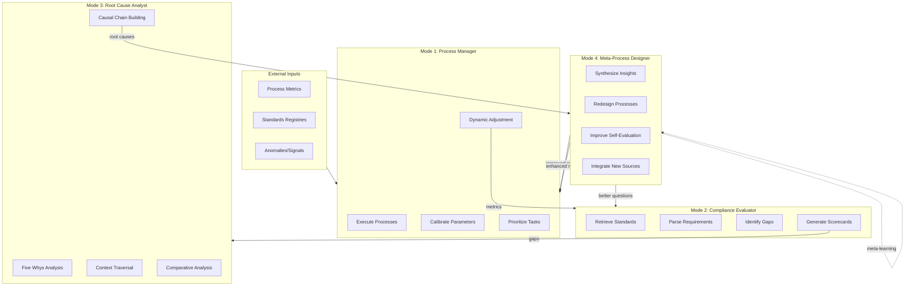
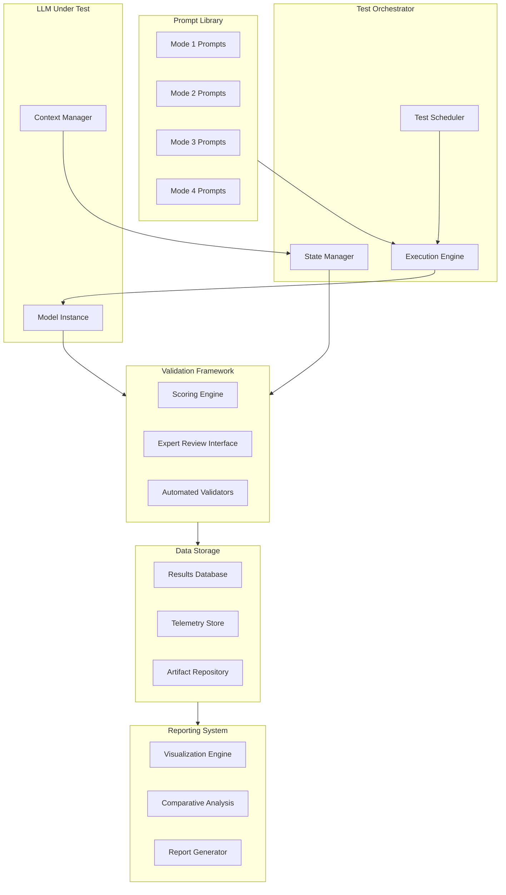
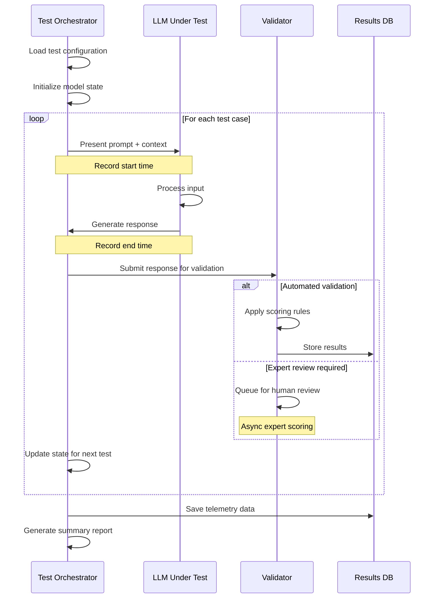

# LLM Evaluation Framework for Neurosymbolic Continuous Improvement Systems

**Version**: 1.0.0  
**Created**: 2026-01-17  
**Status**: Specification  
**Purpose**: Standardized benchmarking suite for evaluating small-scale local LLMs within multi-modal continuous improvement architectures

---

## Table of Contents

1. [Executive Summary](#executive-summary)
2. [System Architecture Context](#system-architecture-context)
3. [Four Operational Modes](#four-operational-modes)
4. [Evaluation Dimensions](#evaluation-dimensions)
5. [Test Harness Architecture](#test-harness-architecture)
6. [Scoring Methodology](#scoring-methodology)
7. [Implementation Roadmap](#implementation-roadmap)
8. [Integration Points](#integration-points)

---

## Executive Summary

This framework provides standardized evaluation of LLMs operating within a neurosymbolic continuous improvement kata engine. The system implements a closed-loop PDCA-style improvement cycle through four interdependent cognitive modes:

1. **Process Manager & Orchestrator** - Real-time execution and calibration
2. **Process Analyst & Compliance Evaluator** - Standards comparison and gap analysis
3. **Root Cause Analyst & Deep Research Investigator** - Multi-hop causal reasoning
4. **Complex Learning Synthesizer & Meta-Process Designer** - Higher-order synthesis and self-improvement

Each mode builds upon outputs from prior modes while feeding insights forward, creating a self-reflective process optimization engine with meta-learning capabilities.

### Key Requirements

- **Isolation Testing**: Each mode evaluated independently first
- **Integration Testing**: Full-cycle scenarios with authentic inter-mode data flow
- **Performance Metrics**: Latency, throughput, memory utilization
- **Accuracy Scoring**: Mode-specific functional effectiveness measures
- **Comparative Analysis**: Cross-model benchmarking with normalized scores

---

## System Architecture Context

### Conceptual Model

The target system operates as a self-reflective process optimization engine where an LLM agent dynamically cycles through four distinct operational modes. This architecture mirrors PDCA (Plan-Do-Check-Act) cycles combined with meta-learning capabilities.



### Integration with Chrysalis Architecture

This evaluation framework extends the existing Chrysalis system agent architecture:

- **Horizontal 1 (LLM Adaptive Layer)**: ComplexityRouter and caching
- **Horizontal 2 (System Agents)**: Ada, Lea, Phil, David evaluation personas
- **New Layer (Kata Engine)**: Four-mode continuous improvement cycle

The evaluation framework tests whether small local LLMs can fulfill these kata engine requirements while maintaining compatibility with the existing agent infrastructure.

---

## Four Operational Modes

### Mode One: Process Manager and Orchestrator

**Cognitive Function**: Real-time process execution, calibration, and dynamic workflow adjustment

#### Core Capabilities Required

1. **State Awareness**: Track concurrent processes and their interdependencies
2. **Resource Allocation**: Distribute compute/memory/network resources optimally
3. **Task Prioritization**: Order execution based on dependencies and criticality
4. **Parameter Calibration**: Adjust process parameters when metrics deviate
5. **Feedback Integration**: Incorporate performance signals into decisions

#### Evaluation Criteria

| Criterion | Measurement Method | Weight |
|-----------|-------------------|--------|
| Decision Latency | Time from signal to decision (p50, p95, p99) | 25% |
| State Management Accuracy | Correctness of concurrent state tracking | 30% |
| Prioritization Logic | Alignment with ground-truth optimal ordering | 20% |
| Calibration Effectiveness | Parameter adjustment quality vs. expert baseline | 25% |

#### Example Test Prompts

**Atomic Task (Single Capability)**:
```
You are managing a data pipeline with current throughput of 150 records/sec. 
The target is 200 records/sec. Current batch_size=100, worker_threads=4.
Historical data shows: throughput correlates 0.7 with batch_size, 0.4 with threads.
What parameter adjustment do you recommend?
```

**Compound Task (Multiple Capabilities)**:
```
You are managing three concurrent processes:
- ETL Pipeline: 70% CPU, 2GB RAM, priority=HIGH
- ML Training: 90% GPU, 8GB VRAM, priority=MEDIUM  
- Report Generation: 40% CPU, 1GB RAM, priority=LOW

Available resources: 1 CPU core, 2GB RAM becoming available in 30 seconds.
ETL pipeline just failed validation (3rd consecutive failure).
ML training is 80% complete (ETA 10 minutes).

What actions do you take and in what order? Explain your reasoning.
```

---

### Mode Two: Process Analyst and Compliance Evaluator

**Cognitive Function**: Systematic comparison of implementations against authoritative external standards

#### Core Capabilities Required

1. **Standards Retrieval**: Fetch current documentation from authoritative sources
2. **Structured Parsing**: Extract requirements from formal and informal documentation
3. **Gap Identification**: Map implementation details to standard requirements
4. **Impact Assessment**: Prioritize compliance gaps by business/technical risk
5. **Remediation Guidance**: Generate actionable improvement recommendations

#### Authoritative Sources

- **W3C Specifications**: [https://www.w3.org/TR/](https://www.w3.org/TR/)
- **GitHub Collaboration Best Practices**: [https://docs.github.com/en/organizations/collaborating-with-groups-in-organizations](https://docs.github.com/en/organizations/collaborating-with-groups-in-organizations)
- **OpenAPI Specification**: [https://spec.openapis.org/oas/latest.html](https://spec.openapis.org/oas/latest.html)
- **OWASP Top 10**: [https://owasp.org/www-project-top-ten/](https://owasp.org/www-project-top-ten/)

#### Evaluation Criteria

| Criterion | Measurement Method | Weight |
|-----------|-------------------|--------|
| Standards Retrieval Completeness | % of relevant standards identified | 20% |
| Gap Identification Precision | True positives / (true positives + false positives) | 30% |
| Gap Identification Recall | True positives / (true positives + false negatives) | 30% |
| Remediation Actionability | Implementation success rate of recommendations | 20% |

#### Example Test Prompts

**Atomic Task**:
```
Evaluate the following API error response against REST best practices:

{
  "error": "Something went wrong",
  "code": 500
}

What compliance gaps exist and what improvements do you recommend?
```

**Compound Task**:
```
Evaluate this GitHub workflow against current GitHub Actions best practices.
Identify all compliance gaps with severity ratings (critical/high/medium/low).
For critical and high severity issues, provide specific remediation steps.

[workflow YAML content]

Reference: https://docs.github.com/en/actions/security-guides/security-hardening-for-github-actions
```

**Adversarial Test (Contradictory Standards)**:
```
You are evaluating authentication implementation against two standards:

1. NIST SP 800-63B recommends minimum 8-character passwords with complexity requirements
2. OWASP Authentication Cheat Sheet recommends minimum 12-character passwords without forced complexity

Current implementation: 10 characters, requires uppercase + lowercase + number

Is this compliant? How do you resolve the contradiction?
```

---

### Mode Three: Root Cause Analyst and Deep Research Investigator

**Cognitive Function**: Iterative causal analysis through multiple layers, questioning initial assumptions and authoritative sources

#### Core Capabilities Required

1. **Five Whys Iteration**: Drill through symptom layers to foundational causes
2. **Context Boundary Traversal**: Examine adjacent system elements and dependencies
3. **Source Quality Assessment**: Evaluate whether current references are optimal
4. **Comparative Research**: Analyze multiple documentation sources and standards bodies
5. **Causal Chain Construction**: Build evidence-supported narratives linking symptoms to root causes

#### Evaluation Criteria

| Criterion | Measurement Method | Weight |
|-----------|-------------------|--------|
| Causal Chain Validity | Expert review of reasoning path coherence | 30% |
| Root Cause Discovery Rate | % of non-obvious causes identified vs. superficial symptoms | 30% |
| Multi-Hop Reasoning Depth | Number of valid inference steps before reaching root cause | 20% |
| Source Quality Improvement | Value added by alternative authoritative references | 20% |

#### Example Test Prompts

**Atomic Task (Two-Level Analysis)**:
```
Symptom: API response times increased from 200ms to 800ms over the past week.
Initial investigation shows database query time unchanged.

Why did response times increase? (Provide one level of "why" analysis)
```

**Compound Task (Multi-Level Why Chain)**:
```
Symptom: User-reported bug rate increased 40% after migration to microservices.

Perform a Five Whys analysis to identify the root cause.
For each "why" question, provide:
1. The hypothesis being tested
2. Evidence needed to validate it
3. What you would investigate next
4. Alternative hypotheses considered

After reaching a root cause, suggest what authoritative sources or documentation 
should have been consulted earlier in the development process.
```

**Integration Scenario (Using Mode Two Outputs)**:
```
Mode Two identified these compliance gaps:
- Missing rate limiting on public API endpoints
- No request size validation
- Insufficient error logging detail

The implementation team reports these were "deprioritized due to performance concerns."

Perform root cause analysis:
1. Why were security controls deprioritized?
2. What underlying process, culture, or resource issue created this tradeoff?
3. Are the current standards (OWASP API Security Top 10) appropriate for this use case?
4. Should alternative or additional standards be consulted?
```

---

### Mode Four: Complex Learning Synthesizer and Meta-Process Designer

**Cognitive Function**: Highest-order cognitive function integrating insights from all prior modes to propose fundamental process redesigns and self-improvement

#### Core Capabilities Required

1. **Cross-Mode Synthesis**: Integrate operational data, compliance gaps, and root causes into coherent understanding
2. **Process Architecture Design**: Generate novel process structures that address identified root causes
3. **Question Reformulation**: Improve the evaluation criteria Mode Two uses
4. **Metric Enhancement**: Design better calibration metrics for Mode One
5. **Meta-Cognitive Improvement**: Create enhanced prompt templates for all four modes

#### Evaluation Criteria

| Criterion | Measurement Method | Weight |
|-----------|-------------------|--------|
| Synthesis Coherence | Quality of integration across heterogeneous inputs | 25% |
| Design Creativity | Novelty of process architecture proposals | 20% |
| Practical Constraints | Feasibility and implementability of designs | 20% |
| Meta-Cognitive Awareness | Quality of self-evaluation improvements | 20% |
| Root Cause Alignment | How well proposals address Mode Three findings | 15% |

#### Example Test Prompts

**Atomic Task (Two-Input Synthesis)**:
```
Mode One data: Process calibration adjustments made 47 times this week, success rate 68%
Mode Two gap: No documented calibration decision criteria

Synthesize these inputs and propose one specific process improvement.
```

**Compound Task (Full Integration)**:
```
You have completed one full cycle through Modes 1-3:

MODE ONE (Process Manager):
- 12 manual interventions required this week
- Average decision latency: 4.2 minutes
- 3 incorrect prioritization decisions identified

MODE TWO (Compliance Evaluator):
- Process documentation 40% complete vs. industry standard
- Missing: incident response procedures, escalation criteria
- Current reference: ITIL v4 Foundation

MODE THREE (Root Cause Analysis):
- Root cause: No clear decision authority assignment in process design
- Contributing factor: ITIL v4 too generic for microservices architecture
- Alternative source identified: Google SRE workbook

Based on this full-cycle analysis:

1. Redesign the process management workflow to address the root cause
2. Propose new evaluation questions for Mode Two that would have caught this earlier
3. Suggest improved calibration metrics for Mode One
4. Recommend which authoritative sources should be in the standard reference set
5. Create an enhanced prompt template for Mode Three root cause analysis
```

**Adversarial Test (Conflicting Findings)**:
```
MODE TWO identified: "Insufficient automated testing coverage (40% vs. 80% standard)"
MODE THREE root cause: "Team optimizing for deployment velocity over test coverage due to aggressive quarterly OKRs"

These findings suggest different solutions:
- Mode Two implies: add more tests
- Mode Three implies: change OKR structure

How do you synthesize these into a coherent process redesign that addresses both the symptom and root cause?
```

---

## Evaluation Dimensions

### Task Decomposition and Dependency Mapping

#### Phase 1: Isolation Testing

Establish baseline competency by testing each mode independently with controlled inputs and deterministic expected outputs.

**Isolation Test Structure**:
```json
{
  "test_id": "mode1_isolation_001",
  "mode": 1,
  "input": {
    "type": "atomic_task",
    "complexity": "low",
    "prompt": "...",
    "context": {}
  },
  "expected_output": {
    "type": "structured",
    "schema": {...},
    "ground_truth": {...}
  },
  "scoring": {
    "method": "exact_match",
    "threshold": 0.8
  }
}
```

#### Phase 2: Inter-Mode Dependencies

Introduce authentic dependencies where Mode N tasks require utilizing Mode N-1 outputs.

**Dependency Test Structure**:
```json
{
  "test_id": "mode2_dependency_001",
  "mode": 2,
  "depends_on": ["mode1_isolation_003"],
  "input": {
    "type": "compound_task",
    "mode1_output": "${mode1_isolation_003.actual_output}",
    "prompt": "...",
    "context": {}
  },
  "expected_output": {
    "type": "structured",
    "schema": {...},
    "validation_rules": [...]
  }
}
```

#### Phase 3: Full-Cycle Scenarios

Execute complete PDCA cycles where Mode Four synthesis depends on authentic outputs from Modes One, Two, and Three executed sequentially.

#### Phase 4: Parallel Execution Tests

Test context-switching overhead when LLM must alternate between modes while maintaining state isolation.

---

### Response Time Performance Metrics

#### Latency Categories

| Metric | Definition | Target (Local SLM) | Target (Cloud LLM) |
|--------|------------|-------------------|-------------------|
| Cold-Start Latency | Time from neutral state to first token | < 2000ms | < 5000ms |
| Warm-State Response | Time for subsequent requests in same mode | < 1000ms | < 3000ms |
| Context-Switch Overhead | Latency increase when changing modes | < 500ms | < 1000ms |
| Batch Throughput | Tasks processed per minute (single mode) | > 15 | > 30 |

#### Memory Utilization

- **Token Efficiency**: Output tokens / input tokens ratio
- **Context Window Usage**: % of available context consumed
- **State Management**: Memory required for concurrent mode operations

---

### Accuracy and Functional Effectiveness Scoring

#### Mode One: Process Manager

**Metrics**:
- **Decision Correctness**: % alignment with ground-truth optimal actions
- **False Positive Rate**: Incorrect interventions / total interventions
- **False Negative Rate**: Missed critical issues / total critical issues
- **Calibration Accuracy**: `1 - |predicted_outcome - actual_outcome|`

**Scoring Formula**:
```
mode1_score = (
    0.3 * decision_correctness +
    0.25 * (1 - false_positive_rate) +
    0.25 * (1 - false_negative_rate) +
    0.2 * calibration_accuracy
) * 10
```

#### Mode Two: Compliance Evaluator

**Metrics**:
- **Standards Retrieval Completeness**: Relevant standards identified / total relevant standards
- **Gap Identification Precision**: True positives / (true positives + false positives)
- **Gap Identification Recall**: True positives / (true positives + false negatives)
- **Remediation Actionability**: Successfully implemented recommendations / total recommendations

**Scoring Formula**:
```
mode2_score = (
    0.2 * retrieval_completeness +
    0.3 * precision +
    0.3 * recall +
    0.2 * actionability
) * 10
```

#### Mode Three: Root Cause Analyst

**Metrics**:
- **Causal Chain Validity**: Expert-rated coherence score (0-10)
- **Discovery Rate**: Non-obvious causes found / total causes
- **Reasoning Depth**: Number of valid inference steps
- **Source Quality Improvement**: Value score of alternative references (0-10)

**Scoring Formula**:
```
mode3_score = (
    0.3 * (causal_chain_validity / 10) +
    0.3 * discovery_rate +
    0.2 * min(reasoning_depth / 5, 1.0) +
    0.2 * (source_quality_improvement / 10)
) * 10
```

#### Mode Four: Meta-Process Designer

**Metrics**:
- **Synthesis Coherence**: Expert-rated integration quality (0-10)
- **Design Creativity**: Novelty score (0-10)
- **Practical Feasibility**: Implementability score (0-10)
- **Meta-Cognitive Quality**: Self-improvement prompt quality (0-10)
- **Root Cause Alignment**: Addressing underlying issues score (0-10)

**Scoring Formula**:
```
mode4_score = (
    0.25 * (synthesis_coherence / 10) +
    0.2 * (design_creativity / 10) +
    0.2 * (practical_feasibility / 10) +
    0.2 * (meta_cognitive_quality / 10) +
    0.15 * (root_cause_alignment / 10)
) * 10
```

#### Overall System Score

```
overall_score = (
    0.25 * mode1_score +
    0.25 * mode2_score +
    0.25 * mode3_score +
    0.25 * mode4_score
)
```

With bonuses/penalties:
- **Integration Bonus** (+0.5): All modes score >= 7.0 and full-cycle test passes
- **Context-Switch Penalty** (-0.3): Context-switch overhead > 1000ms
- **Calibration Bonus** (+0.3): Mode Three causal chains validate Mode One predictions

---

## Test Harness Architecture

### System Components



### Test Execution Flow



### Data Structures

#### Test Case Schema

```typescript
interface TestCase {
  test_id: string;
  mode: 1 | 2 | 3 | 4;
  category: 'atomic' | 'compound' | 'integration' | 'adversarial';
  complexity: 'low' | 'medium' | 'high';
  depends_on?: string[]; // Test IDs this depends on
  
  input: {
    prompt: string;
    context: Record<string, any>;
    prior_outputs?: Record<string, any>; // From dependent tests
  };
  
  expected_output: {
    type: 'structured' | 'free_form' | 'mixed';
    schema?: object; // JSON Schema for structured outputs
    ground_truth?: any; // For exact/fuzzy matching
    validation_rules?: ValidationRule[];
  };
  
  scoring: {
    method: 'exact_match' | 'fuzzy_match' | 'expert_review' | 'automated_metrics';
    threshold?: number; // Minimum score to pass
    weights?: Record<string, number>; // Metric weights
  };
  
  constraints: {
    max_latency_ms?: number;
    max_tokens?: number;
    requires_external_data?: boolean;
  };
  
  metadata: {
    created: string; // ISO timestamp
    author: string;
    tags: string[];
    difficulty: number; // 1-10 scale
  };
}
```

#### Test Result Schema

```typescript
interface TestResult {
  test_id: string;
  execution_id: string;
  model_id: string;
  timestamp: string;
  
  input_captured: {
    prompt: string;
    context: Record<string, any>;
    tokens_in: number;
  };
  
  output_captured: {
    response: string;
    structured_data?: any;
    tokens_out: number;
  };
  
  performance: {
    latency_ms: number;
    cold_start: boolean;
    context_switch_from?: number; // Previous mode
    memory_used_mb?: number;
  };
  
  scoring: {
    automated_scores: Record<string, number>;
    expert_scores?: Record<string, number>;
    final_score: number;
    passed: boolean;
  };
  
  validation_details: {
    schema_valid?: boolean;
    ground_truth_match?: number; // 0-1 similarity
    rule_violations?: string[];
    expert_feedback?: string;
  };
  
  errors?: {
    type: string;
    message: string;
    stack?: string;
  }[];
}
```

#### Model Profile Schema

```typescript
interface ModelProfile {
  model_id: string;
  name: string;
  version: string;
  
  characteristics: {
    type: 'local_slm' | 'cloud_llm' | 'hybrid';
    parameters: string; // e.g., "7B", "13B"
    quantization?: string; // e.g., "Q4_K_M"
    context_window: number;
  };
  
  deployment: {
    provider: string; // "ollama", "anthropic", "openai"
    endpoint?: string;
    api_key_required: boolean;
  };
  
  test_results: {
    mode1_avg_score: number;
    mode2_avg_score: number;
    mode3_avg_score: number;
    mode4_avg_score: number;
    overall_avg_score: number;
    
    avg_latency_ms: number;
    avg_tokens_out: number;
    
    pass_rate: number; // 0-1
    tests_completed: number;
  };
}
```

---

## Scoring Methodology

### Normalized Scoring for Cross-Model Comparison

#### Baseline Establishment

1. **Reference Model**: Define a baseline model with known capabilities (e.g., GPT-4 or Claude Opus)
2. **Benchmark Suite**: Run reference model through all test cases
3. **Score Anchors**: Establish percentile anchors (P25, P50, P75, P90)

#### Percentile Ranking

For each metric, calculate model's percentile rank within the evaluation cohort:

```
percentile_rank = (models_with_lower_score / total_models) * 100
```

#### Weighted Composite Score

Different tasks have different business criticality:

```typescript
interface TaskWeights {
  mode1: {
    decision_latency: 0.25,
    state_accuracy: 0.30,
    prioritization: 0.20,
    calibration: 0.25
  },
  mode2: {
    retrieval: 0.20,
    precision: 0.30,
    recall: 0.30,
    actionability: 0.20
  },
  mode3: {
    causal_validity: 0.30,
    discovery_rate: 0.30,
    reasoning_depth: 0.20,
    source_quality: 0.20
  },
  mode4: {
    synthesis: 0.25,
    creativity: 0.20,
    feasibility: 0.20,
    meta_cognitive: 0.20,
    alignment: 0.15
  }
}
```

### Multi-Dimensional Scorecards

#### Speed-Accuracy Tradeoff Visualization

```
         │
   10.0  │     B
         │    
    9.0  │         C
         │  A
    8.0  │         
Accuracy │       
    7.0  │               D
         │
    6.0  │
         │
    5.0  └─────────────────────
              500  1000  1500  2000
                  Latency (ms)

A: Local SLM (Fast, Good)
B: Cloud LLM (Slower, Excellent)
C: Hybrid (Balanced)
D: Undertrained (Fast, Poor)
```

#### Mode-Specific Competency Profiles

Radar chart showing relative strengths across four modes:

```
         Mode 1
           10
          / | \
         /  |  \
        /   |   \
Mode 4 ─────┼───── Mode 2
        \   |   /
         \  |  /
          \ | /
           10
         Mode 3

Model A: [9, 7, 8, 6]  - Strong in execution
Model B: [6, 9, 9, 8]  - Strong in analysis
Model C: [8, 8, 8, 8]  - Balanced generalist
```

#### Integration Effectiveness Matrix

Heatmap showing which mode-to-mode transitions work well:

```
To:        Mode1  Mode2  Mode3  Mode4
From:
Mode1       -     0.85   0.72   0.68
Mode2      0.78    -     0.91   0.74
Mode3      0.82   0.88    -     0.93
Mode4      0.95   0.89   0.81    -

Values: Integration success rate (0-1)
```

### Comparative Visualizations

#### Cross-Model Benchmark Dashboard

```
┌─────────────────────────────────────────┐
│ Overall Performance Ranking             │
├─────────────────────────────────────────┤
│ 1. Claude Opus    8.7  ████████████████ │
│ 2. GPT-4          8.5  ███████████████  │
│ 3. Llama3-70B     7.9  ██████████████   │
│ 4. Mistral-7B     7.2  ████████████     │
│ 5. Gemma-7B       6.8  ███████████      │
└─────────────────────────────────────────┘

┌─────────────────────────────────────────┐
│ Mode-Specific Leaders                   │
├─────────────────────────────────────────┤
│ Mode 1: GPT-4          9.1              │
│ Mode 2: Claude Opus    9.3              │
│ Mode 3: Claude Opus    8.9              │
│ Mode 4: GPT-4          8.8              │
└─────────────────────────────────────────┘

┌─────────────────────────────────────────┐
│ Best Value (Score/Cost)                 │
├─────────────────────────────────────────┤
│ 1. Mistral-7B     7.2 / $0.001          │
│ 2. Llama3-70B     7.9 / $0.003          │
│ 3. Gemma-7B       6.8 / $0.000 (local)  │
└─────────────────────────────────────────┘
```

---

## Implementation Roadmap

### Phase 1: Foundation (Weeks 1-2)

- [ ] Create test harness core architecture
- [ ] Implement test case schema and validation
- [ ] Build LLM adapter interface for multiple providers
- [ ] Set up results database schema
- [ ] Create basic execution engine

### Phase 2: Prompt Library (Weeks 3-4)

- [ ] Develop Mode 1 atomic test prompts (10 tests)
- [ ] Develop Mode 1 compound test prompts (10 tests)
- [ ] Develop Mode 2 atomic test prompts (10 tests)
- [ ] Develop Mode 2 compound test prompts (10 tests)
- [ ] Develop Mode 3 atomic test prompts (10 tests)
- [ ] Develop Mode 3 compound test prompts (10 tests)
- [ ] Develop Mode 4 atomic test prompts (10 tests)
- [ ] Develop Mode 4 compound test prompts (10 tests)

### Phase 3: Validation Framework (Week 5)

- [ ] Implement automated scoring engine
- [ ] Create expert review interface
- [ ] Build ground-truth comparison logic
- [ ] Develop rule-based validators
- [ ] Set up human-in-the-loop workflows

### Phase 4: Integration Tests (Week 6)

- [ ] Create Mode 1→2 integration scenarios (5 tests)
- [ ] Create Mode 2→3 integration scenarios (5 tests)
- [ ] Create Mode 3→4 integration scenarios (5 tests)
- [ ] Create full-cycle PDCA tests (5 tests)
- [ ] Create parallel execution tests (5 tests)

### Phase 5: Reporting & Visualization (Week 7)

- [ ] Build comparative analysis engine
- [ ] Implement radar chart generation
- [ ] Create heatmap visualizations
- [ ] Develop percentile ranking system
- [ ] Generate automated reports

### Phase 6: Baseline & Benchmarking (Week 8)

- [ ] Run baseline tests with reference models
- [ ] Establish score anchors and percentiles
- [ ] Evaluate 5+ small local LLMs
- [ ] Document performance characteristics
- [ ] Publish initial benchmark results

---

## Integration Points

### Chrysalis System Integration

#### LLM Gateway Integration

The evaluation framework leverages the existing Chrysalis Go LLM Gateway ([`go-services/`](../../go-services/)) for:

- **Model Routing**: ComplexityRouter for tier-based routing
- **Rate Limiting**: Per-agent rate limit enforcement
- **Caching**: Response caching for repeated prompts
- **Telemetry**: Performance metrics collection

**Integration Pattern**:
```go
// Test harness calls gateway with agent context
request := &LLMRequest{
    AgentID: "kata-mode-1",
    ModelTier: "local_slm",
    Prompt: testCase.Input.Prompt,
    Context: testCase.Input.Context,
}

response, err := gateway.Infer(ctx, request)
```

#### System Agents Extension

The four kata engine modes extend (but do not replace) the existing system agent personas:

| Kata Mode | Chrysalis Persona | Relationship |
|-----------|-------------------|--------------|
| Mode 1: Process Manager | Milton (Ops Caretaker) | Shares process management focus |
| Mode 2: Compliance Evaluator | Lea (Implementation Reviewer) | Shares quality assessment focus |
| Mode 3: Root Cause Analyst | David (Metacognitive Guardian) | Shares deep analysis focus |
| Mode 4: Meta-Process Designer | Ada (Algorithmic Architect) | Shares design/architecture focus |

The kata engine operates at a higher level of abstraction, using the system agents as evaluative components within each mode.

#### Memory System Integration

Test results and model performance data integrate with the existing memory system:

- **Short-term (Beads)**: Test execution state and intermediate results
- **Local CRDT (Fireproof)**: Test case library and result history
- **Long-term (Zep/Letta)**: Model performance trends and learning patterns

---

## Appendices

### Appendix A: Glossary

- **PDCA**: Plan-Do-Check-Act continuous improvement cycle
- **Five Whys**: Iterative interrogative technique for root cause analysis
- **Neurosymbolic**: Integration of neural networks with symbolic reasoning
- **Kata**: Deliberate practice pattern for skill development
- **Meta-Learning**: Learning about the learning process itself

### Appendix B: Related Documents

- [`Agents/system-agents/README.md`](../../Agents/system-agents/README.md) - System agent architecture
- [`plans/adaptive-llm-layer-prompts-and-connectors.md`](../../plans/adaptive-llm-layer-prompts-and-connectors.md) - LLM layer specification
- [`docs/ARCHITECTURE_AUDIT_2026-01-16.md`](../../docs/ARCHITECTURE_AUDIT_2026-01-16.md) - Architecture audit
- [`AGENT.md`](../../AGENT.md) - Complex Learning Agent principles

### Appendix C: References

- W3C Standards: [https://www.w3.org/TR/](https://www.w3.org/TR/)
- GitHub Best Practices: [https://docs.github.com/en/organizations/collaborating-with-groups-in-organizations](https://docs.github.com/en/organizations/collaborating-with-groups-in-organizations)
- OWASP Top 10: [https://owasp.org/www-project-top-ten/](https://owasp.org/www-project-top-ten/)
- Google SRE Workbook: [https://sre.google/workbook/table-of-contents/](https://sre.google/workbook/table-of-contents/)

---

**Document Version**: 1.0.0  
**Last Updated**: 2026-01-17  
**Status**: Specification Complete - Ready for Implementation
