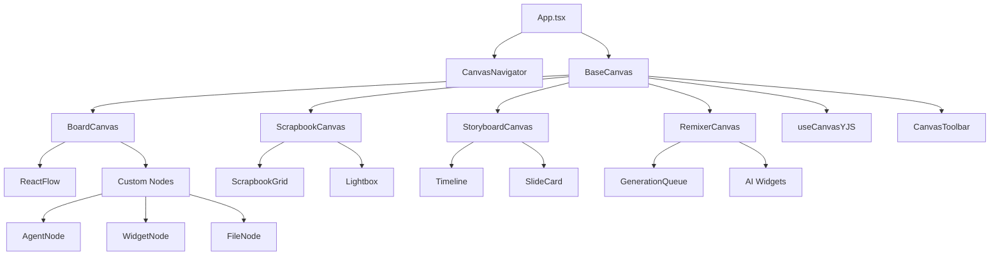

# Canvas System - Comprehensive Implementation Plan

**Version:** 1.0  
**Date:** January 14, 2026  
**Status:** Technical Specification

---

## Executive Summary

This document provides a complete technical specification for implementing five distinct canvas types in the Chrysalis Terminal UI using React Flow (@xyflow/react). The plan establishes shared infrastructure, defines canvas-specific behaviors, sequences implementation, and provides testing strategies.

**Key Metrics:**
- 5 Canvas Types (Settings, Board, Scrapbook, Storyboard, Remixer)
- ~2,500 LOC for shared infrastructure
- ~800 LOC per canvas type
- 3-week implementation timeline
- Target: 70%+ test coverage

---

## Table of Contents

1. [Canvas Type Analysis](#1-canvas-type-analysis)
2. [React Flow Architecture Review](#2-react-flow-architecture-review)
3. [Shared Infrastructure Design](#3-shared-infrastructure-design)
4. [Canvas-Specific Implementations](#4-canvas-specific-implementations)
5. [Component Hierarchy](#5-component-hierarchy)
6. [Data Models & Schema](#6-data-models--schema)
7. [Integration Points](#7-integration-points)
8. [Implementation Sequence](#8-implementation-sequence)
9. [Testing Strategy](#9-testing-strategy)
10. [Technical Specifications](#10-technical-specifications)

---

## 1. Canvas Type Analysis

### 1.1 Canvas Types Overview

Based on architecture specification and user workflows, we define five primary canvas types:

```typescript
type CanvasType = 
  | 'settings'    // System configuration (already implemented)
  | 'board'       // General-purpose node canvas (React Flow)
  | 'scrapbook'   // Media collection and annotation
  | 'storyboard'  // Sequential narrative with timeline
  | 'remixer'     // AI generation workspace (Runway, etc.)
```

### 1.2 Canvas Type Specifications

#### **Settings Canvas** ✅ IMPLEMENTED
- **Purpose**: System configuration and API management
- **UI Pattern**: Tabbed settings panels
- **Data Flow**: LocalStorage → Context → UI
- **Interactions**: Forms, toggles, API key management
- **Status**: Complete (January 14, 2026)

#### **Board Canvas** (General-Purpose)
- **Purpose**: Flexible node-based workspace for agents, widgets, and connections
- **UI Pattern**: Infinite canvas with nodes and edges (React Flow)
- **Accepts**: All node types (agent, widget, file, link, group)
- **Data Flow**: YJS ↔ React Flow ↔ Canvas State
- **Interactions**:
  - Drag nodes to reposition
  - Connect nodes with edges
  - Double-click to edit
  - Right-click context menu
  - Zoom/pan viewport
- **Visual Requirements**:
  - Dot grid background
  - Mini-map for navigation
  - Zoom controls (0.1x - 2x)
  - Selection rectangle
  - Connection lines (smoothstep bezier)
- **Node Types**:
  - Agent nodes (🤖)
  - Widget nodes (📊 charts, 📝 markdown, 💻 code)
  - File nodes (📄 documents, 🖼️ images)
  - Link nodes (🔗 external resources)
  - Group nodes (📦 containers)

#### **Scrapbook Canvas**
- **Purpose**: Visual collection of media, notes, and references
- **UI Pattern**: Masonry grid with drag-and-drop
- **Accepts**: Images, videos, audio, text notes, links
- **Data Flow**: Asset uploads → Storage → Grid layout → YJS sync
- **Interactions**:
  - Drag-and-drop files from desktop
  - Click to view full-size
  - Add tags and annotations
  - Filter by tag/type/date
  - Search functionality
- **Visual Requirements**:
  - Responsive masonry layout
  - Image thumbnails (lazy-loaded)
  - Tag chips
  - Lightbox viewer
  - Infinite scroll
- **Special Features**:
  - Bulk import from folders
  - AI auto-tagging (via LLM)
  - Export as PDF/ZIP

#### **Storyboard Canvas**
- **Purpose**: Sequential narrative building with timeline
- **UI Pattern**: Horizontal timeline with scene cards
- **Accepts**: Slides with text, images, voice annotations
- **Data Flow**: Timeline data → Slides → Voice/Media → YJS sync
- **Interactions**:
  - Drag slides to reorder
  - Click to edit slide content
  - Record/attach voice narration
  - Play as presentation
  - Export as video/PDF
- **Visual Requirements**:
  - Horizontal scrollable timeline
  - Slide thumbnails (16:9 ratio)
  - Playback controls
  - Voice waveform visualization
  - Duration markers
- **Special Features**:
  - Auto-generate from script (LLM)
  - Text-to-speech synthesis
  - Export to video (MP4)

#### **Remixer Canvas**
- **Purpose**: AI-powered creative workspace (Runway, DALL-E, etc.)
- **UI Pattern**: Widget workspace with generation queue
- **Accepts**: AI generation widgets (video, image, audio)
- **Data Flow**: Prompt → AI API → Results → Canvas → YJS sync
- **Interactions**:
  - Add generation widgets
  - Configure parameters
  - Queue generation jobs
  - View results gallery
  - Refine with variations
- **Visual Requirements**:
  - Widget cards with status
  - Generation queue panel
  - Parameter controls
  - Progress indicators
  - Results gallery
- **Special Features**:
  - Runway ML integration
  - DALL-E 3 integration
  - ElevenLabs TTS integration
  - Generation history

### 1.3 Canvas Comparison Matrix

| Feature | Board | Scrapbook | Storyboard | Remixer |
|---------|-------|-----------|------------|---------|
| **Layout** | Infinite canvas | Masonry grid | Timeline | Widget workspace |
| **Primary Entity** | Node | Media item | Slide | Generation job |
| **Collaboration** | Real-time | Real-time | Real-time | Queue-based |
| **File Upload** | ✅ | ✅ | ✅ | ❌ (AI-generated) |
| **Search** | Basic | Advanced tags | By slide | By prompt |
| **Export** | JSON, PNG | PDF, ZIP | Video, PDF | Gallery |
| **Complexity** | Medium | Low | Medium | High |

---

## 2. React Flow Architecture Review

### 2.1 React Flow Core Concepts

**React Flow** (v12+) provides:
- **Nodes**: Visual elements with position, type, and data
- **Edges**: Connections between nodes with styling
- **Viewport**: Pan, zoom, and fit-view controls
- **Interactions**: Drag, select, connect, delete
- **Extensions**: Mini-map, controls, background, panel

### 2.2 Key Components & APIs

```typescript
// Core components
import {
  ReactFlow,          // Main canvas component
  Node,               // Node type definition
  Edge,               // Edge type definition
  Controls,           // Zoom/fit controls
  MiniMap,            // Navigation mini-map
  Background,         // Grid/dots background
  Panel,              // Overlay panels
  NodeTypes,          // Custom node registry
  EdgeTypes,          // Custom edge registry
  useNodesState,      // Node state hook
  useEdgesState,      // Edge state hook
  useReactFlow,       // Canvas API hook
  addEdge,            // Helper to add edges
} from '@xyflow/react';

// Node manipulation APIs
const { 
  fitView,           // Fit all nodes in view
  zoomIn,            // Zoom in
  zoomOut,           // Zoom out
  setCenter,         // Center on coordinates
  project,           // Screen → flow coordinates
  screenToFlowPosition, // Mouse → node position
  getNode,           // Get node by ID
  getEdge,           // Get edge by ID
  setNodes,          // Update nodes
  setEdges,          // Update edges
} = useReactFlow();
```

### 2.3 Custom Node System

React Flow supports custom node components:

```typescript
// 1. Define node data interface
interface CustomNodeData {
  label: string;
  icon: string;
  metadata: Record<string, any>;
}

// 2. Create node component
function CustomNode({ data, selected }: NodeProps<CustomNodeData>) {
  return (
    <div className={selected ? 'selected' : ''}>
      <Handle type="target" position={Position.Left} />
      <div>{data.icon} {data.label}</div>
      <Handle type="source" position={Position.Right} />
    </div>
  );
}

// 3. Register in nodeTypes
const nodeTypes = {
  'custom': CustomNode,
};

// 4. Use in ReactFlow
<ReactFlow nodeTypes={nodeTypes} ... />
```

### 2.4 Event System

```typescript
// Node events
onNodeClick={(event, node) => { }}
onNodeDoubleClick={(event, node) => { }}
onNodeDragStart={(event, node) => { }}
onNodeDrag={(event, node) => { }}
onNodeDragStop={(event, node) => { }}
onNodeMouseEnter={(event, node) => { }}
onNodeMouseLeave={(event, node) => { }}

// Edge events
onEdgeClick={(event, edge) => { }}
onEdgeUpdate={(oldEdge, newConnection) => { }}

// Canvas events
onPaneClick={(event) => { }}
onPaneContextMenu={(event) => { }}
onSelectionChange={(params) => { }}
onMoveEnd={(event, viewport) => { }}
```

### 2.5 Extensibility Mechanisms

**Custom Node Types**: Any React component can be a node  
**Custom Edge Types**: Custom edge rendering and behavior  
**Custom Handles**: Connection point styling and logic  
**Viewport Bounds**: Limit pan/zoom area  
**Snap-to-Grid**: Align nodes to grid  
**Selection Mode**: Rectangle selection, single, multi  
**Keyboard Shortcuts**: Delete, copy, paste, undo

### 2.6 Performance Optimizations

- **Node Virtualization**: Only render visible nodes (built-in)
- **Edge Simplification**: Reduce path complexity at low zoom
- **Memoization**: React.memo for custom components
- **Debounced Updates**: Throttle YJS sync
- **Viewport Culling**: Hide off-screen edges

---

## 3. Shared Infrastructure Design

### 3.1 Base Canvas Configuration

All canvas types share common infrastructure:

```typescript
// ui/src/components/Canvas/BaseCanvas.tsx

export interface BaseCanvasProps {
  canvasId: string;
  canvasType: CanvasType;
  initialData?: any;
  onDataChange?: (data: any) => void;
  readOnly?: boolean;
  showControls?: boolean;
  showMiniMap?: boolean;
}

export interface BaseCanvasConfig {
  // YJS sync
  yjsEnabled: boolean;
  yjsDocName: string;
  
  // Layout
  fitView: boolean;
  minZoom: number;
  maxZoom: number;
  
  // Interactions
  nodesDraggable: boolean;
  nodesConnectable: boolean;
  elementsSelectable: boolean;
  
  // Visual
  background: 'dots' | 'lines' | 'none';
  gridSize: number;
  snapToGrid: boolean;
}
```

### 3.2 Common Node Templates

**Base Node Interface**:
```typescript
interface BaseNodeData {
  id: string;
  type: string;
  label: string;
  icon?: string;
  metadata?: Record<string, any>;
  createdAt: number;
  updatedAt: number;
  createdBy: string; // User or agent ID
}

interface BaseNode extends Node {
  data: BaseNodeData;
}
```

**Shared Node Types**:
1. **TextNode** - Rich text content
2. **ImageNode** - Image with caption
3. **LinkNode** - External URL reference
4. **GroupNode** - Container for other nodes
5. **WidgetNode** - Embedded React component

### 3.3 Reusable Edge Styles

```typescript
// ui/src/components/Canvas/edges/styles.ts

export const edgeStyles = {
  default: {
    stroke: 'var(--color-slate-600)',
    strokeWidth: 2,
  },
  selected: {
    stroke: 'var(--color-cyan-500)',
    strokeWidth: 3,
  },
  animated: {
    stroke: 'var(--color-cyan-400)',
    strokeWidth: 2,
    strokeDasharray: '5,5',
  },
  connection: {
    stroke: 'var(--color-purple-500)',
    strokeWidth: 2,
  },
};

export const edgeTypes = {
  default: 'smoothstep',
  straight: 'straight',
  step: 'step',
  bezier: 'default',
};
```

### 3.4 Unified State Management

**Canvas State Structure**:
```typescript
interface CanvasState {
  // Core data
  canvasId: string;
  canvasType: CanvasType;
  nodes: Node[];
  edges: Edge[];
  viewport: { x: number; y: number; zoom: number };
  
  // UI state
  selectedNodeIds: string[];
  selectedEdgeIds: string[];
  isEditing: boolean;
  
  // Metadata
  createdAt: number;
  updatedAt: number;
  collaborators: string[];
  
  // Type-specific data
  typeData?: Record<string, any>;
}
```

**YJS Document Schema**:
```typescript
// YJS document structure for each canvas
Y.Doc {
  canvas_metadata: Y.Map<CanvasMetadata>
  canvas_nodes: Y.Array<Node>
  canvas_edges: Y.Array<Edge>
  canvas_viewport: Y.Map<Viewport>
  canvas_typedata: Y.Map<any>  // Canvas-specific data
}
```

### 3.5 Component Library Foundation

**Shared Components**:
- `<BaseCanvas>` - Core canvas wrapper with YJS sync
- `<CanvasToolbar>` - Common controls (save, export, share)
- `<NodePalette>` - Draggable node templates
- `<PropertyPanel>` - Node/edge property editor
- `<ContextMenu>` - Right-click menu
- `<SearchBar>` - Canvas-wide search
- `<ExportDialog>` - Export options modal

---

## 4. Canvas-Specific Implementations

### 4.1 Board Canvas (General-Purpose)

**File**: `ui/src/components/Canvas/BoardCanvas/BoardCanvas.tsx`

**Purpose**: Flexible node-based workspace (default React Flow behavior)

**Custom Node Types**:
```typescript
const boardNodeTypes = {
  'agent': AgentNode,
  'widget:markdown': MarkdownWidgetNode,
  'widget:code': CodeWidgetNode,
  'widget:chart': ChartWidgetNode,
  'file': FileNode,
  'link': LinkNode,
  'group': GroupNode,
};
```

**Unique Features**:
- Agent execution controls
- Widget embedding
- File previews
- Connection validation (type-safe edges)

**Implementation Complexity**: **Medium** (extends existing ReactFlowCanvas)

---

### 4.2 Scrapbook Canvas

**File**: `ui/src/components/Canvas/ScrapbookCanvas/ScrapbookCanvas.tsx`

**Purpose**: Visual media collection with tagging

**Data Model**:
```typescript
interface ScrapbookItem {
  id: string;
  type: 'image' | 'video' | 'audio' | 'note' | 'link';
  url?: string;
  content?: string; // For notes
  title: string;
  description?: string;
  tags: string[];
  createdAt: number;
  thumbnail?: string;
  metadata: {
    width?: number;
    height?: number;
    duration?: number;
    fileSize?: number;
  };
}

interface ScrapbookState {
  items: ScrapbookItem[];
  selectedTags: string[];
  sortBy: 'date' | 'title' | 'type';
  layout: 'grid' | 'masonry' | 'list';
}
```

**Layout Strategy**:
- Use `react-masonry-css` or custom grid
- Lazy-load images with `react-lazy-load-image-component`
- Infinite scroll with `react-infinite-scroll-component`

**Unique Features**:
- Drag-and-drop file upload
- Tag autocomplete
- AI-powered tagging (via LLM)
- Bulk operations (tag, delete, export)
- Lightbox viewer

**Implementation Complexity**: **Low** (no React Flow, simpler layout)

---

### 4.3 Storyboard Canvas

**File**: `ui/src/components/Canvas/StoryboardCanvas/StoryboardCanvas.tsx`

**Purpose**: Sequential narrative with timeline

**Data Model**:
```typescript
interface StoryboardSlide {
  id: string;
  order: number;
  title: string;
  content: string; // Markdown
  imageUrl?: string;
  voiceUrl?: string; // Audio narration
  voiceDuration?: number;
  notes?: string;
  duration: number; // Seconds
  transition?: 'fade' | 'slide' | 'none';
}

interface StoryboardState {
  slides: StoryboardSlide[];
  totalDuration: number;
  currentSlideId: string | null;
  isPlaying: boolean;
  playbackPosition: number;
}
```

**Layout Strategy**:
- Horizontal scrollable timeline
- Fixed-height slide cards (16:9 ratio)
- Drag-to-reorder with `react-beautiful-dnd`

**Unique Features**:
- Voice recording integration
- Auto-generate from script (LLM)
- Playback mode (auto-advance slides)
- Export to video (via ffmpeg or cloud service)
- Text-to-speech synthesis

**Implementation Complexity**: **Medium** (timeline UI + voice integration)

---

### 4.4 Remixer Canvas

**File**: `ui/src/components/Canvas/RemixerCanvas/RemixerCanvas.tsx`

**Purpose**: AI generation workspace

**Data Model**:
```typescript
interface GenerationJob {
  id: string;
  type: 'image' | 'video' | 'audio' | 'text';
  provider: 'runway' | 'openai' | 'elevenlabs' | 'stable-diffusion';
  prompt: string;
  parameters: Record<string, any>;
  status: 'queued' | 'processing' | 'completed' | 'failed';
  result?: {
    url: string;
    metadata: Record<string, any>;
  };
  error?: string;
  createdAt: number;
  completedAt?: number;
}

interface RemixerState {
  jobs: GenerationJob[];
  selectedJobId: string | null;
  activeWidgets: string[]; // Widget IDs
}
```

**Widget Types**:
- **RunwayWidget**: Video generation (Gen-2, Gen-3)
- **DALL-EWidget**: Image generation
- **ElevenLabsWidget**: Voice synthesis
- **StableDiffusionWidget**: Image generation (local/API)

**Unique Features**:
- Generation queue management
- Parameter presets
- Variation generation
- Result comparison view
- Export to gallery

**Implementation Complexity**: **High** (AI API integrations + queue management)

---

## 5. Component Hierarchy

### 5.1 File Structure

```
ui/src/components/Canvas/
├── BaseCanvas/
│   ├── BaseCanvas.tsx           # Core canvas wrapper
│   ├── BaseCanvas.module.css
│   └── useCanvasYJS.ts          # YJS sync hook
├── BoardCanvas/
│   ├── BoardCanvas.tsx
│   ├── BoardCanvas.module.css
│   └── nodes/
│       ├── AgentNode.tsx        # ✅ Exists
│       ├── WidgetNode.tsx
│       ├── FileNode.tsx
│       ├── LinkNode.tsx
│       └── GroupNode.tsx
├── ScrapbookCanvas/
│   ├── ScrapbookCanvas.tsx
│   ├── ScrapbookCanvas.module.css
│   ├── ScrapbookItem.tsx
│   ├── ScrapbookGrid.tsx
│   ├── TagFilter.tsx
│   └── Lightbox.tsx
├── StoryboardCanvas/
│   ├── StoryboardCanvas.tsx
│   ├── StoryboardCanvas.module.css
│   ├── SlideCard.tsx
│   ├── Timeline.tsx
│   ├── VoiceRecorder.tsx
│   └── PlaybackControls.tsx
├── RemixerCanvas/
│   ├── RemixerCanvas.tsx
│   ├── RemixerCanvas.module.css
│   ├── GenerationQueue.tsx
│   ├── widgets/
│   │   ├── RunwayWidget.tsx
│   │   ├── DALL-EWidget.tsx
│   │   ├── ElevenLabsWidget.tsx
│   │   └── StableDiffusionWidget.tsx
│   └── ResultGallery.tsx
└── shared/
    ├── CanvasToolbar.tsx
    ├── NodePalette.tsx
    ├── PropertyPanel.tsx
    ├── ContextMenu.tsx
    ├── SearchBar.tsx
    ├── ExportDialog.tsx
    └── hooks/
        ├── useCanvasState.ts
        ├── useCanvasSync.ts
        └── useCanvasExport.ts
```

### 5.2 Module Dependency Graph



---

## 6. Data Models & Schema

### 6.1 YJS Document Schema

Each canvas has its own YJS room/document:

```typescript
// Canvas metadata (Y.Map)
{
  canvasId: string;
  canvasType: CanvasType;
  title: string;
  description?: string;
  createdAt: number;
  createdBy: string;
  collaborators: string[];
}

// Nodes (Y.Array<Node>)
[
  {
    id: string;
    type: string;
    position: { x: number; y: number };
    data: NodeData;
    ...
  }
]

// Edges (Y.Array<Edge>)
[
  {
    id: string;
    source: string;
    target: string;
    type: string;
    ...
  }
]

// Viewport (Y.Map)
{
  x: number;
  y: number;
  zoom: number;
}

// Type-specific data (Y.Map<any>)
// For Scrapbook:
{
  items: ScrapbookItem[];
  tags: string[];
  layout: 'grid' | 'masonry';
}

// For Storyboard:
{
  slides: StoryboardSlide[];
  totalDuration: number;
}

// For Remixer:
{
  jobs: GenerationJob[];
  widgets: WidgetConfig[];
}
```

### 6.2 LocalStorage Schema

Canvas preferences stored locally:

```typescript
// localStorage key: `canvas_prefs_${canvasId}`
{
  viewportHistory: Viewport[]; // Last 10 viewports
  recentFiles: string[];
  customColors: string[];
  keyboardShortcuts: Record<string, string>;
}
```

### 6.3 Backend Persistence

Canvas snapshots saved to backend:

```typescript
// POST /api/canvas/{canvasId}/snapshot
{
  canvasId: string;
  snapshot: {
    metadata: CanvasMetadata;
    nodes: Node[];
    edges: Edge[];
    viewport: Viewport;
    typeData: any;
  };
  timestamp: number;
  version: number;
}
```

---

## 7. Integration Points

### 7.1 Toolbar Controls

**Shared Toolbar** (all canvas types):
```typescript
<CanvasToolbar>
  <ToolbarGroup label="File">
    <ToolbarButton icon="💾" onClick={handleSave}>Save</ToolbarButton>
    <ToolbarButton icon="📤" onClick={handleExport}>Export</ToolbarButton>
    <ToolbarButton icon="📥" onClick={handleImport}>Import</ToolbarButton>
  </ToolbarGroup>
  
  <ToolbarGroup label="Edit">
    <ToolbarButton icon="↩️" onClick={handleUndo}>Undo</ToolbarButton>
    <ToolbarButton icon="↪️" onClick={handleRedo}>Redo</ToolbarButton>
    <ToolbarButton icon="🗑️" onClick={handleDelete}>Delete</ToolbarButton>
  </ToolbarGroup>
  
  <ToolbarGroup label="View">
    <ToolbarButton icon="🔍+" onClick={handleZoomIn}>Zoom In</ToolbarButton>
    <ToolbarButton icon="🔍-" onClick={handleZoomOut}>Zoom Out</ToolbarButton>
    <ToolbarButton icon="⬜" onClick={handleFitView}>Fit View</ToolbarButton>
  </ToolbarGroup>
  
  {/* Canvas-specific controls */}
  {children}
</CanvasToolbar>
```

### 7.2 Property Panels

**Dynamic Property Panel** (based on selection):
```typescript
<PropertyPanel>
  {selectedNode && (
    <NodeProperties
      node={selectedNode}
      onChange={handleNodeUpdate}
    />
  )}
  
  {selectedEdge && (
    <EdgeProperties
      edge={selectedEdge}
      onChange={handleEdgeUpdate}
    />
  )}
  
  {!selectedNode && !selectedEdge && (
    <CanvasProperties
      canvasType={canvasType}
      metadata={canvasMetadata}
      onChange={handleCanvasUpdate}
    />
  )}
</PropertyPanel>
```

### 7.3 External Data Sources

**File Upload**:
```typescript
const handleFileDrop = async (files: File[]) => {
  for (const file of files) {
    // Upload to backend storage
    const url = await uploadFile(file);
    
    // Create node/item based on canvas type
    if (canvasType === 'board') {
      addNode({ type: 'file', data: { url, name: file.name }});
    } else if (canvasType === 'scrapbook') {
      addItem({ type: getFileType(file), url, title: file.name });
    }
  }
};
```

**AI Generation Results**:
```typescript
const handleGenerationComplete = (job: GenerationJob) => {
  if (job.status === 'completed' && job.result) {
    // Add result to canvas
    addItem({
      type: job.type,
      url: job.result.url,
      title: `Generated ${job.type}`,
      metadata: { prompt: job.prompt, ...job.result.metadata }
    });
  }
};
```

---

## 8. Implementation Sequence

### Phase 1: Shared Infrastructure (Week 1)

**Goal**: Build reusable foundation for all canvas types

```
Sprint 1.1 (Days 1-2): Base Canvas Component
├── BaseCanvas wrapper with YJS sync
├── useCanvasState hook
├── useCanvasSync hook (debounced YJS updates)
└── CanvasToolbar component

Sprint 1.2 (Days 3-4): Shared Components
├── NodePalette (draggable templates)
├── PropertyPanel (dynamic based on selection)
├── ContextMenu (right-click)
├── SearchBar (canvas-wide search)
└── ExportDialog (PNG, JSON, PDF export)

Sprint 1.3 (Day 5): Common Node Types
├── TextNode
├── ImageNode
├── LinkNode
└── GroupNode
```

**Deliverables**:
- `BaseCanvas.tsx` (200 LOC)
- `useCanvasYJS.ts` (150 LOC)
- `CanvasToolbar.tsx` (100 LOC)
- Shared components (~400 LOC total)

**Validation**: Can create empty canvas, sync to YJS, add/remove generic nodes

---

### Phase 2: Board Canvas (Week 2)

**Goal**: Enhance existing ReactFlowCanvas with shared infrastructure

```
Sprint 2.1 (Days 1-2): Board Canvas Migration
├── Extend ReactFlowCanvas with BaseCanvas
├── Integrate CanvasToolbar
├── Add PropertyPanel
└── Wire up YJS sync via useCanvasYJS

Sprint 2.2 (Days 3-4): Board-Specific Nodes
├── Complete WidgetNode (markdown, code, chart)
├── FileNode with preview
├── Enhance AgentNode
└── GroupNode container

Sprint 2.3 (Day 5): Board Features
├── Node palette (drag to add)
├── Context menu
├── Keyboard shortcuts (delete, copy, paste)
└── Export (PNG, JSON)
```

**Deliverables**:
- `BoardCanvas.tsx` (300 LOC)
- Widget nodes (200 LOC each)
- Integration complete

**Validation**: Full board workflow - add nodes, connect, collaborate, export

---

### Phase 3: Scrapbook Canvas (Week 3)

**Goal**: Simplest canvas type as proof-of-concept for non-React-Flow layouts

```
Sprint 3.1 (Days 1-2): Scrapbook Core
├── ScrapbookCanvas component
├── ScrapbookGrid (masonry layout)
├── ScrapbookItem component
└── File upload integration

Sprint 3.2 (Days 3-4): Scrapbook Features
├── Tag system (add, filter, autocomplete)
├── Lightbox viewer
├── Search functionality
└── YJS sync for items array

Sprint 3.3 (Day 5): Scrapbook Polish
├── AI auto-tagging (LLM API)
├── Bulk operations
├── Export (ZIP, PDF)
└── Infinite scroll
```

**Deliverables**:
- `ScrapbookCanvas.tsx` (400 LOC)
- `ScrapbookGrid.tsx` (200 LOC)
- Tag system (150 LOC)

**Validation**: Upload 50+ images, tag, filter, search, export

---

### Phase 4: Storyboard Canvas (Week 4)

**Goal**: Timeline-based sequential narrative

```
Sprint 4.1 (Days 1-2): Storyboard Core
├── StoryboardCanvas component
├── Timeline component (horizontal scroll)
├── SlideCard component
└── Drag-to-reorder integration

Sprint 4.2 (Days 3-4): Storyboard Features
├── Voice recording (MediaRecorder API)
├── Voice playback controls
├── Auto-advance slides (presentation mode)
└── YJS sync for slides array

Sprint 4.3 (Day 5): Storyboard Advanced
├── Text-to-speech synthesis
├── Auto-generate from script (LLM)
├── Export to PDF
└── Video export (stretch goal)
```

**Deliverables**:
- `StoryboardCanvas.tsx` (500 LOC)
- `Timeline.tsx` (300 LOC)
- Voice integration (200 LOC)

**Validation**: Create 10-slide story, record narration, play, export

---

### Phase 5: Remixer Canvas (Week 5)

**Goal**: AI generation workspace (most complex)

```
Sprint 5.1 (Days 1-3): Remixer Core
├── RemixerCanvas component
├── GenerationQueue panel
├── Widget system architecture
└── Job state management

Sprint 5.2 (Days 4-6): AI Widgets
├── RunwayWidget (video generation)
├── DALL-EWidget (image generation)
├── ElevenLabsWidget (voice synthesis)
└── Widget parameter forms

Sprint 5.3 (Day 7): Remixer Features
├── Result gallery
├── Variation generation
├── Export functionality
└── YJS sync for jobs
```

**Deliverables**:
- `RemixerCanvas.tsx` (600 LOC)
- AI widgets (300 LOC each)
- Queue management (200 LOC)

**Validation**: Queue 5 generations, view results, create variations, export

---

### Phase 6: Testing & Polish (Week 6)

```
Sprint 6.1 (Days 1-2): Unit Tests
├── BaseCanvas tests
├── Hook tests (useCanvasYJS, useCanvasState)
├── Node component tests
└── Shared component tests

Sprint 6.2 (Days 3-4): Integration Tests
├── Canvas workflow tests
├── YJS sync tests
├── File upload tests
└── Export tests

Sprint 6.3 (Days 5-7): E2E & Performance
├── Playwright E2E tests
├── Performance profiling
├── Accessibility audit
└── Cross-browser testing
```

**Target Coverage**: 70%+

---

## 9. Testing Strategy

### 9.1 Unit Testing

**Vitest + Testing Library** for components and hooks:

```typescript
// BaseCanvas.test.tsx
describe('BaseCanvas', () => {
  it('should render with YJS sync', async () => {
    const { getByTestId } = renderWithYJS(
      <BaseCanvas canvasId="test" canvasType="board" />
    );
    
    expect(getByTestId('base-canvas')).toBeInTheDocument();
  });
  
  it('should sync nodes to YJS', async () => {
    const doc = new Y.Doc();
    const { addNode } = renderBaseCanvas({ doc });
    
    addNode({ id: '1', type: 'text', data: { label: 'Test' }});
    
    const yNodes = doc.getArray('canvas_nodes');
    expect(yNodes.length).toBe(1);
  });
});
```

### 9.2 Integration Testing

**Test canvas workflows end-to-end**:

```typescript
// BoardCanvas.integration.test.tsx
describe('Board Canvas Workflow', () => {
  it('should create, connect, and sync nodes', async () => {
    const { addNode, connectNodes, syncToYJS } = renderBoardCanvas();
    
    // Add two nodes
    const node1 = addNode({ type: 'agent', data: { label: 'Agent 1' }});
    const node2 = addNode({ type: 'widget', data: { label: 'Chart' }});
    
    // Connect them
    connectNodes(node1.id, node2.id);
    
    // Verify YJS sync
    await waitFor(() => {
      expect(syncToYJS).toHaveBeenCalled();
    });
  });
});
```

### 9.3 E2E Testing

**Playwright** for full user flows:

```typescript
// canvas.e2e.test.ts
test('complete board canvas workflow', async ({ page }) => {
  await page.goto('/');
  
  // Select board canvas
  await page.click('[data-testid="canvas-board"]');
  
  // Add agent node
  await page.click('[data-testid="add-agent-node"]');
  await page.fill('[data-testid="agent-name"]', 'Test Agent');
  await page.click('[data-testid="save-node"]');
  
  // Verify node appears
  await expect(page.locator('text=Test Agent')).toBeVisible();
  
  // Export canvas
  await page.click('[data-testid="export-canvas"]');
  await page.click('[data-testid="export-png"]');
  
  // Verify download
  const download = await page.waitForEvent('download');
  expect(download.suggestedFilename()).toContain('canvas-');
});
```

### 9.4 Performance Testing

**Measure render performance under load**:

```typescript
// performance.test.ts
describe('Canvas Performance', () => {
  it('should render 100 nodes in <2s', async () => {
    const start = performance.now();
    
    const nodes = Array.from({ length: 100 }, (_, i) => ({
      id: `node-${i}`,
      type: 'text',
      position: { x: (i % 10) * 100, y: Math.floor(i / 10) * 100 },
      data: { label: `Node ${i}` }
    }));
    
    const { rerender } = renderBoardCanvas({ initialNodes: nodes });
    
    const end = performance.now();
    expect(end - start).toBeLessThan(2000);
  });
});
```

### 9.5 Accessibility Testing

**Axe + manual testing**:

```typescript
// accessibility.test.tsx
describe('Canvas Accessibility', () => {
  it('should have no axe violations', async () => {
    const { container } = render(<BoardCanvas />);
    const results = await axe(container);
    expect(results).toHaveNoViolations();
  });
  
  it('should support keyboard navigation', async () => {
    const { getByRole } = render(<BoardCanvas />);
    
    // Tab to toolbar
    await userEvent.tab();
    expect(getByRole('toolbar')).toHaveFocus();
    
    // Arrow keys to navigate nodes
    await userEvent.keyboard('{ArrowRight}');
    // ...verify node selection
  });
});
```

---

## 10. Technical Specifications

### 10.1 Component Interfaces

**BaseCanvas**:
```typescript
interface BaseCanvasProps {
  canvasId: string;
  canvasType: CanvasType;
  initialData?: CanvasData;
  readOnly?: boolean;
  showControls?: boolean;
  showMiniMap?: boolean;
  onDataChange?: (data: CanvasData) => void;
  onSave?: (snapshot: CanvasSnapshot) => Promise<void>;
  onExport?: (format: ExportFormat) => Promise<void>;
}
```

**BoardCanvas**:
```typescript
interface BoardCanvasProps extends BaseCanvasProps {
  nodeTypes?: NodeTypes;
  edgeTypes?: EdgeTypes;
  defaultNodeColor?: string;
  connectionLineStyle?: CSSProperties;
  onNodeClick?: (event: MouseEvent, node: Node) => void;
  onEdgeClick?: (event: MouseEvent, edge: Edge) => void;
}
```

**ScrapbookCanvas**:
```typescript
interface ScrapbookCanvasProps extends BaseCanvasProps {
  layout?: 'grid' | 'masonry' | 'list';
  columns?: number;
  enableAITagging?: boolean;
  onItemClick?: (item: ScrapbookItem) => void;
  onTagAdd?: (tag: string) => void;
}
```

**StoryboardCanvas**:
```typescript
interface StoryboardCanvasProps extends BaseCanvasProps {
  enableVoiceRecording?: boolean;
  enableTextToSpeech?: boolean;
  autoAdvanceSeconds?: number;
  onSlideChange?: (slideId: string) => void;
  onPlaybackStateChange?: (playing: boolean) => void;
}
```

**RemixerCanvas**:
```typescript
interface RemixerCanvasProps extends BaseCanvasProps {
  enabledProviders?: AIProvider[];
  maxQueueSize?: number;
  onJobComplete?: (job: GenerationJob) => void;
  onJobError?: (job: GenerationJob, error: Error) => void;
}
```

### 10.2 Configuration Options

**Canvas Configuration**:
```typescript
const canvasConfig: Record<CanvasType, BaseCanvasConfig> = {
  board: {
    yjsEnabled: true,
    fitView: true,
    minZoom: 0.1,
    maxZoom: 2,
    nodesDraggable: true,
    nodesConnectable: true,
    elementsSelectable: true,
    background: 'dots',
    gridSize: 16,
    snapToGrid: true,
  },
  scrapbook: {
    yjsEnabled: true,
    fitView: false, // Scroll-based
    minZoom: 1,
    maxZoom: 1,
    nodesDraggable: false,
    nodesConnectable: false,
    elementsSelectable: true,
    background: 'none',
    gridSize: 0,
    snapToGrid: false,
  },
  // ... other canvas types
};
```

### 10.3 Export Formats

**Supported Export Formats**:
```typescript
type ExportFormat = 'png' | 'svg' | 'json' | 'pdf' | 'zip' | 'mp4';

interface ExportOptions {
  format: ExportFormat;
  quality?: number; // 0-1 for image formats
  includeMetadata?: boolean;
  filename?: string;
}

async function exportCanvas(
  canvasType: CanvasType,
  data: CanvasData,
  options: ExportOptions
): Promise<Blob>;
```

---

## Appendix A: React Flow API Reference

**Key APIs Used**:
```typescript
// Node manipulation
const { setNodes, setEdges, addNodes, deleteElements } = useReactFlow();

// Viewport
const { fitView, zoomIn, zoomOut, setCenter } = useReactFlow();

// Selection
const { getSelectedElements, setSelectedElements } = useReactFlow();

// Coordinates
const { project, screenToFlowPosition } = useReactFlow();

// Export
const { toObject, getViewport } = useReactFlow();
```

---

## Appendix B: YJS Sync Patterns

**Best Practices**:
1. Debounce updates (100-200ms)
2. Use transactions for batch updates
3. Observe at component mount only
4. Unobserve on unmount
5. Handle conflicts with last-write-wins

**Example**:
```typescript
useEffect(() => {
  const yArray = doc.getArray('canvas_nodes');
  
  const observer = () => {
    setNodes(yArray.toArray());
  };
  
  yArray.observe(observer);
  return () => yArray.unobserve(observer);
}, [doc]);
```

---

## Appendix C: Performance Benchmarks

**Target Metrics**:
- 100 nodes: <2s initial render
- 500 nodes: <5s initial render
- 1000 nodes: <10s with virtualization
- 60 FPS during pan/zoom
- <100ms sync latency

---

**End of Document**

**Version**: 1.0  
**Status**: Technical Specification  
**Next Steps**: Begin Phase 1 implementation (Shared Infrastructure)