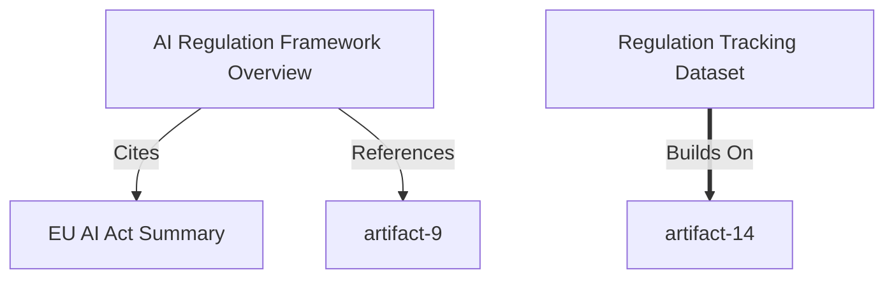

# Curation Canvas - User Guide

**Version:** 1.0  
**Date:** January 15, 2026  
**Status:** MVP Complete

---

## Overview

The Curation Canvas is a domain-focused research library that helps you collect, organize, and understand relationships between various types of artifacts. It provides multiple views to explore your knowledge graph and supports Mermaid-compatible relationship modeling.

### Key Features

- ✅ **Multi-Artifact Support**: Documents, media, code, data, links, and notes
- ✅ **Mermaid-Compatible Relationships**: 7 semantic relationship types
- ✅ **Four View Modes**: Grid, Timeline, Graph, and Collections
- ✅ **Hierarchical Collections**: Folders and flat tags
- ✅ **Advanced Filtering**: By type, tags, date, and collection
- ✅ **Graph Visualization**: Interactive relationship mapping with @xyflow/react
- ✅ **Mermaid Export**: One-click export to Mermaid diagram syntax

---

## Artifact Types

The Curation Canvas supports six artifact types:

| Type | Icon | Description | Use Case |
|------|------|-------------|----------|
| **Document** | 📄 | Text documents, PDFs, reports | Research papers, specifications |
| **Media** | 🎬 | Images, videos, audio | Screenshots, diagrams, recordings |
| **Code** | 💻 | Code snippets, scripts | Implementation examples, tools |
| **Data** | 📊 | Datasets, JSON, CSV files | Analysis data, metrics |
| **Link** | 🔗 | External URLs | References, resources |
| **Note** | 📝 | Quick notes, ideas | Meeting notes, brainstorming |

---

## Relationship Types (Mermaid-Compatible)

The Curation Canvas uses a Mermaid-compatible semantic relationship model:

### 1. **References** (`-->`)
- **Mermaid**: `A -->|refs| B`
- **Use**: Basic reference or citation
- **Example**: Paper → Dataset

### 2. **Builds On** (`==>`)
- **Mermaid**: `A ==>|builds| B`
- **Use**: Extends or derives from
- **Example**: V2 Feature → V1 Feature

### 3. **Contradicts** (`-.->`)
- **Mermaid**: `A -.->|contra| B`
- **Use**: Conflicts with or opposes
- **Example**: Study A → Study B

### 4. **Implements** (`-->`)
- **Mermaid**: `A -->|impl| B`
- **Use**: Code realizes specification
- **Example**: Code → Specification Doc

### 5. **Cites** (`-->`)
- **Mermaid**: `A -->|cite| B`
- **Use**: Academic/formal citation
- **Example**: Paper → Paper

### 6. **Derives From** (`==>`)
- **Mermaid**: `A ==>|from| B`
- **Use**: Data lineage, transformation
- **Example**: Visualization → Raw Data

### 7. **Related To** (`---`)
- **Mermaid**: `A --- B`
- **Use**: Generic connection
- **Example**: Doc --- Media

---

## View Modes

### Grid View (Default)
- **Layout**: Masonry grid with artifact cards
- **Features**: 
  - Type badges with color coding
  - Thumbnail previews
  - Tag display
  - Relationship count
  - Creation date
- **Best For**: Browsing and discovering artifacts

### Timeline View
- **Layout**: Chronological vertical scroll
- **Features**:
  - Grouped by date
  - Visual timeline connector
  - Date markers
  - Chronological ordering
- **Best For**: Understanding temporal progression

### Graph View
- **Layout**: Interactive node-and-edge visualization
- **Features**:
  - Drag-and-drop repositioning
  - Relationship strength indicators
  - Minimap navigation
  - Zoom controls
  - Mermaid export
- **Best For**: Understanding relationships and connections

### Collections View
*(Planned for future release)*

---

## Collections System

The Curation Canvas supports both hierarchical and flat organization:

### Folders (Hierarchical)
- **Purpose**: Organize artifacts in nested structure
- **Features**: 
  - Parent-child relationships
  - Expandable/collapsible
  - Custom icons and colors
  - Artifact counts
- **Example**: Research → Papers → EU Regulations

### Tags (Flat)
- **Purpose**: Cross-cutting labels
- **Features**:
  - No hierarchy
  - Multiple tags per artifact
  - Quick filtering
- **Example**: #high-priority, #needs-review

---

## Filtering & Search

### Search
- **Scope**: Title, description, content, tags
- **Location**: Header search bar
- **Real-time**: Updates as you type

### Type Filter
- Select one or more artifact types
- Chips in filter bar
- Clear individual or all filters

### Tag Filter
- Select from all available tags
- Automatically extracted from artifacts
- Multi-select support

### Collection Filter
- Click collection in sidebar
- Shows only artifacts in that collection
- Works with other filters

### Date Range
*(Planned for future release)*

---

## Mermaid Integration

### Export to Mermaid

The graph view includes a "Export Mermaid" button that generates complete Mermaid diagram syntax:

**Example Output:**


**Features:**
- One-click generation
- Copies to clipboard
- All relationships included
- Preserves relationship types
- Clean node labels

### Import from Mermaid
*(Planned for future release)*

---

## Mock Data

The MVP includes comprehensive mock data demonstrating all features:

- **14 Artifacts** across all 6 types
- **12 Relationships** showing all 7 types
- **7 Collections** (5 folders + 2 tags)
- **Topic**: AI Regulation Research

### Sample Artifacts
1. AI Regulation Framework Overview (Document)
2. EU AI Act Summary (Document)
3. AI Regulation Timeline Infographic (Media)
4. Compliance Checker Script (Code)
5. Regulation Tracking Dataset (Data)
6. OECD AI Principles (Link)
7. Meeting Notes - Regulation Strategy (Note)
... and 7 more

---

## Keyboard Shortcuts

*(Planned for future release)*

- `G` - Switch to Grid view
- `T` - Switch to Timeline view
- `N` - Switch to Graph (Network) view
- `/` - Focus search
- `Esc` - Clear filters
- `Cmd/Ctrl + K` - Quick command palette

---

## Technical Architecture

### State Management
- **Zustand**: Local UI state (view mode, filters, selections)
- **Future**: YJS for real-time collaboration

### Graph Visualization
- **@xyflow/react**: React Flow library
- **Features**: Drag-and-drop, auto-layout, mini-map
- **Custom Nodes**: Artifact-specific node components

### Relationship Model
- **Semantic Types**: 7 Mermaid-compatible relationships
- **Confidence Scores**: 0-100 percentage
- **Bidirectional**: Source and target for each relationship

### File Structure
```
CurationCanvas/
├── types.ts                    # Type definitions
├── store.ts                    # Zustand state management
├── utils.ts                    # Utility functions
├── mockData.ts                 # Demo data
├── CurationCanvas.tsx          # Main component
├── ArtifactCard.tsx           # Card display
├── ArtifactGrid.tsx           # Grid view
├── TimelineView.tsx           # Timeline view
├── GraphView.tsx              # Graph visualization
├── CollectionPanel.tsx        # Collection tree
├── FilterBar.tsx              # Filter controls
└── *.module.css               # Component styles
```

---

## Future Enhancements

### High Priority
- Agent synthesis (LLM summarization of artifacts)
- Auto-relationship detection
- Import from Mermaid diagrams
- YJS real-time collaboration

### Medium Priority
- Collections view mode
- Advanced date range filtering
- Keyboard shortcuts
- Bulk operations

### Low Priority
- Export to other formats (JSON, GraphML)
- Semantic search
- Version history
- External source imports

---

## Best Practices

### Organizing Artifacts
1. **Use descriptive titles**: Make artifacts easily identifiable
2. **Add tags liberally**: Enable cross-cutting discovery
3. **Choose appropriate types**: Use the right artifact type for content
4. **Write descriptions**: Help future you understand context

### Creating Relationships
1. **Be specific**: Use appropriate relationship types
2. **Add confidence scores**: Indicate certainty level
3. **Write notes**: Explain why the relationship exists
4. **Keep it meaningful**: Only create relationships that add value

### Using Collections
1. **Start with folders**: Create main categories first
2. **Add subcollections**: Break down into logical groups
3. **Use tags for themes**: Cross-cutting concepts (priority, status)
4. **Keep it simple**: Don't over-organize

---

## Troubleshooting

### Graph view is empty
- **Solution**: Add artifacts and create relationships first
- **Check**: Ensure artifacts are not filtered out

### Can't find an artifact
- **Solution**: Clear all filters and search
- **Check**: Verify it hasn't been deleted

### Relationships not showing
- **Solution**: Refresh the graph view
- **Check**: Ensure both source and target artifacts exist

### Mermaid export not working
- **Solution**: Check browser clipboard permissions
- **Workaround**: Open console and copy from logs

---

## Getting Help

- **Documentation**: See `ui/docs/` directory
- **Code Examples**: Check `mockData.ts` for usage patterns
- **Bug Reports**: File issue with reproduction steps

---

**Last Updated:** January 15, 2026  
**Contributors:** Development Team  
**License:** MIT