# MVP Canvas Implementation Plan - Final Specification

**Version:** 2.0  
**Date:** January 14, 2026  
**Status:** APPROVED - In Implementation

---

## Executive Summary

This document defines the **8 primary canvas types** for the Chrysalis Terminal MVP, their implementation sequence, and technical specifications.

### MVP Canvas Types (8 Total)

| # | Canvas Type | Category | Status | Priority |
|---|-------------|----------|--------|----------|
| 1 | **Settings** | System | ✅ Implemented | Critical |
| 2 | **Board** | Work | ✅ Implemented | Critical |
| 3 | **Scrapbook** | Content & Collection | ✅ Implemented | High |
| 4 | **Research** | Content & Collection | ✅ Implemented | High |
| 5 | **Wiki** | Knowledge & Collaboration | 🚧 In Progress | High |
| 6 | **Scenarios** | Content & Collection | Planned | High |
| 7 | **Curation** | Content & Collection | Planned | High |
| 8 | **Media** | Content & Collection | Planned | High |

**Deferred to Post-MVP**:
- Agent Registry (system canvas)
- Contacts/Teams (system canvas)
- Project Canvas
- Schedule Canvas
- Storyboard Canvas
- Remixer Canvas

---

## Table of Contents

1. [Canvas Type Definitions](#1-canvas-type-definitions)
2. [Scenarios Canvas Specification](#2-scenarios-canvas-specification)
3. [Research Canvas Specification](#3-research-canvas-specification)
4. [Implementation Timeline](#4-implementation-timeline)
5. [Resource Allocation](#5-resource-allocation)
6. [Success Metrics](#6-success-metrics)

---

## 1. Canvas Type Definitions

### 1.1 System Canvases (Infrastructure)

#### **Settings Canvas** ✅ IMPLEMENTED
- **Purpose**: System configuration and API key management
- **Status**: Production-ready (Jan 14, 2026)
- **Key Features**: Provider configs, API keys (AES-256-GCM encrypted), model settings, preferences
- **Implementation**: 3 days, 1,100 LOC

### 1.2 Work Canvases (MVP)

#### **Board Canvas** ✅ IMPLEMENTED  
- **Purpose**: General-purpose node-based workspace for agents and widgets
- **Status**: Production-ready (React Flow integration complete)
- **Key Features**: Agent nodes, widget embedding, connections, real-time YJS sync
- **Implementation**: Extended existing ReactFlowCanvas

#### **Scrapbook Canvas**
- **Purpose**: Quick media collection with tagging
- **Type**: Media-first storage
- **Accepts**: Images, videos, audio, links, notes
- **Key Features**: Masonry grid, tags, search, lightbox viewer
- **Timeline**: Week 3 (5 days)

#### **Research Canvas** (renamed from Knowledge)
- **Purpose**: Structured documentation and knowledge organization
- **Type**: Document-centric with hierarchy
- **Accepts**: Markdown documents, embedded media, code blocks
- **Key Features**: Hierarchical structure, [[wiki-links]], full-text search, agent summaries
- **Timeline**: Week 4 (5 days)

#### **Wiki Canvas** 🆕
- **Purpose**: Collaborative knowledge base for agents and humans
- **Type**: MediaWiki-based collaborative wiki embedded in canvas
- **Accepts**: Wiki pages, categories, templates, media files
- **Key Features**:
  - MediaWiki integration via iframe/API
  - Agent collaborative editing
  - Background knowledge loading
  - Zep knowledge graph integration (optional)
  - Full wiki syntax support
  - Version history and page diffs
  - Inter-page linking and categories
  - Can run invisibly as project knowledge base
  - Agent-accessible via API
- **Timeline**: Week 5 (5 days)
- **Special Properties**: Can run in background, supports invisible mode
- **Integration**: Optional Zep knowledge graph sync for semantic search

#### **Scenarios Canvas**
- **Purpose**: Future planning through scenario analysis
- **Type**: Flexible planning workspace
- **Accepts**: Scenarios, indicators, assumptions, outcomes
- **Key Features**: Multiple future paths, indicator tracking, reality checks, probability updates
- **Timeline**: Week 5 (4 days)
- **Details**: See Section 2 below

#### **Curation Canvas**
- **Purpose**: Domain-focused research library
- **Type**: Multi-artifact collection unified by topic
- **Accepts**: Everything (documents, media, code, data, links)
- **Key Features**: Relationships, collections, timeline, graph view, agent synthesis
- **Timeline**: Week 6 (5 days)

#### **Media Canvas**
- **Purpose**: Audio/video/image editing workspace
- **Type**: Active media manipulation
- **Accepts**: Images, audio, video files
- **Key Features**: Image editing, audio trimming, video preview, format conversion
- **Timeline**: Week 7 (5 days)

---

## 2. Scenarios Canvas Specification

### 2.1 Conceptual Foundation

**Core Insight**: Planning isn't about predicting the future—it's about preparing for multiple possible futures by identifying what to watch for and how to respond.

**Metaphor**: Strategic planning war room + futures wheel  
**Mental Model**: "What could happen, what would we see if it's happening, what should we do?"  
**Key Philosophy**: Scenarios are living hypotheses that update as reality unfolds

### 2.2 Purpose & Boundaries

**Primary Purpose**: Outline alternative future scenarios, define indicators that signal which path is unfolding, and track reality against expectations.

**Scope Includes**:
- Multiple scenario definitions (optimistic, pessimistic, realistic, wildcards)
- Causal assumptions (what needs to be true for this to happen)
- Key indicators (leading and lagging)
- Indicator tracking over time (manual or automated)
- Scenario probability updates
- Decision triggers ("if X happens, we do Y")
- Cross-scenario comparisons

**Scope Excludes**:
- Detailed project plans (deferred to Project Canvas later)
- Task scheduling (deferred to Schedule Canvas later)
- Linear forecasting (this is about branching possibilities)
- Real-time data dashboards (indicators are tracked, not streamed)

**Conceptual Boundaries**:
- Focus: Multiple possible futures and their signals
- Unit of work: Scenario or indicator
- Time horizon: Weeks to years (strategic, not tactical)
- Update frequency: Regular reviews, not real-time

**Example Use Cases**:
```
"AI Regulation Scenarios"
├── Scenario A: Heavy Regulation (30% probability)
│   ├── Assumptions: Public backlash, major incident
│   ├── Indicators: New bills introduced, EU leads, tech stocks drop
│   └── Response: Pivot to compliance tooling
│
├── Scenario B: Light Touch (50% probability)
│   ├── Assumptions: Industry self-regulation succeeds
│   ├── Indicators: Voluntary frameworks adopted, no major laws
│   └── Response: Continue current strategy
│
└── Scenario C: Fragmentation (20% probability)
    ├── Assumptions: US/EU/China diverge
    ├── Indicators: Trade restrictions, different standards
    └── Response: Regional partnerships
```

### 2.3 Core Data Model

```typescript
interface ScenariosCanvas {
  id: string;
  topic: string; // "AI Regulation", "Climate Scenarios", etc.
  description: string;
  scenarios: Scenario[];
  globalIndicators: Indicator[]; // Track across all scenarios
  decisionFramework: DecisionTrigger[];
  metadata: {
    createdAt: number;
    lastReviewDate: number;
    nextReviewDate: number;
  };
}

interface Scenario {
  id: string;
  name: string;
  description: string;
  probability: number; // 0-100%
  timeHorizon: TimeHorizon;
  
  // What needs to be true
  assumptions: Assumption[];
  
  // What to watch for
  indicators: Indicator[];
  
  // What this future looks like
  outcomes: Outcome[];
  
  // Historical tracking
  probabilityHistory: ProbabilityUpdate[];
  
  metadata: {
    createdAt: number;
    createdBy: string;
    tags: string[];
    status: 'active' | 'archived' | 'happened' | 'ruled-out';
  };
}

interface Assumption {
  id: string;
  description: string;
  criticality: 'low' | 'medium' | 'high'; // How important to scenario
  confidence: number; // 0-100% - how confident we are this is true/will be true
  evidence?: string; // Supporting info
}

interface Indicator {
  id: string;
  name: string;
  description: string;
  type: 'leading' | 'lagging'; // Leading = early signal, Lagging = confirmation
  category: 'political' | 'economic' | 'social' | 'technological' | 'environmental' | 'custom';
  
  // Measurement
  measurementMethod: 'manual' | 'automated' | 'agent-monitored';
  currentValue?: string | number;
  targetValue?: string | number; // What value signals scenario is happening
  
  // Tracking
  observations: Observation[];
  trend?: 'increasing' | 'decreasing' | 'stable' | 'volatile';
  
  // Significance
  weight: number; // 1-10 - how important is this indicator
  threshold?: number; // At what point does this trigger scenario
}

interface Observation {
  id: string;
  date: Date;
  value: string | number;
  source?: string; // URL, document reference
  notes?: string;
  recordedBy: string; // User or agent ID
}

interface Outcome {
  id: string;
  category: 'opportunity' | 'threat' | 'neutral';
  description: string;
  impact: 'low' | 'medium' | 'high';
  likelihood: number; // 0-100% (if this scenario happens)
}

interface DecisionTrigger {
  id: string;
  name: string;
  condition: string; // "If Scenario A > 70% probability"
  action: string; // "Pivot product strategy"
  status: 'monitoring' | 'triggered' | 'executed';
  triggeredAt?: Date;
}

interface ProbabilityUpdate {
  date: Date;
  oldProbability: number;
  newProbability: number;
  reason: string;
  updatedBy: string;
}

interface TimeHorizon {
  range: '0-3 months' | '3-12 months' | '1-3 years' | '3-5 years' | '5+ years';
  description?: string;
}
```

### 2.4 User Interactions

**Primary Views**:

1. **Scenario Board** (Default)
   - Card-based layout of all scenarios
   - Probability displayed prominently
   - Traffic light colors (green/yellow/red based on desirability)
   - Quick indicators: trending up/down/stable

2. **Indicator Dashboard**
   - All indicators across scenarios
   - Current values vs targets
   - Trend visualization
   - Overdue observations flagged

3. **Timeline View**
   - Historical probability changes
   - When indicators were observed
   - Scenario lifecycle (created → active → ruled out/happened)

4. **Comparison Matrix**
   - Side-by-side scenario comparison
   - Assumptions, indicators, outcomes
   - Probability evolution over time

**Core Interactions**:
- **Create**: New scenario with wizard (name, assumptions, indicators)
- **Update**: Probability based on new information
- **Observe**: Log indicator observations (manual entry or link to source)
- **Review**: Periodic review flow (update probabilities, add observations)
- **Trigger**: Mark decision triggers as activated
- **Archive**: Mark scenarios as ruled-out or happened
- **Compare**: Side-by-side scenario analysis

**Advanced Interactions**:
- **Agent Monitoring**: Assign agents to monitor specific indicators
- **Divergence Alerts**: Alert when reality significantly differs from all scenarios
- **Probability Reconciliation**: Ensure all scenario probabilities sum to ≤100%
- **Export**: Scenario report as PDF/Markdown

### 2.5 Agent Integration

**Agent Capabilities**:

1. **Indicator Monitoring**
   ```typescript
   Agent: "Monitor tech stock prices weekly for AI Regulation scenarios"
   System: Assigns agent to track indicator, creates observations
   ```

2. **News Scanning**
   ```typescript
   Agent: "Scan for news about EU AI regulations"
   System: Agent finds relevant articles, suggests adding as observations
   ```

3. **Probability Suggestions**
   ```typescript
   Agent: "Based on recent observations, Scenario A probability should increase from 30% to 45%"
   User: Reviews evidence, accepts or modifies
   ```

4. **Gap Identification**
   ```typescript
   Agent: "Scenario B lacks leading indicators. Suggest adding: [list]"
   User: Reviews and adds indicators
   ```

5. **Cross-Scenario Analysis**
   ```typescript
   User: "What's the common factor across scenarios?"
   Agent: Analyzes assumptions, identifies shared dependencies
   ```

**Agent API**:
```typescript
interface ScenariosAgentAPI {
  monitorIndicator(indicatorId: string, frequency: 'daily' | 'weekly' | 'monthly'): Promise<void>;
  scanNews(keywords: string[], scenarioId: string): Promise<NewsItem[]>;
  suggestProbabilityUpdate(scenarioId: string): Promise<ProbabilitySuggestion>;
  identifyGaps(scenarioId: string): Promise<string[]>;
  analyzeCrossScenario(scenarioIds: string[]): Promise<Analysis>;
}
```

### 2.6 Integration with Other Canvases

**With Research Canvas**:
- Research documents inform scenario assumptions
- Research insights used as evidence for probability updates
- Scenarios can reference research documents

**With Curation Canvas**:
- Curated artifacts (papers, articles) feed scenario analysis
- Indicators can link to curated evidence
- Scenario reviews pull from curated research

**With Board Canvas**:
- Scenarios can be visualized as flowchart on Board
- Decision trees exported to Board for detailed planning

**With Scrapbook Canvas**:
- Quick saves of news/articles related to indicators
- Media evidence for observations

**With Chat**:
- @mention scenarios in discussions
- Ask agents: "What's the latest on Scenario A?"
- Update probabilities via chat commands

### 2.7 Data Model & State Management

**YJS Document Schema**:
```typescript
// YJS room: scenarios-canvas-{canvasId}
Y.Doc {
  canvas_metadata: Y.Map<{
    canvasId: string;
    topic: string;
    description: string;
  }>;
  
  scenarios: Y.Map<string, Scenario>; // By scenario ID
  indicators: Y.Map<string, Indicator>; // By indicator ID
  observations: Y.Array<Observation>; // All observations (sorted by date)
  decision_triggers: Y.Array<DecisionTrigger>;
  
  // Agent assignments
  agent_monitoring: Y.Map<string, {
    indicatorId: string;
    agentId: string;
    frequency: string;
  }>;
  
  // Review history
  review_log: Y.Array<{
    date: Date;
    reviewedBy: string;
    changesCount: number;
    summary: string;
  }>;
}
```

**Local State (Zustand)**:
```typescript
interface ScenariosCanvasState {
  // UI state
  viewMode: 'board' | 'indicators' | 'timeline' | 'comparison';
  selectedScenarioIds: string[];
  filterByStatus: ScenarioStatus[];
  sortBy: 'probability' | 'name' | 'updated';
  
  // Comparison
  comparisonScenarioIds: string[];
  
  // Computed
  totalProbability: number; // Sum of all scenario probabilities
  needsReconciliation: boolean; // If > 100%
  overdueIndicators: Indicator[];
  
  // Actions
  createScenario: (scenario: Partial<Scenario>) => void;
  updateProbability: (scenarioId: string, newProb: number, reason: string) => void;
  addObservation: (indicatorId: string, obs: Observation) => void;
  archiveScenario: (scenarioId: string, reason: string) => void;
  scheduleReview: (date: Date) => void;
  exportReport: (scenarioIds: string[]) => Promise<Blob>;
}
```

### 2.8 Phased Development Plan

**Phase 1: Core Scenario Management (2 days)**

*Sprint 1.1 (Days 1-2): Foundation*
```
Tasks:
├── Define TypeScript interfaces (Scenario, Indicator, Observation)
├── Implement YJS schema
├── Create useScenariosCanvas hook
├── Zustand store setup
├── Scenario Board view
├── Create/edit scenario forms
└── Probability management

Deliverables:
- scenarios/types.ts (300 LOC)
- scenarios/useScenariosYJS.ts (200 LOC)
- scenarios/store.ts (250 LOC)
- ScenariosCanvas.tsx (250 LOC)
- ScenarioBoard.tsx (200 LOC)
- ScenarioCard.tsx (200 LOC)

Dependencies: None
```

**Phase 2: Indicators & Observations (1.5 days)**

*Sprint 2.1 (Days 1-1.5): Indicator System*
```
Tasks:
├── Indicator Dashboard view
├── Indicator creation/editing
├── Observation logging UI
├── Trend calculation
└── Overdue indicator detection

Deliverables:
- IndicatorDashboard.tsx (250 LOC)
- IndicatorCard.tsx (150 LOC)
- ObservationLog.tsx (150 LOC)
- trendAnalysis.ts (100 LOC)

Dependencies: Phase 1
```

**Phase 3: Advanced Features (0.5 day)**

*Sprint 3.1 (Day 0.5): Views & Export*
```
Tasks:
├── Timeline view
├── Comparison matrix
├── Export to PDF/Markdown
└── Basic styling polish

Deliverables:
- TimelineView.tsx (150 LOC)
- ComparisonMatrix.tsx (200 LOC)
- export.ts (150 LOC)

Dependencies: Phase 2
```

**Total Development Time**: 4 days with 1 developer

---

## 3. Research Canvas Specification

### 3.1 Purpose (Renamed from Knowledge)

**Primary Purpose**: Structured documentation and knowledge organization with hierarchical structure and wiki-style linking.

**No changes to functionality** - only renamed for clarity:
- "Knowledge Canvas" → "Research Canvas"
- Better reflects use case: research notes, documentation, insights
- Distinguishes from Curation (broad artifact collection) and Scrapbook (media collection)

### 3.2 Key Features (Same as Knowledge Canvas)

- Hierarchical document structure (folders, pages, sections)
- Markdown documents with rich editing
- [[Wiki-style]] bi-directional links
- Full-text search
- Tag-based organization
- Agent-generated summaries and insights
- Graph view of document relationships

### 3.3 Development Timeline

**No change**: 5 days (same as planned for Knowledge Canvas)

See `CANVAS_MODE_ANALYSIS_AND_PROPOSALS.md` for full specification (search/replace "Knowledge" with "Research")

---

## 4. Implementation Timeline

### 4.1 Complete MVP Timeline (7 Weeks)

**Week 1**: Settings Canvas ✅ COMPLETE  
**Week 2**: Board Canvas ✅ COMPLETE  

**Week 3**: Scrapbook Canvas (5 days)
- Masonry grid media collection
- Tagging, search, lightbox
- Agent auto-tagging

**Week 4**: Research Canvas (5 days)  
- Hierarchical documents
- Wiki-links, search
- Agent summaries

**Week 5**: Wiki Canvas (5 days) 🆕
- MediaWiki integration
- Agent collaboration API
- Zep knowledge graph linking
- Background operation mode

**Week 6**: Scenarios Canvas (4 days)
- Scenario management
- Indicator tracking
- Probability updates

**Week 7**: Curation Canvas (5 days)
- Multi-type artifact collection
- Relationships, collections
- Agent synthesis

**Week 8**: Media Canvas (5 days)
- Image editing (crop, filters)
- Audio editing (trim, effects)
- Video preview/trim

**Total Timeline**: 8 weeks to MVP completion

### 4.2 Post-MVP (Deferred)

**Future Phase 1** (3-4 weeks):
- Agent Registry Canvas (agent configuration)
- Contacts/Teams Canvas (contact management)
- Project Canvas (task management)
- Schedule Canvas (calendar/temporal)

**Future Phase 2** (2-3 weeks):
- Storyboard Canvas (sequential narrative)
- Remixer Canvas (AI generation)

**Total Additional**: 5-7 weeks post-MVP

### 4.3 Dependency Graph

```mermaid
graph TD
    A[Settings ✅] --> B[Board ✅]
    B --> C[Scrapbook - Week 3]
    C --> D[Research - Week 4]
    D --> E[Scenarios - Week 5]
    E --> F[Curation - Week 6]
    F --> G[Media - Week 7]
    
    C -.feeds.-> D
    D -.informs.-> E
    E -.uses.-> D
    F -.references.-> D
    G -.edits.-> C
    
    style A fill:#10b981
    style B fill:#10b981
    style C fill:#3b82f6
    style D fill:#3b82f6
    style E fill:#3b82f6
    style F fill:#3b82f6
    style G fill:#3b82f6
```



---

## 5. Resource Allocation

### 5.1 Team Structure

**Developer 1** (Frontend Lead):
- Weeks 3-7: All canvas implementations
- Focus: UI components, interactions, styling
- Estimated effort: 29 days (5+5+4+5+5)

**Developer 2** (Part-time, State Management):
- Weeks 3-7: YJS integration, data models
- Focus: State management, agent APIs
- Estimated effort: 15 days (part-time support)

**QA Engineer** (Part-time):
- Weeks 4-7: Testing, accessibility
- Focus: E2E tests, WCAG compliance
- Estimated effort: 10 days

**Total Team-Days**: 54 days across 7 weeks

### 5.2 Workload Distribution

| Week | Canvas | Developer 1 | Developer 2 | QA |
|------|--------|-------------|-------------|-----|
| 3 | Scrapbook | 5 days | 2 days | 1 day |
| 4 | Research | 5 days | 2 days | 2 days |
| 5 | Scenarios | 4 days | 2 days | 2 days |
| 6 | Curation | 5 days | 3 days | 2 days |
| 7 | Media | 5 days | 3 days | 3 days |

---

## 6. Success Metrics

### 6.1 MVP Completion Criteria

**Per Canvas**:
- ✅ Core features implemented (no placeholders)
- ✅ YJS real-time sync working
- ✅ Agent integration functional
- ✅ Basic UI polish complete
- ✅ 50%+ test coverage

**Overall System**:
- ✅ All 7 canvas types operational
- ✅ Cross-canvas navigation works
- ✅ Settings persist across canvases
- ✅ Performance: <2s canvas load time
- ✅ Accessibility: WCAG Level A minimum

### 6.2 Scenarios Canvas Specific Metrics

- Users can create 3+ scenarios with 5+ indicators each
- Probability updates work with validation (sum ≤ 100%)
- Observations can be logged with sources
- Timeline view shows historical changes
- Export generates readable PDF report
- Agent monitoring can be assigned to indicators

---

## 7. Canvas Type Summary

### 7.1 The 7 MVP Canvas Types

**Category: System** (2 canvases)
1. **Settings** ✅ - System configuration
2. **Board** ✅ - General-purpose workspace

**Category: Content & Collection** (5 canvases)
3. **Scrapbook** - Quick media collection
4. **Research** - Structured documentation  
5. **Scenarios** - Future planning & scenario analysis
6. **Curation** - Domain research library
7. **Media** - Audio/video/image editing

### 7.2 Canvas Positioning

**Quick vs Deep**:
- Quick: Scrapbook (dump media)
- Deep: Curation (curate over time)

**Loose vs Structured**:
- Loose: Board, Scrapbook, Media (flexible)
- Structured: Research, Scenarios (hierarchical/systematic)

**Past vs Future**:
- Past/Present: Research, Curation (what we know)
- Future: Scenarios (what might happen)

**Storage vs Active**:
- Storage: Scrapbook, Curation, Research (archive)
- Active: Media, Scenarios, Board (work in progress)

### 7.3 Typical Workflows

**Research → Plan**:
```
Scrapbook (collect) → Research (synthesize) → Scenarios (plan futures)
```

**Curate → Document**:
```
Curation (domain library) → Research (structured docs)
```

**Quick → Polish**:
```
Scrapbook (quick save) → Media (edit/enhance) → Curation (keep forever)
```

**Explore → Decide**:
```
Research (understand) → Scenarios (explore options) → Board (execute)
```

---

## Appendix A: Scenarios Canvas Examples

### Example 1: AI Regulation Landscape

```typescript
{
  topic: "AI Regulation in Next 18 Months",
  scenarios: [
    {
      name: "Regulatory Patchwork",
      probability: 45,
      assumptions: [
        "No major AI incidents",
        "Industry self-regulation shows progress",
        "Political gridlock continues"
      ],
      indicators: [
        { name: "Voluntary AI Safety Frameworks Adopted", type: "leading" },
        { name: "EU AI Act Implementation Delayed", type: "lagging" },
        { name: "Congressional Hearings Frequency", type: "leading" }
      ]
    },
    {
      name: "Comprehensive Federal Law",
      probability: 30,
      assumptions: [
        "Major AI incident occurs",
        "Bipartisan consensus emerges",
        "EU AI Act proves workable"
      ],
      indicators: [
        { name: "AI Safety Bills Introduced (count)", type: "leading" },
        { name: "Public Opinion Shift", type: "leading" },
        { name: "Tech Stock Volatility", type: "lagging" }
      ]
    }
  ]
}
```

### Example 2: Climate Adaptation Scenarios

```typescript
{
  topic: "Coastal City Adaptation to Sea Level Rise",
  scenarios: [
    {
      name: "Managed Retreat",
      probability: 25,
      timeHorizon: "10-20 years",
      indicators: [
        { name: "Property Values in Flood Zones", type: "leading" },
        { name: "Insurance Premium Increases", type: "leading" },
        { name: "Migration Patterns", type: "lagging" }
      ]
    }
  ]
}
```

---

## Appendix B: File Structure

```
ui/src/components/Canvas/
├── Settings/                    ✅ Complete
├── Board/                       ✅ Complete (ReactFlowCanvas)
├── Scrapbook/                   Week 3
│   ├── ScrapbookCanvas.tsx
│   ├── ScrapbookGrid.tsx
│   └── ScrapbookItem.tsx
├── Research/                    Week 4 (renamed from Knowledge)
│   ├── ResearchCanvas.tsx
│   ├── DocumentTree.tsx
│   ├── DocumentEditor.tsx
│   └── GraphView.tsx
├── Scenarios/                   Week 5 (NEW)
│   ├── ScenariosCanvas.tsx
│   ├── ScenarioBoard.tsx
│   ├── IndicatorDashboard.tsx
│   ├── TimelineView.tsx
│   └── ComparisonMatrix.tsx
├── Curation/                    Week 6
│   ├── CurationCanvas.tsx
│   ├── ArtifactGallery.tsx
│   ├── GraphView.tsx
│   └── CollectionsView.tsx
└── Media/                       Week 7
    ├── MediaCanvas.tsx
    ├── ImageEditor.tsx
    ├── AudioEditor.tsx
    └── VideoEditor.tsx
```

---

**End of Document**

**Version**: 2.1  
**Canvas Count**: **8 MVP Canvases** (Settings, Board, Scrapbook, Research, Wiki, Scenarios, Curation, Media)  
**Timeline**: 8 weeks to MVP  
**Status**: IN IMPLEMENTATION - Week 5 (Wiki Canvas)  
**Last Updated**: January 14, 2026