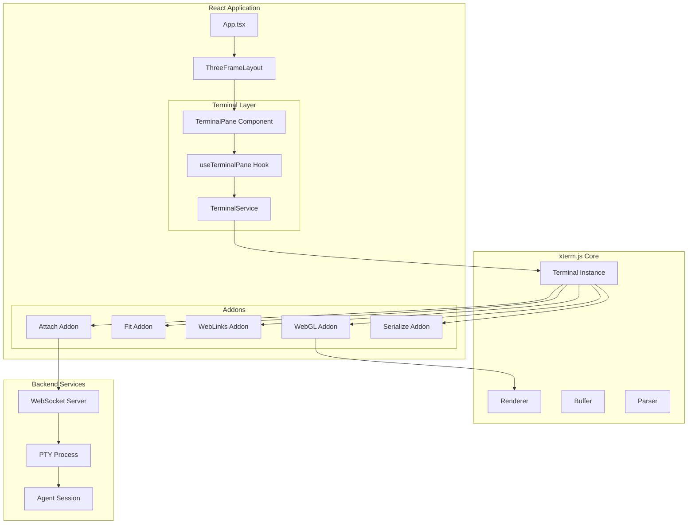
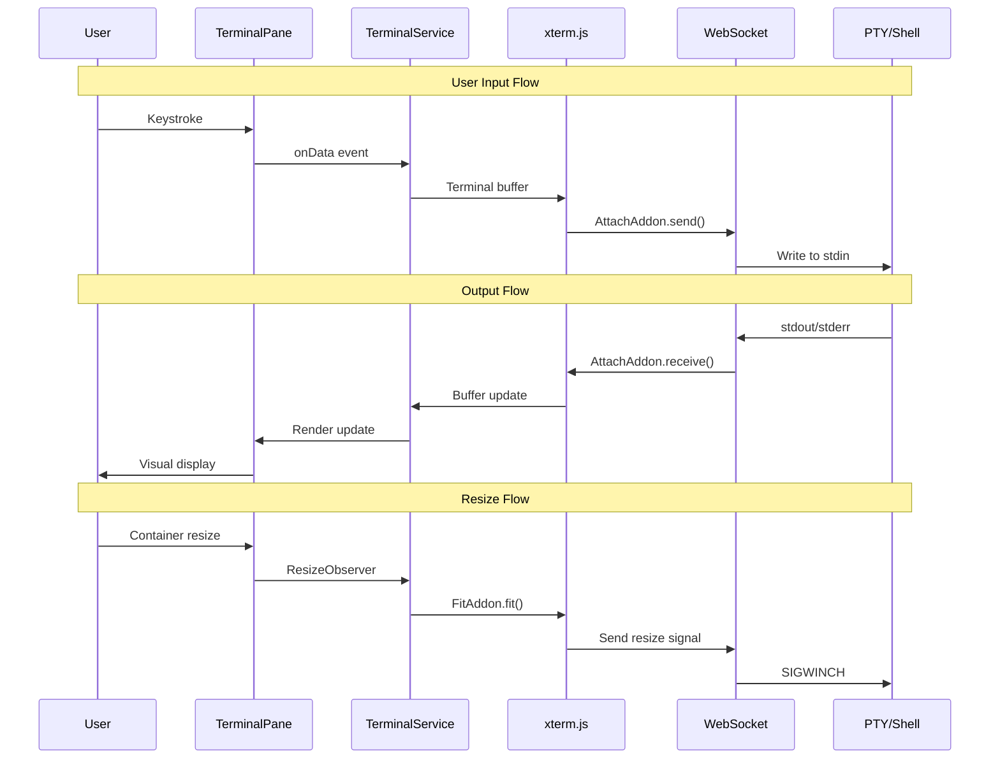
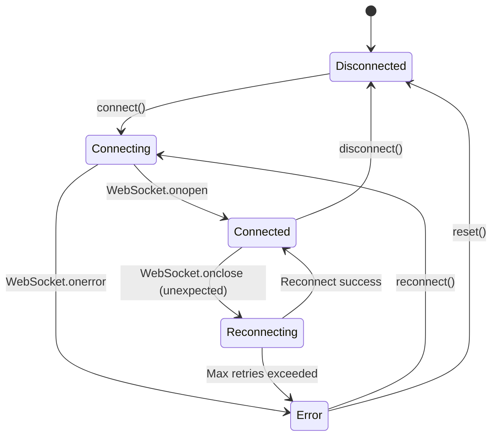
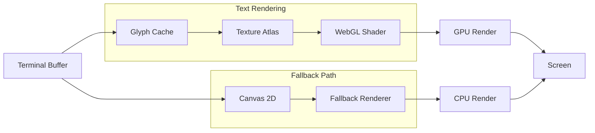

# Terminal Pane Architecture Documentation

**Version:** 1.0.0  
**Last Updated:** 2026-01-11  
**Status:** Implementation Complete  

---

## Table of Contents

1. [Overview](#overview)
2. [Architecture](#architecture)
3. [Component Reference](#component-reference)
4. [Configuration Options](#configuration-options)
5. [Data Flow](#data-flow)
6. [WebGL Rendering](#webgl-rendering)
7. [Theming](#theming)
8. [Integration Patterns](#integration-patterns)
9. [Error Handling](#error-handling)
10. [Troubleshooting](#troubleshooting)
11. [API Reference](#api-reference)

---

## Overview

The Terminal Pane system provides embedded terminal emulation within the Chrysalis Terminal application using [xterm.js](https://xtermjs.org/) as the core library with WebGL-accelerated rendering. The implementation supports two primary use cases:

1. **Voyeur Session Popup** - Real-time observation of agent terminal sessions
2. **Interactive Terminal** - Full bidirectional terminal interaction

### Key Features

- ✅ WebGL-accelerated rendering with automatic canvas fallback
- ✅ Automatic terminal resize handling
- ✅ Theme synchronization with application design system
- ✅ WebSocket-based backend connection
- ✅ Error boundaries with automatic recovery
- ✅ Comprehensive React hook integration
- ✅ TypeScript-first API design

---

## Architecture

### High-Level Component Diagram



### File Structure

```
ui/src/
├── components/
│   └── TerminalPane/
│       ├── index.ts              # Public exports
│       ├── TerminalPane.tsx      # React component
│       ├── TerminalPane.module.css   # Component styles
│       └── __tests__/
│           └── TerminalPane.test.tsx  # Component tests
├── services/
│   └── terminal/
│       ├── index.ts              # Service exports
│       ├── TerminalService.ts    # Core terminal service
│       └── __tests__/
│           └── TerminalService.test.ts  # Service tests
└── hooks/
    └── useTerminalPane.ts        # React hook for terminal management
```

---

## Component Reference

### TerminalPane Component

The main React component for rendering an embedded terminal.

```tsx
import { TerminalPane, type TerminalPaneProps } from '@/components/TerminalPane';

<TerminalPane
  paneId="voyeur-terminal"
  title="Agent Session"
  websocketUrl="ws://localhost:8080/terminal"
  autoConnect={true}
  showHeader={true}
  showConnectionStatus={true}
  showRenderingBackend={true}
  theme={{
    background: '#1e1e2e',
    foreground: '#cdd6f4',
  }}
  onReady={(terminal) => console.log('Terminal ready')}
  onData={(data) => console.log('User input:', data)}
  onResize={(cols, rows) => console.log(`Resized to ${cols}x${rows}`)}
/>
```

### TerminalService

Low-level service for terminal management without React.

```typescript
import { createTerminalService, type ITerminalService } from '@/services/terminal';

const terminal = createTerminalService({
  enableWebGL: true,
  enableLinks: true,
  fontSize: 14,
  fontFamily: 'Cascadia Code, monospace',
});

terminal.mount(document.getElementById('terminal-container')!);
terminal.write('Hello, World!\r\n');

// Cleanup
terminal.dispose();
```

### useTerminalPane Hook

React hook for declarative terminal management.

```tsx
import { useTerminalPane } from '@/hooks/useTerminalPane';

function MyTerminal() {
  const {
    terminalRef,
    connectionState,
    renderingBackend,
    dimensions,
    actions,
    terminalProps,
  } = useTerminalPane({
    paneId: 'my-terminal',
    websocketUrl: 'ws://localhost:8080',
    onData: (data) => console.log('Input:', data),
  });

  return (
    <div>
      <p>Status: {connectionState}</p>
      <p>Rendering: {renderingBackend}</p>
      <p>Size: {dimensions.cols}x{dimensions.rows}</p>
      <button onClick={() => actions.clear()}>Clear</button>
      <TerminalPane ref={terminalRef} {...terminalProps} />
    </div>
  );
}
```

---

## Configuration Options

### TerminalServiceConfig

| Option | Type | Default | Description |
|--------|------|---------|-------------|
| `terminalOptions` | `Partial<ITerminalOptions>` | `{}` | Raw xterm.js options |
| `theme` | `Partial<TerminalTheme>` | Catppuccin Mocha | Color theme |
| `fontFamily` | `string` | `'Cascadia Code, ...'` | Font family stack |
| `fontSize` | `number` | `14` | Font size in pixels |
| `lineHeight` | `number` | `1.2` | Line height multiplier |
| `letterSpacing` | `number` | `0` | Letter spacing in pixels |
| `scrollback` | `number` | `10000` | Scrollback buffer lines |
| `enableWebGL` | `boolean` | `true` | Enable WebGL rendering |
| `enableLinks` | `boolean` | `true` | Enable clickable links |
| `linkHandler` | `Function` | Opens in new tab | Custom link click handler |
| `websocketUrl` | `string` | `''` | WebSocket URL for attach |
| `enableMetrics` | `boolean` | `false` | Enable performance metrics |
| `metricsInterval` | `number` | `1000` | Metrics update interval (ms) |

### TerminalPaneProps

| Prop | Type | Required | Description |
|------|------|----------|-------------|
| `paneId` | `string` | ✅ | Unique identifier |
| `title` | `string` | ❌ | Header title |
| `websocketUrl` | `string` | ❌ | WebSocket connection URL |
| `autoConnect` | `boolean` | ❌ | Auto-connect on mount |
| `config` | `TerminalServiceConfig` | ❌ | Service configuration |
| `theme` | `Partial<TerminalTheme>` | ❌ | Theme overrides |
| `showHeader` | `boolean` | ❌ | Show header bar |
| `showConnectionStatus` | `boolean` | ❌ | Show connection badge |
| `showRenderingBackend` | `boolean` | ❌ | Show WebGL/Canvas badge |
| `initialContent` | `string` | ❌ | Initial content to write |
| `readOnly` | `boolean` | ❌ | Disable user input |
| `onReady` | `Function` | ❌ | Terminal ready callback |
| `onData` | `Function` | ❌ | User input callback |
| `onResize` | `Function` | ❌ | Resize callback |
| `onConnectionStateChange` | `Function` | ❌ | Connection state callback |
| `onMetricsUpdate` | `Function` | ❌ | Metrics update callback |

---

## Data Flow

### Input/Output Flow Diagram



### Connection State Machine



---

## WebGL Rendering

### Rendering Pipeline



### WebGL Addon Initialization

```typescript
// WebGL initialization sequence with fallback
private attachWebGLAddon(): void {
  if (!this.config.enableWebGL || !this.webglSupported) {
    this.renderingBackend = 'canvas';
    return;
  }

  try {
    this.webglAddon = new WebglAddon();
    
    // Handle context loss
    this.webglAddon.onContextLoss(() => {
      this.handleWebGLContextLoss();
    });
    
    this.terminal.loadAddon(this.webglAddon);
    this.renderingBackend = 'webgl';
  } catch (error) {
    // Fallback to canvas
    this.webglAddon = null;
    this.renderingBackend = 'canvas';
  }
}
```

### WebGL Context Loss Recovery

When WebGL context is lost (e.g., GPU driver crash, resource pressure):

1. `onContextLoss` event fires
2. WebGL addon is disposed
3. Rendering falls back to canvas
4. After 1 second delay, recovery is attempted
5. If recovery succeeds, WebGL is restored
6. If recovery fails, canvas rendering continues

---

## Theming

### Default Theme (Catppuccin Mocha)

```typescript
const DEFAULT_THEME: TerminalTheme = {
  background: '#1e1e2e',
  foreground: '#cdd6f4',
  cursor: '#f5e0dc',
  cursorAccent: '#1e1e2e',
  selectionBackground: '#585b70',
  selectionForeground: '#cdd6f4',
  selectionInactiveBackground: '#45475a',
  black: '#45475a',
  red: '#f38ba8',
  green: '#a6e3a1',
  yellow: '#f9e2af',
  blue: '#89b4fa',
  magenta: '#f5c2e7',
  cyan: '#94e2d5',
  white: '#bac2de',
  brightBlack: '#585b70',
  brightRed: '#f38ba8',
  brightGreen: '#a6e3a1',
  brightYellow: '#f9e2af',
  brightBlue: '#89b4fa',
  brightMagenta: '#f5c2e7',
  brightCyan: '#94e2d5',
  brightWhite: '#a6adc8',
};
```

### Dynamic Theme Updates

```tsx
// Via component props
<TerminalPane
  theme={{
    background: '#000000',
    foreground: '#ffffff',
  }}
/>

// Via ref handle
terminalRef.current?.setTheme({
  background: '#000000',
  cursor: '#ff0000',
});

// Via hook actions
const { actions } = useTerminalPane({ paneId: 'test' });
actions.setTheme({ background: '#1a1a1a' });
```

### CSS Variables Integration

The component respects CSS custom properties for consistency:

```css
.terminalPane {
  background: var(--color-surface-primary, #1e1e2e);
  border: 1px solid var(--color-border-subtle, rgba(255, 255, 255, 0.08));
}

.terminalContainer :global(.xterm-viewport) {
  scrollbar-color: var(--color-scrollbar-thumb, rgba(255, 255, 255, 0.2)) transparent;
}
```

---

## Integration Patterns

### Voyeur Session Integration

```tsx
import { useVoyeurTerminal } from '@/hooks/useTerminalPane';
import { useVoyeurEvents } from '@/contexts/VoyeurContext';

function VoyeurTerminalPane({ sessionId }: { sessionId: string }) {
  const voyeur = useVoyeurEvents();
  const {
    terminalRef,
    terminalProps,
    actions,
  } = useVoyeurTerminal({
    paneId: `voyeur-${sessionId}`,
    sessionId,
    showTimestamps: true,
    readOnly: true,
  });

  // Subscribe to Voyeur events
  useEffect(() => {
    const unsubscribe = voyeur.subscribe((event) => {
      if (event.sessionId === sessionId) {
        actions.writeln(formatEvent(event));
      }
    });
    return unsubscribe;
  }, [sessionId, voyeur, actions]);

  return (
    <TerminalPane
      ref={terminalRef}
      {...terminalProps}
      title={`Session: ${sessionId}`}
      showHeader={true}
    />
  );
}
```

### ChatPane Container Integration

```tsx
import { ThreeFrameLayout } from '@/components/ThreeFrameLayout';
import { ChatPane } from '@/components/ChatPane';
import { TerminalPane } from '@/components/TerminalPane';

function ChrysalisWorkspace() {
  const [showTerminal, setShowTerminal] = useState(false);

  return (
    <ThreeFrameLayout
      left={<ChatPane pane="left" />}
      center={
        showTerminal ? (
          <TerminalPane
            paneId="center-terminal"
            websocketUrl="ws://localhost:8080/terminal"
            autoConnect={true}
          />
        ) : (
          <ReactFlowCanvas />
        )
      }
      right={<ChatPane pane="right" />}
    />
  );
}
```

### Multiple Terminal Instances

```tsx
function MultiTerminalView() {
  const terminals = ['term-1', 'term-2', 'term-3'];

  return (
    <div className="terminal-grid">
      {terminals.map((id) => (
        <TerminalPane
          key={id}
          paneId={id}
          title={`Terminal ${id}`}
          config={{
            scrollback: 5000, // Reduced for memory
          }}
        />
      ))}
    </div>
  );
}
```

---

## Error Handling

### Error Boundary

The TerminalPane includes a built-in error boundary:

```tsx
class TerminalErrorBoundary extends React.Component {
  state = { hasError: false, error: null };

  static getDerivedStateFromError(error) {
    return { hasError: true, error };
  }

  componentDidCatch(error, errorInfo) {
    console.error('TerminalPane error:', error, errorInfo);
  }

  handleReset = () => {
    this.setState({ hasError: false, error: null });
    this.props.onReset();
  };

  render() {
    if (this.state.hasError) {
      return (
        <div className={styles.errorContainer}>
          <h4>Terminal Error</h4>
          <p>{this.state.error?.message}</p>
          <Button onClick={this.handleReset}>Restart Terminal</Button>
        </div>
      );
    }
    return this.props.children;
  }
}
```

### Connection Error Recovery

```typescript
// Automatic reconnection with exponential backoff
private attemptReconnect(): void {
  if (this.reconnectAttempts >= this.maxReconnectAttempts) {
    this.setConnectionState('error');
    return;
  }

  this.setConnectionState('reconnecting');
  this.reconnectAttempts++;

  setTimeout(() => {
    this.connect(this.currentWebsocketUrl).catch(() => {
      this.attemptReconnect();
    });
  }, this.reconnectDelay * this.reconnectAttempts);
}
```

---

## Troubleshooting

### Common Issues

#### WebGL Not Available

**Symptom:** Terminal renders but shows "Canvas" badge instead of "WebGL"

**Causes:**
- Browser doesn't support WebGL2/WebGL
- Hardware acceleration disabled
- GPU blocklist

**Solutions:**
1. Check `chrome://gpu` for WebGL status
2. Enable hardware acceleration in browser settings
3. Update graphics drivers
4. Set `enableWebGL: false` to force canvas mode

#### Terminal Not Resizing

**Symptom:** Terminal content doesn't fit container

**Causes:**
- Container has no explicit dimensions
- ResizeObserver not supported
- FitAddon failed to load

**Solutions:**
1. Ensure container has CSS `width` and `height`
2. Call `fit()` manually after layout changes
3. Check browser compatibility for ResizeObserver

#### WebSocket Connection Failing

**Symptom:** Connection state stays "Error" or "Reconnecting"

**Causes:**
- Invalid WebSocket URL
- CORS issues
- Backend not running
- Network issues

**Solutions:**
1. Verify WebSocket URL format (`ws://` or `wss://`)
2. Check browser console for CORS errors
3. Verify backend is running and accessible
4. Check network connectivity

### Debug Mode

Enable verbose logging:

```tsx
<TerminalPane
  config={{
    enableMetrics: true,
    metricsInterval: 1000,
  }}
  onMetricsUpdate={(metrics) => {
    console.log('Terminal metrics:', metrics);
  }}
/>
```

---

## API Reference

### TerminalPaneHandle (Ref Methods)

| Method | Signature | Description |
|--------|-----------|-------------|
| `write` | `(data: string \| Uint8Array) => void` | Write data to terminal |
| `writeln` | `(line: string) => void` | Write line with newline |
| `clear` | `() => void` | Clear terminal buffer |
| `reset` | `() => void` | Reset terminal state |
| `focus` | `() => void` | Focus terminal |
| `blur` | `() => void` | Blur terminal |
| `fit` | `() => void` | Fit to container |
| `getDimensions` | `() => { cols, rows }` | Get current size |
| `serialize` | `() => string` | Get buffer content |
| `getSelection` | `() => string` | Get selected text |
| `connect` | `(url: string) => Promise<void>` | Connect WebSocket |
| `disconnect` | `() => void` | Disconnect WebSocket |
| `reconnect` | `() => Promise<void>` | Reconnect WebSocket |
| `getConnectionState` | `() => ConnectionState` | Get connection state |
| `getRenderingBackend` | `() => RenderingBackend` | Get renderer type |
| `getMetrics` | `() => TerminalMetrics` | Get performance metrics |
| `setTheme` | `(theme: Partial<TerminalTheme>) => void` | Update theme |
| `scrollToBottom` | `() => void` | Scroll to end |

### TerminalMetrics

```typescript
interface TerminalMetrics {
  renderingBackend: 'webgl' | 'canvas';
  webglSupported: boolean;
  webglContextLost: boolean;
  framesRendered: number;
  averageFrameTime: number;
  lastFrameTime: number;
  memoryUsage?: number;
}
```

### ConnectionState

```typescript
type ConnectionState = 
  | 'disconnected' 
  | 'connecting' 
  | 'connected' 
  | 'reconnecting' 
  | 'error';
```

---

## Dependencies

| Package | Version | Purpose |
|---------|---------|---------|
| `@xterm/xterm` | `^5.5.0` | Core terminal emulation |
| `@xterm/addon-webgl` | `^0.18.0` | WebGL rendering |
| `@xterm/addon-fit` | `^0.10.0` | Auto-resize |
| `@xterm/addon-web-links` | `^0.11.0` | Clickable links |
| `@xterm/addon-attach` | `^0.11.0` | WebSocket connection |
| `@xterm/addon-serialize` | `^0.13.0` | Buffer serialization |

---

## Changelog

### v1.0.0 (2026-01-11)

- Initial implementation
- WebGL rendering with canvas fallback
- React component with error boundaries
- useTerminalPane and useVoyeurTerminal hooks
- Comprehensive theming support
- WebSocket connection management
- Unit and integration tests

---

*Documentation generated for the Chrysalis Terminal Frontend Engineering Team*
