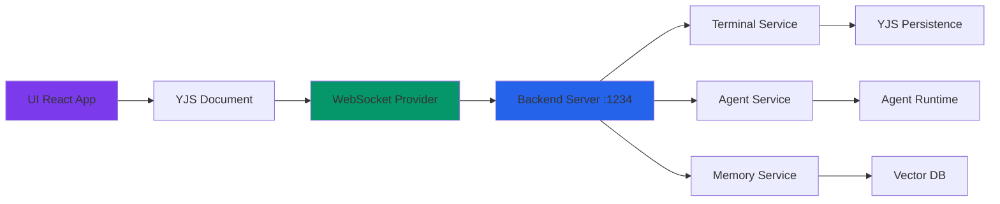
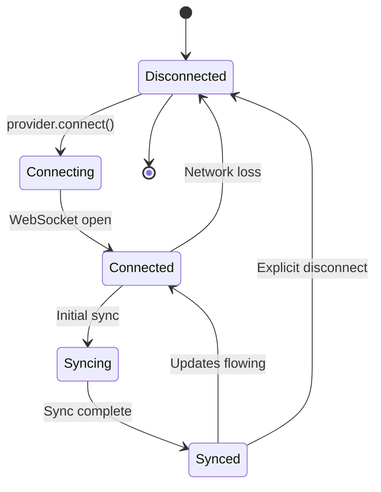

# Backend Integration

**Version:** 1.0.0  
**Last Updated:** January 10, 2026  
**Protocol:** WebSocket + YJS CRDTs

This document describes the integration between Chrysalis Terminal UI and the backend services.

---

## Overview



---

## WebSocket Connection

### Connection Setup

```typescript
import { WebsocketProvider } from 'y-websocket';
import * as Y from 'yjs';

// Create YJS document
const doc = new Y.Doc();

// Connect to backend
const provider = new WebsocketProvider(
  'ws://localhost:1234',           // Server URL
  'chrysalis-terminal-session-id', // Room name
  doc,                              // YJS document
  {
    // Options
    connect: true,
    awareness: {
      // User presence data
      user: {
        name: 'Alice',
        color: '#3B82F6',
        type: 'human'
      }
    }
  }
);

// Connection events
provider.on('status', ({ status }) => {
  // status: 'connecting' | 'connected' | 'disconnected'
  console.log('Connection status:', status);
});

provider.on('sync', (isSynced: boolean) => {
  console.log('Document synced:', isSynced);
});
```

**Source:** [y-websocket](https://github.com/yjs/y-websocket)

---

### Connection States



---

## Data Contracts

### YJS Document Structure

The backend expects this YJS document structure:

```typescript
// Document root
Y.Doc {
  // Session metadata
  session: Y.Map {
    id: string
    name: string
    createdAt: number
    participants: Participant[]
  }
  
  // Chat messages
  chat_left_messages: Y.Array<ChatMessage>
  chat_right_messages: Y.Array<ChatMessage>
  
  // Typing indicators
  typing_indicators: Y.Map {
    left: boolean
    right: boolean
  }
  
  // Canvas state
  canvas_nodes: Y.Array<CanvasNode>
  canvas_edges: Y.Array<CanvasEdge>
  canvas_viewport: Y.Map {
    x: number
    y: number
    zoom: number
  }
}
```

---

### ChatMessage Interface

```typescript
interface ChatMessage {
  id: string;                    // Unique message ID
  content: string;               // Message text
  senderId: string;              // Sender ID (agent ID or user ID)
  senderType: 'human' | 'agent'; // Sender type
  senderName: string;            // Display name
  timestamp: number;             // Unix timestamp (ms)
  metadata: {                    // Optional metadata
    attachments?: Attachment[];
    mentions?: string[];
    replyTo?: string;
    [key: string]: unknown;
  };
}
```

**Created by:** Frontend when user sends message  
**Read by:** Frontend to display messages  
**Modified by:** Backend can add metadata (e.g., sentiment analysis)

---

### CanvasNode Interface

```typescript
interface CanvasNode {
  id: string;                    // Unique node ID
  type: 'text' | 'file' | 'link' | 'group' | 'widget';
  x: number;                     // X position
  y: number;                     // Y position
  width: number;                 // Width in pixels
  height: number;                // Height in pixels
  color?: string;                // Hex color (optional)
  
  // Type-specific data
  text?: string;                 // For type: 'text'
  file?: string;                 // For type: 'file'
  url?: string;                  // For type: 'link'
  widgetType?: string;           // For type: 'widget' ('markdown', 'code', etc.)
  widgetData?: unknown;          // Widget-specific data
}
```

**Source:** [JSONCanvas Specification](https://jsoncanvas.org/)

---

### CanvasEdge Interface

```typescript
interface CanvasEdge {
  id: string;                    // Unique edge ID
  fromNode: string;              // Source node ID
  toNode: string;                // Target node ID
  fromSide?: 'top' | 'right' | 'bottom' | 'left';
  toSide?: 'top' | 'right' | 'bottom' | 'left';
  label?: string;                // Edge label (optional)
  color?: string;                // Hex color (optional)
}
```

---

### Participant Interface

```typescript
interface Participant {
  id: string;                    // Unique participant ID
  name: string;                  // Display name
  type: 'human' | 'agent';       // Participant type
  avatar?: string;               // Avatar URL or emoji
  joinedAt: number;              // Unix timestamp (ms)
  lastActive: number;            // Unix timestamp (ms)
}
```

---

## API Endpoints

### REST Endpoints (Planned)

**Session Management:**

```http
POST /api/terminal/sessions
GET /api/terminal/sessions/:sessionId
DELETE /api/terminal/sessions/:sessionId
```

**Agent Management:**

```http
POST /api/agents
GET /api/agents/:agentId
PUT /api/agents/:agentId
DELETE /api/agents/:agentId
POST /api/agents/:agentId/start
POST /api/agents/:agentId/stop
```

**File Uploads:**

```http
POST /api/uploads
GET /api/uploads/:fileId
DELETE /api/uploads/:fileId
```

---

## Error Handling

### WebSocket Errors

```typescript
provider.on('connection-error', (error) => {
  console.error('WebSocket error:', error);
  
  // Show user notification
  showNotification({
    type: 'error',
    message: 'Connection lost. Reconnecting...'
  });
});
```

### YJS Sync Errors

```typescript
provider.on('sync-error', (error) => {
  console.error('Sync error:', error);
  
  // Possible causes:
  // - Network interruption
  // - Server restart
  // - Document conflict
  
  // YJS will automatically retry
});
```

---

## Authentication (Planned)

### API Key Authentication

```typescript
const provider = new WebsocketProvider(
  'ws://localhost:1234',
  'chrysalis-terminal-session-id',
  doc,
  {
    connect: true,
    params: {
      // Send API key in connection params
      apiKey: wallet.getKeyForProvider('chrysalis')
    }
  }
);
```

### JWT Authentication (Future)

```typescript
const provider = new WebsocketProvider(
  'ws://localhost:1234',
  'chrysalis-terminal-session-id',
  doc,
  {
    connect: true,
    params: {
      token: authToken
    }
  }
);
```

---

## Performance Considerations

### Connection Pooling

One WebSocket connection per Terminal session (not per component).

**✅ Good:**
```tsx
// Single connection at app level
const terminal = useTerminal({ terminalId: 'session-1' });
```

**❌ Bad:**
```tsx
// Don't create multiple connections
const terminal1 = useTerminal({ terminalId: 'session-1' });
const terminal2 = useTerminal({ terminalId: 'session-1' }); // Duplicate!
```

---

### Message Batching

YJS automatically batches updates in transactions:

```typescript
doc.transact(() => {
  // All changes sent as single update
  yMessages.push([message1]);
  yMessages.push([message2]);
  yNodes.insert(0, [node1]);
});
```

---

### Throttling Updates

```typescript
import { throttle } from 'lodash';

// Throttle viewport updates
const handleViewportChange = throttle((viewport) => {
  const yViewport = doc.getMap('canvas_viewport');
  doc.transact(() => {
    yViewport.set('x', viewport.x);
    yViewport.set('y', viewport.y);
    yViewport.set('zoom', viewport.zoom);
  });
}, 100); // Max 10 updates/second
```

---

## Testing

### Mock WebSocket Server

```typescript
// For testing without backend
import { WebsocketProvider } from 'y-websocket';

const mockProvider = {
  on: jest.fn(),
  off: jest.fn(),
  disconnect: jest.fn(),
  awareness: {
    setLocalState: jest.fn(),
    getStates: () => new Map()
  }
};
```

### Local Backend

```bash
# Start local backend (if available)
cd ../backend
npm run dev

# Backend runs on ws://localhost:1234
```

---

## Monitoring

### Connection Health

```typescript
function useConnectionHealth(provider: WebsocketProvider) {
  const [health, setHealth] = useState<'good' | 'poor' | 'disconnected'>('disconnected');
  
  useEffect(() => {
    let reconnectCount = 0;
    
    provider.on('status', ({ status }) => {
      if (status === 'connected') {
        reconnectCount = 0;
        setHealth('good');
      } else if (status === 'connecting') {
        reconnectCount++;
        setHealth(reconnectCount > 3 ? 'poor' : 'good');
      } else {
        setHealth('disconnected');
      }
    });
  }, [provider]);
  
  return health;
}
```

---

## External References

- [YJS Documentation](https://docs.yjs.dev/)
- [y-websocket](https://github.com/yjs/y-websocket)
- [JSONCanvas Specification](https://jsoncanvas.org/)
- [WebSocket Protocol](https://datatracker.ietf.org/doc/html/rfc6455)
- [CRDT Overview](https://crdt.tech/)

---

**Version:** 1.0.0  
**Last Updated:** January 10, 2026  
**Maintainer:** Chrysalis UI Team