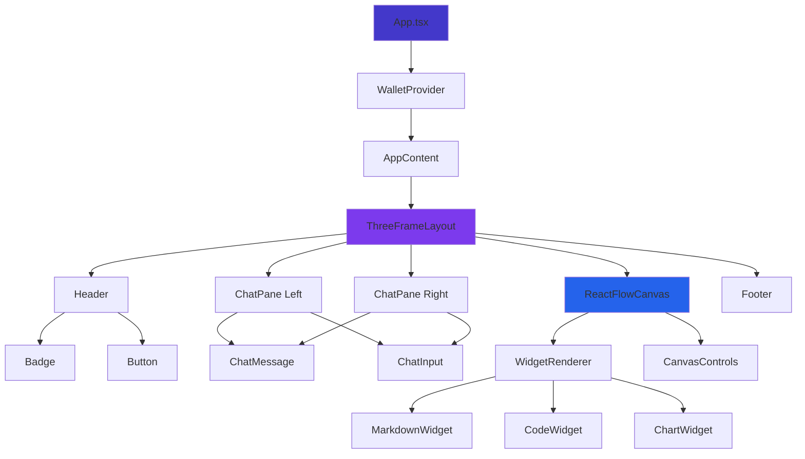
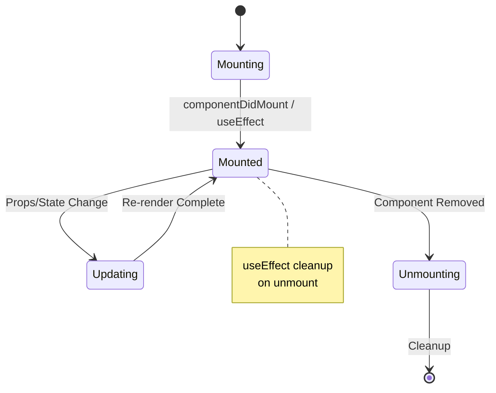

# Component Architecture

**Version:** 1.0.0  
**Last Updated:** January 10, 2026  
**Applies To:** Chrysalis Terminal UI

This document describes the component organization, design patterns, and architectural principles for the Chrysalis Terminal UI.

---

## Component Hierarchy



**Source:** [React Component Composition](https://react.dev/learn/thinking-in-react)

---

## Component Organization

### Directory Structure

```
src/components/
├── ChatPane/              # Chat interface
│   ├── ChatPane.tsx
│   ├── ChatPane.module.css
│   ├── ChatMessage.tsx
│   └── ChatInput.tsx
│
├── ReactFlowCanvas/       # Canvas rendering
│   ├── ReactFlowCanvas.tsx
│   ├── ReactFlowCanvas.module.css
│   ├── nodes/
│   │   └── AgentNode.tsx
│   ├── WidgetRenderer.tsx
│   └── widgets/
│       ├── MarkdownWidget.tsx
│       ├── CodeWidget.tsx
│       └── ChartWidget.tsx
│
├── ThreeFrameLayout/      # Layout system
│   ├── ThreeFrameLayout.tsx
│   └── ThreeFrameLayout.module.css
│
├── Wallet/                # API key management
│   ├── WalletModal.tsx
│   ├── ApiKeyWalletWidget.tsx
│   └── index.ts
│
└── design-system/         # Reusable UI components
    ├── Button/
    ├── Input/
    ├── Card/
    ├── Badge/
    └── index.ts (barrel export)
```

**Pattern:** Feature-based organization with design system separation

---

## Component Types

### 1. Layout Components

**Purpose:** Structure the application layout

**Examples:**
- `ThreeFrameLayout` - Main 3-pane layout
- `Header` - Application header
- `Footer` - Application footer

**Characteristics:**
- Manage spatial relationships
- Control resizing and responsiveness
- Minimal business logic
- Accept children via props

**Example:**
```tsx
interface ThreeFrameLayoutProps {
  header: ReactNode;
  leftPane: ReactNode;
  centerPane: ReactNode;
  rightPane: ReactNode;
  footer: ReactNode;
}
```

---

### 2. Feature Components

**Purpose:** Implement specific features

**Examples:**
- `ChatPane` - Chat functionality
- `ReactFlowCanvas` - Canvas rendering
- `WalletModal` - API key management

**Characteristics:**
- Own state and behavior
- Connect to contexts/hooks
- Coordinate child components
- Implement business logic

**Example:**
```tsx
function ChatPane({ side, messages, onSendMessage }: ChatPaneProps) {
  const [inputValue, setInputValue] = useState('');
  
  const handleSubmit = () => {
    onSendMessage(inputValue);
    setInputValue('');
  };
  
  return (/* render chat UI */);
}
```

---

### 3. Design System Components

**Purpose:** Reusable UI primitives

**Examples:**
- `Button` - Interactive button
- `Input` - Form input
- `Card` - Container component
- `Badge` - Status indicator

**Characteristics:**
- No business logic
- Highly reusable
- Props-driven behavior
- Design token integration
- Full accessibility

**Example:**
```tsx
interface ButtonProps {
  variant: 'primary' | 'secondary' | 'ghost' | 'danger';
  size: 'sm' | 'md' | 'lg';
  isLoading?: boolean;
  iconBefore?: ReactNode;
  children: ReactNode;
  onClick?: () => void;
}
```

**Source:** [Component API Design Patterns](https://kentcdodds.com/blog/how-to-use-react-context-effectively)

---

### 4. Widget Components

**Purpose:** Render canvas content

**Examples:**
- `MarkdownWidget` - Markdown rendering
- `CodeWidget` - Code display with syntax highlighting
- `ChartWidget` - Data visualization

**Characteristics:**
- Receive data via props
- Render specific content types
- Support canvas interactions
- Follow React Flow patterns

**Example:**
```tsx
interface WidgetProps {
  nodeId: string;
  data: ReactFlowNodeData;
  width: number;
  height: number;
  onResize?: (width: number, height: number) => void;
}
```

---

## Component Patterns

### Composition Pattern

**Prefer composition over inheritance**

```tsx
// ❌ Bad: Inheritance-based
class SpecialButton extends Button {
  render() { /* custom logic */ }
}

// ✅ Good: Composition-based
<Button iconBefore={<Icon />} variant="primary">
  {children}
</Button>
```

**Source:** [Composition vs Inheritance](https://react.dev/learn/passing-props-to-a-component)

---

### Container/Presentation Pattern

**Separate logic from presentation**

```tsx
// Container (logic)
function ChatPaneContainer({ terminalId }: Props) {
  const terminal = useTerminal({ terminalId });
  const handleSend = (msg: string) => terminal.actions.sendMessage(msg);
  
  return (
    <ChatPanePresentation
      messages={terminal.messages}
      onSend={handleSend}
    />
  );
}

// Presentation (UI)
function ChatPanePresentation({ messages, onSend }: Props) {
  return (/* pure UI rendering */);
}
```

**Source:** [Presentational and Container Components](https://medium.com/@dan_abramov/smart-and-dumb-components-7ca2f9a7c7d0)

---

### Render Props Pattern

**Share logic between components**

```tsx
<WidgetRenderer nodeId={nodeId}>
  {({ data, isLoading, error }) => (
    isLoading ? <Skeleton /> :
    error ? <ErrorDisplay error={error} /> :
    <MarkdownWidget data={data} />
  )}
</WidgetRenderer>
```

---

### Custom Hooks Pattern

**Extract reusable logic**

```tsx
// Custom hook
function useTerminalConnection(terminalId: string) {
  const [connected, setConnected] = useState(false);
  // Connection logic
  return { connected, send, disconnect };
}

// Usage
function MyComponent() {
  const terminal = useTerminalConnection('my-terminal');
  return <Badge variant={terminal.connected ? 'live' : 'error'} />;
}
```

**Source:** [Building Your Own Hooks](https://react.dev/learn/reusing-logic-with-custom-hooks)

---

## Props Conventions

### Naming

```tsx
interface ComponentProps {
  // Boolean props: is*, has*, should*, can*
  isLoading?: boolean;
  hasError?: boolean;
  shouldAutoFocus?: boolean;
  canEdit?: boolean;
  
  // Event handlers: on*
  onClick?: () => void;
  onChange?: (value: string) => void;
  onSubmit?: (data: FormData) => void;
  
  // Render props: render*
  renderHeader?: () => ReactNode;
  renderEmpty?: () => ReactNode;
  
  // Children (special case)
  children?: ReactNode;
}
```

---

### Required vs Optional

```tsx
// ✅ Good: Clear required/optional split
interface MessageProps {
  // Required
  id: string;
  content: string;
  timestamp: number;
  
  // Optional (with defaults or nullable)
  senderName?: string;
  isRead?: boolean;
  onDelete?: (id: string) => void;
}

// ❌ Bad: Everything optional
interface MessageProps {
  id?: string;
  content?: string;
  // ...
}
```

---

### Props Destructuring

```tsx
// ✅ Good: Destructure in function signature
function Button({ variant, size, children, onClick }: ButtonProps) {
  return <button className={cn(variant, size)} onClick={onClick}>{children}</button>;
}

// ❌ Bad: Access via props object
function Button(props: ButtonProps) {
  return <button onClick={props.onClick}>{props.children}</button>;
}
```

---

## Styling Approach

### CSS Modules

**All components use CSS Modules for scoped styling**

```tsx
// Component.tsx
import styles from './Component.module.css';

function Component() {
  return <div className={styles.container}>...</div>;
}

// Component.module.css
.container {
  background: var(--color-bg-primary);
  padding: var(--space-4);
  border-radius: var(--radius-lg);
}
```

**Benefits:**
- Scoped class names (no conflicts)
- Co-located with components
- Type-safe (with vite-env.d.ts)

---

### Design Tokens

**Use CSS variables from design system**

```css
/* ✅ Good: Use tokens */
.button {
  background: var(--button-primary-bg);
  color: var(--button-primary-text);
  padding: var(--space-3) var(--space-6);
  border-radius: var(--button-radius);
}

/* ❌ Bad: Hardcoded values */
.button {
  background: #3B82F6;
  color: white;
  padding: 12px 24px;
  border-radius: 8px;
}
```

**See:** [Design System README](../../src/styles/README.md)

---

### Conditional Styling

**Use clsx for dynamic classes**

```tsx
import clsx from 'clsx';
import styles from './Button.module.css';

function Button({ variant, size, isLoading }: ButtonProps) {
  return (
    <button
      className={clsx(
        styles.button,
        styles[variant],
        styles[size],
        isLoading && styles.loading
      )}
    >
      {children}
    </button>
  );
}
```

**Source:** [clsx](https://github.com/lukeed/clsx)

---

## TypeScript Patterns

### Interface vs Type

```tsx
// ✅ Use interface for component props (extendable)
interface ButtonProps {
  variant: 'primary' | 'secondary';
  onClick?: () => void;
}

// ✅ Use type for unions and utilities
type ButtonVariant = 'primary' | 'secondary' | 'ghost' | 'danger';
type ButtonSize = 'sm' | 'md' | 'lg';
```

---

### Generic Components

```tsx
// Generic list component
interface ListProps<T> {
  items: T[];
  renderItem: (item: T) => ReactNode;
  keyExtractor: (item: T) => string;
}

function List<T>({ items, renderItem, keyExtractor }: ListProps<T>) {
  return (
    <ul>
      {items.map(item => (
        <li key={keyExtractor(item)}>
          {renderItem(item)}
        </li>
      ))}
    </ul>
  );
}
```

---

### Discriminated Unions

```tsx
// Message type with discriminated union
type Message =
  | { type: 'text'; content: string }
  | { type: 'image'; url: string; alt: string }
  | { type: 'code'; language: string; code: string };

function MessageRenderer({ message }: { message: Message }) {
  switch (message.type) {
    case 'text':
      return <p>{message.content}</p>;
    case 'image':
      return ;
    case 'code':
      return <CodeBlock language={message.language}>{message.code}</CodeBlock>;
  }
}
```

**Source:** [TypeScript Discriminated Unions](https://www.typescriptlang.org/docs/handbook/typescript-in-5-minutes-func.html#discriminated-unions)

---

## File Organization

### Component File Structure

```
Button/
├── Button.tsx           # Main component
├── Button.module.css    # Scoped styles
├── Button.test.tsx      # Tests (future)
└── index.ts             # Barrel export
```

### Index Files (Barrel Exports)

```tsx
// components/design-system/index.ts
export { Button } from './Button/Button';
export type { ButtonProps } from './Button/Button';
export { Input } from './Input/Input';
export type { InputProps } from './Input/Input';
// ...
```

**Usage:**
```tsx
import { Button, Input, Card } from '@/components/design-system';
```

---

## Component Lifecycle

### Mounting & Updates



**Source:** [React Lifecycle](https://react.dev/learn/lifecycle-of-reactive-effects)

---

### Effect Cleanup

```tsx
useEffect(() => {
  // Setup
  const subscription = terminal.subscribe(handleUpdate);
  
  // Cleanup
  return () => {
    subscription.unsubscribe();
  };
}, [terminal]);
```

---

## Accessibility

### ARIA Attributes

```tsx
<button
  aria-label="Send message"
  aria-disabled={isDisabled}
  aria-busy={isLoading}
>
  Send
</button>
```

---

### Keyboard Navigation

```tsx
function Modal({ onClose }: ModalProps) {
  useEffect(() => {
    const handleEscape = (e: KeyboardEvent) => {
      if (e.key === 'Escape') onClose();
    };
    
    document.addEventListener('keydown', handleEscape);
    return () => document.removeEventListener('keydown', handleEscape);
  }, [onClose]);
  
  return (/* modal content */);
}
```

---

### Focus Management

```tsx
function Dialog({ isOpen }: DialogProps) {
  const dialogRef = useRef<HTMLDivElement>(null);
  
  useEffect(() => {
    if (isOpen && dialogRef.current) {
      dialogRef.current.focus();
    }
  }, [isOpen]);
  
  return (
    <div ref={dialogRef} tabIndex={-1} role="dialog">
      {/* content */}
    </div>
  );
}
```

**Source:** [WAI-ARIA Authoring Practices](https://www.w3.org/WAI/ARIA/apg/)

---

## Performance

### React.memo

```tsx
// Memoize expensive components
const ChatMessage = React.memo(function ChatMessage({ message }: Props) {
  return <div className={styles.message}>{message.content}</div>;
}, (prevProps, nextProps) => {
  return prevProps.message.id === nextProps.message.id;
});
```

---

### useCallback

```tsx
function ChatPane() {
  // Memoize callback to prevent child re-renders
  const handleSend = useCallback((content: string) => {
    terminal.actions.sendMessage(content);
  }, [terminal.actions]);
  
  return <ChatInput onSend={handleSend} />;
}
```

---

### useMemo

```tsx
function Canvas({ nodes }: Props) {
  // Memoize expensive computations
  const sortedNodes = useMemo(() => {
    return nodes.sort((a, b) => a.zIndex - b.zIndex);
  }, [nodes]);
  
  return (/* render sortedNodes */);
}
```

**Source:** [React Performance Optimization](https://react.dev/learn/keeping-components-pure)

---

## Testing (Future)

### Component Tests

```tsx
import { render, screen } from '@testing-library/react';
import { Button } from './Button';

test('renders button with text', () => {
  render(<Button variant="primary">Click me</Button>);
  expect(screen.getByRole('button')).toHaveTextContent('Click me');
});

test('calls onClick when clicked', () => {
  const handleClick = jest.fn();
  render(<Button onClick={handleClick}>Click</Button>);
  screen.getByRole('button').click();
  expect(handleClick).toHaveBeenCalledTimes(1);
});
```

---

## Best Practices

### ✅ Do

- Use TypeScript for all components
- Follow design system patterns
- Use CSS Modules for styling
- Implement accessibility features
- Extract reusable logic into hooks
- Use descriptive prop names
- Provide TypeScript interfaces for all props
- Add JSDoc comments for complex components

### ❌ Don't

- Use inline styles (use design tokens)
- Create deeply nested component trees
- Pass too many props (consider context)
- Mutate props or state directly
- Ignore TypeScript errors
- Skip accessibility features
- Hardcode colors or spacing values
- Create "god components" (too many responsibilities)

---

## External References

- [React Documentation](https://react.dev/) - Official React docs
- [TypeScript React Cheatsheet](https://react-typescript-cheatsheet.netlify.app/) - TypeScript patterns
- [WAI-ARIA Patterns](https://www.w3.org/WAI/ARIA/apg/patterns/) - Accessibility guidelines
- [React Performance](https://react.dev/learn/render-and-commit) - Optimization techniques

---

**Version:** 1.0.0  
**Last Updated:** January 10, 2026  
**Maintainer:** Chrysalis UI Team