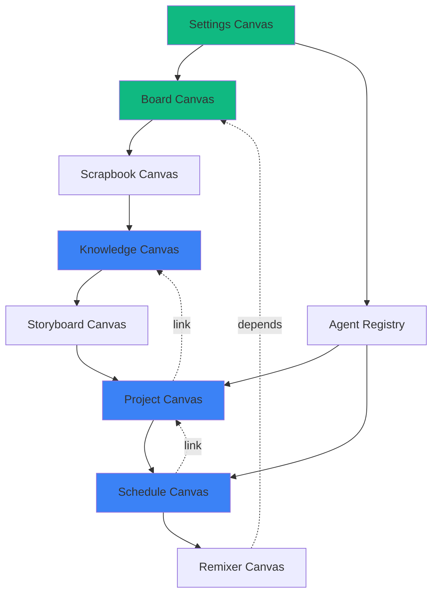

# Canvas Operation Modes - Analysis & New Proposals

**Version:** 1.0  
**Date:** January 14, 2026  
**Status:** Architecture Proposal

---

## Executive Summary

This document analyzes existing canvas operation modes in Chrysalis Terminal, identifies gaps in user experience and functional coverage, and proposes three new canvas modes that logically extend the current taxonomy. Each proposal includes comprehensive specifications with purpose, artifact types, integration patterns, and phased development plans.

---

## Table of Contents

1. [Existing Canvas Modes Analysis](#1-existing-canvas-modes-analysis)
2. [User Experience & Functional Gaps](#2-user-experience--functional-gaps)
3. [Proposed New Canvas Modes](#3-proposed-new-canvas-modes)
4. [Mode Comparison Matrix](#4-mode-comparison-matrix)
5. [Cross-Mode Integration Patterns](#5-cross-mode-integration-patterns)
6. [Implementation Roadmap](#6-implementation-roadmap)

---

## 1. Existing Canvas Modes Analysis

### 1.1 System Service Canvases (Core Infrastructure)

These are always-running invisible canvases providing foundational functionality:

#### **Settings Canvas** ✅ IMPLEMENTED (Jan 14, 2026)
- **Purpose**: System configuration and bootstrap dependency
- **Scope**: API key management, LLM configuration, voice providers, system preferences
- **Visibility**: Can be visible or invisible
- **User Access**: Direct UI interaction
- **Agent Access**: Read-only for configuration retrieval
- **Key Artifacts**:
  - API key definitions (encrypted)
  - Model configurations
  - Voice provider settings
  - System preferences
- **Interactions**:
  - Form-based configuration
  - API key CRUD operations
  - Import/export settings
- **Integration**: Accessed by all agents and canvases for configuration
- **Status**: Production-ready

#### **Contacts/Teams Canvas** (Documented, Not Implemented)
- **Purpose**: Contact and team management
- **Scope**: Individual contacts, team definitions, bulk invites, notification preferences
- **Visibility**: Invisible by default, can be made visible
- **User Access**: Full CRUD operations
- **Agent Access**: Read for @mentions, limited write for suggestions
- **Key Artifacts**:
  - Contact records (name, email, avatar, metadata)
  - Team definitions (members, roles, permissions)
  - Invite templates
  - Notification rules
- **Interactions**:
  - Contact/team CRUD
  - Bulk import from CSV/vCard
  - @mention autocomplete data source
- **Integration**: Powers chat @mentions, collaboration features
- **Status**: Specification phase

#### **Agent Registry Canvas** (Documented, Not Implemented)
- **Purpose**: Inside Agent definitions and configurations
- **Scope**: Agent personas, LLM connections, tool assignments, permissions
- **Visibility**: Invisible by default, visible for agent configuration
- **User Access**: Full CRUD for agent definitions
- **Agent Access**: Read-only self-introspection
- **Key Artifacts**:
  - Agent definition files (.agent format)
  - LLM connection configs
  - Tool/widget assignments
  - Access permissions (chat read/write, canvas access)
- **Interactions**:
  - Agent CRUD operations
  - LLM connection testing
  - Permission management UI
- **Integration**: Populates agent roster, controls agent access to chats/canvases
- **Status**: Specification phase

### 1.2 Work Canvas Modes (User-Facing)

These are flexible canvases for project work:

#### **Board Canvas** (General-Purpose)
- **Purpose**: Flexible node-based workspace for general collaboration
- **Scope**: Agents, widgets, files, connections - any node type
- **Type System**: `'board'` (accepts all)
- **Layout**: Infinite React Flow canvas
- **Key Artifacts**:
  - Agent nodes (🤖)
  - Widget nodes (📊 charts, 📝 markdown, 💻 code)
  - File nodes (📄)
  - Link nodes (🔗)
  - Group nodes (📦)
  - Edges (connections)
- **Interactions**:
  - Drag nodes to position
  - Connect nodes with edges
  - Double-click to edit
  - Right-click context menu
  - Zoom/pan viewport
- **Integration**: Default canvas type, works with all agents and widgets
- **Status**: Implemented (ReactFlowCanvas)

#### **Scrapbook Canvas**
- **Purpose**: Visual media collection with annotation and tagging
- **Scope**: Images, videos, audio, text notes, links
- **Type System**: `'scrapbook'` (accepts media + notes)
- **Layout**: Masonry grid with responsive columns
- **Key Artifacts**:
  - Image files (thumbnails + full-size)
  - Video/audio files
  - Text notes (markdown)
  - External links
  - Tags and metadata
- **Interactions**:
  - Drag-and-drop upload
  - Tag/untag items
  - Filter by tag/type/date
  - Search functionality
  - Lightbox viewer
- **Integration**: Agents can auto-tag via LLM, export to other canvases
- **Status**: Planned (Week 3)

#### **Storyboard Canvas**
- **Purpose**: Sequential narrative building with timeline
- **Scope**: Slides with text, images, voice annotations
- **Type System**: `'storyboard'` (accepts slides + media)
- **Layout**: Horizontal timeline with slide cards
- **Key Artifacts**:
  - Slide definitions (text, image, voice)
  - Voice recordings (WAV/MP3)
  - Timeline metadata (duration, transitions)
- **Interactions**:
  - Drag slides to reorder
  - Edit slide content
  - Record/attach voice
  - Play presentation
  - Export as video/PDF
- **Integration**: Agents can generate slides from scripts, TTS for narration
- **Status**: Planned (Week 4)

#### **Remixer Canvas**
- **Purpose**: AI-powered creative workspace
- **Scope**: AI generation widgets (Runway, DALL-E, ElevenLabs)
- **Type System**: `'remixer'` (accepts generation widgets)
- **Layout**: Widget workspace with generation queue
- **Key Artifacts**:
  - Generation job definitions (prompt, parameters)
  - AI-generated results (images, videos, audio)
  - Generation history
- **Interactions**:
  - Configure generation parameters
  - Queue generation jobs
  - View results gallery
  - Create variations
- **Integration**: Agents can trigger generations, results exportable to other canvases
- **Status**: Planned (Week 5)

---

## 2. User Experience & Functional Gaps

### 2.1 Gap Analysis

Based on architecture review and user workflow requirements:

| Gap Category | Description | Impact | Affected Workflows |
|-------------|-------------|--------|-------------------|
| **Project Organization** | No dedicated mode for project structure, milestones, dependencies | High | Long-term projects, multi-agent coordination |
| **Knowledge Management** | No structured way to organize domain knowledge, documentation, research | High | Research workflows, knowledge synthesis |
| **Temporal Planning** | No calendar/timeline view for scheduled work, deadlines, agent tasks | Medium | Time-sensitive projects, scheduling |
| **Data Analysis** | Media/Data canvases mentioned but no analysis-focused workspace | Medium | Data science, analytics workflows |
| **Collaborative Review** | No dedicated mode for review cycles, feedback, approvals | Medium | Quality assurance, iterative refinement |
| **Agent Orchestration** | Agent Registry is config-only, no visual orchestration workspace | Low | Complex multi-agent workflows |

### 2.2 Architectural Patterns Identified

**Pattern 1: Dual Nature**
- Canvases can be visible (user-facing) or invisible (agent workspace)
- Example: Settings visible for user config, invisible for agent access

**Pattern 2: Type-Safe Artifacts**
- Each canvas accepts specific artifact types (MIME types, file extensions)
- Reject non-matching types with visual feedback

**Pattern 3: YJS Collaboration**
- Real-time sync via YJS (one room per canvas)
- Multi-user, multi-agent collaboration boundary

**Pattern 4: Agent Integration**
- Agents can read/write based on permissions
- @mention override for direct requests

**Pattern 5: Voyeur Mode**
- Pure observation of invisible canvases
- No control, only visibility into agent work

### 2.3 User Workflow Requirements

From documentation and architectural philosophy:

**Workflow 1: Research & Synthesis**
- Collect information from multiple sources
- Organize knowledge hierarchically
- Synthesize insights with agent assistance
- **Gap**: No structured knowledge organization mode

**Workflow 2: Project Planning**
- Define project structure and milestones
- Assign tasks to agents
- Track dependencies and progress
- **Gap**: No project planning mode

**Workflow 3: Temporal Coordination**
- Schedule agent tasks
- Set deadlines and reminders
- View timeline of work
- **Gap**: No temporal planning mode

**Workflow 4: Data Analysis**
- Import datasets
- Run analysis with agent assistance
- Visualize results
- **Gap**: Data Canvas mentioned but not specified

---

## 3. Proposed New Canvas Modes

### 3.1 Knowledge Canvas (Research & Documentation)

**Conceptual Foundation**: A hierarchical knowledge organization system inspired by note-taking apps (Notion, Obsidian) but designed for agent-assisted research and documentation.

#### Purpose & Boundaries

**Primary Purpose**: Organize domain knowledge, research notes, documentation, and reference materials in a structured, searchable, and agent-accessible format.

**Scope Includes**:
- Hierarchical document structure (folders, pages, nested sections)
- Markdown documents with rich text editing
- Bi-directional links between documents (wiki-style)
- Embedded media and code blocks
- Tag-based organization
- Full-text search
- Agent-generated summaries and insights

**Scope Excludes**:
- Project management features (use Project Canvas)
- Media-first collections (use Scrapbook Canvas)
- Sequential narratives (use Storyboard Canvas)
- Real-time data analysis (use Data Canvas)

**Conceptual Boundaries**:
- Focus: Knowledge preservation and retrieval
- Metaphor: Digital knowledge base / wiki
- Unit of work: Document or note
- Organization: Hierarchical + tag-based

#### Artifact Types & Interactions

**Accepted Artifact Types**:
```typescript
interface KnowledgeCanvasAccepts {
  documents: ['.md', '.txt', '.html'];
  embeddings: ['.pdf', '.png', '.jpg', '.svg'];
  code: ['.js', '.ts', '.py', '.json'];
  data: ['.csv', '.json'] // Read-only preview;
}
```

**Core Artifacts**:

1. **Knowledge Documents**
   ```typescript
   interface KnowledgeDocument {
     id: string;
     title: string;
     content: string; // Markdown
     parentId: string | null; // For hierarchy
     tags: string[];
     metadata: {
       createdAt: number;
       updatedAt: number;
       createdBy: string;
       wordCount: number;
       readingTime: number;
     };
     backlinks: string[]; // Document IDs linking here
     attachments: MediaAttachment[];
   }
   ```

2. **Knowledge Links**
   ```typescript
   interface KnowledgeLink {
     sourceDocId: string;
     targetDocId: string;
     context: string; // Surrounding text
     type: 'reference' | 'related' | 'parent' | 'child';
   }
   ```

3. **Agent Insights**
   ```typescript
   interface AgentInsight {
     id: string;
     documentId: string;
     agentId: string;
     type: 'summary' | 'question' | 'suggestion' | 'connection';
     content: string;
     confidence: number;
     createdAt: number;
   }
   ```

**User Interactions**:
- **Create**: New document, folder, or nested section
- **Edit**: Rich markdown editor with live preview
- **Link**: Create [[wiki-style]] links to other documents
- **Search**: Full-text search across all documents
- **Tag**: Add/remove tags, filter by tag
- **Navigate**: Breadcrumb navigation, document tree
- **Request**: Ask agent to summarize, expand, or find connections

**Agent Interactions**:
- **Read**: Access all documents for context retrieval
- **Write**: Create summaries, insights, suggested connections
- **Search**: Find relevant documents for user queries
- **Analyze**: Identify gaps, duplicate content, or related topics
- **Suggest**: Recommend document structure improvements

#### Integration with Existing Modes

**With Settings Canvas**:
- Knowledge Canvas respects API key settings for LLM-based features
- Voice provider settings apply to text-to-speech for documents

**With Agent Registry**:
- Agents with "knowledge_assistant" role can suggest document structure
- Permission-controlled write access for agent-generated insights

**With Board Canvas**:
- Documents can be exported as nodes with backlinks preserved as edges
- Visual graph view of document relationships

**With Scrapbook Canvas**:
- Media from Scrapbook can be embedded in Knowledge documents
- Documents can reference Scrapbook items with thumbnails

**With Chat Panes**:
- @mention a document to include its content in agent context
- Agents can cite documents in responses with links

#### Data Model & State Management

**YJS Document Schema**:
```typescript
// YJS room: knowledge-canvas-{canvasId}
Y.Doc {
  canvas_metadata: Y.Map<{
    canvasId: string;
    title: string;
    rootDocumentId: string;
  }>;
  
  knowledge_documents: Y.Map<string, KnowledgeDocument>;
  knowledge_links: Y.Array<KnowledgeLink>;
  knowledge_tags: Y.Array<string>; // All unique tags
  agent_insights: Y.Map<string, AgentInsight[]>; // By documentId
  
  // For real-time editing
  active_editors: Y.Map<string, {
    userId: string;
    documentId: string;
    cursorPosition: number;
  }>;
}
```

**Local State (Zustand)**:
```typescript
interface KnowledgeCanvasState {
  // UI state
  activeDocumentId: string | null;
  isEditing: boolean;
  searchQuery: string;
  selectedTags: string[];
  viewMode: 'document' | 'outline' | 'graph';
  
  // Document tree
  documentTree: DocumentTreeNode[];
  
  // Search results
  searchResults: KnowledgeDocument[];
  
  // Actions
  createDocument: (parentId: string | null) => void;
  updateDocument: (id: string, updates: Partial<KnowledgeDocument>) => void;
  deleteDocument: (id: string) => void;
  createLink: (sourceId: string, targetId: string) => void;
  searchDocuments: (query: string) => void;
}
```

#### Phased Development Plan

**Phase 1: Data Model & Core Rendering (5 days)**

*Sprint 1.1 (Days 1-2): Data Infrastructure*
```
Tasks:
├── Define TypeScript interfaces (KnowledgeDocument, Link, Insight)
├── Implement YJS schema setup
├── Create useKnowledgeCanvas hook
├── Implement Zustand store for local state
└── Unit tests for data layer

Deliverables:
- knowledge/types.ts (150 LOC)
- knowledge/useKnowledgeYJS.ts (200 LOC)  
- knowledge/store.ts (250 LOC)
- Tests (100 LOC)

Dependencies: None
```

*Sprint 1.2 (Days 3-5): Core Rendering*
```
Tasks:
├── KnowledgeCanvas container component
├── DocumentTree sidebar (hierarchical navigation)
├── DocumentViewer (markdown renderer)
├── DocumentEditor (markdown editor with live preview)
└── Basic styling with CSS Modules

Deliverables:
- KnowledgeCanvas.tsx (400 LOC)
- DocumentTree.tsx (200 LOC)
- DocumentViewer.tsx (150 LOC)
- DocumentEditor.tsx (250 LOC)
- Styles (150 LOC)

Dependencies: Phase 1.1
```

**Phase 2: Interaction Logic (4 days)**

*Sprint 2.1 (Days 1-2): Document Operations*
```
Tasks:
├── Create/update/delete document logic
├── Drag-and-drop to reorganize tree
├── Copy/paste documents
├── Undo/redo for editor
└── Auto-save to YJS

Deliverables:
- Document CRUD operations (200 LOC)
- Tree reorganization (150 LOC)
- Editor history (100 LOC)

Dependencies: Phase 1
```

*Sprint 2.2 (Days 3-4): Linking & Search*
```
Tasks:
├── [[Wiki-style]] link parser
├── Link autocomplete
├── Backlink panel
├── Full-text search implementation
├── Tag-based filtering

Deliverables:
- LinkParser.ts (150 LOC)
- SearchEngine.ts (200 LOC)
- BacklinkPanel.tsx (100 LOC)
- TagFilter.tsx (100 LOC)

Dependencies: Phase 1
```

**Phase 3: Agent Integration (3 days)**

*Sprint 3.1 (Days 1-2): Agent Read Access*
```
Tasks:
├── Agent permission checks (read from Agent Registry)
├── Document retrieval API for agents
├── Search API for agent context gathering
└── Citation formatting

Deliverables:
- agentAccess.ts (200 LOC)
- Agent search API (150 LOC)

Dependencies: Agent Registry Canvas
```

*Sprint 3.2 (Day 3): Agent Write Features*
```
Tasks:
├── Agent insight submission
├── Insight display in document margins
├── Summary generation UI
└── Connection suggestion panel

Deliverables:
- AgentInsightPanel.tsx (200 LOC)
- Insight rendering (100 LOC)

Dependencies: Phase 3.1
```

**Phase 4: UI Refinements (3 days)**

*Sprint 4.1 (Days 1-2): Advanced Features*
```
Tasks:
├── Graph view (document relationships)
├── Export to Markdown/PDF
├── Import from Markdown files/folders
├── Template system (pre-structured documents)
└── Table of contents auto-generation

Deliverables:
- GraphView.tsx (using react-force-graph) (300 LOC)
- Export/import (200 LOC)
- Templates (100 LOC)

Dependencies: Phases 1-3
```

*Sprint 4.2 (Day 3): Polish*
```
Tasks:
├── Keyboard shortcuts (Cmd+K for search, Cmd+N for new)
├── Accessibility (ARIA labels, keyboard nav)
├── Responsive design
└── Loading states and error handling

Deliverables:
- Polish and refinements (150 LOC)
- Accessibility audit

Dependencies: All previous phases
```

**Total Effort**: 15 days (3 weeks) with 1 developer

---

### 3.2 Project Canvas (Planning & Coordination)

**Conceptual Foundation**: A project management workspace combining Gantt charts, kanban boards, and milestone tracking, optimized for human-agent collaboration.

#### Purpose & Boundaries

**Primary Purpose**: Plan, track, and coordinate multi-agent projects with milestones, dependencies, and task assignments.

**Scope Includes**:
- Project structure definition (phases, milestones, tasks)
- Task assignments to humans and agents
- Dependency tracking (blocked by, blocks)
- Timeline visualization (Gantt chart)
- Progress tracking and status updates
- Resource allocation
- Agent work queues

**Scope Excludes**:
- Document writing (use Knowledge Canvas)
- Media organization (use Scrapbook Canvas)
- Code execution (use Board Canvas with widgets)
- Detailed scheduling (use Schedule Canvas)

**Conceptual Boundaries**:
- Focus: Project structure and coordination
- Metaphor: Digital project board + Gantt chart
- Unit of work: Task or milestone
- Organization: Hierarchical (project → phase → task)

#### Artifact Types & Interactions

**Accepted Artifact Types**:
```typescript
interface ProjectCanvasAccepts {
  projectFiles: ['.project.json', '.gantt.json'];
  attachments: ['.md', '.pdf', '.png']; // Reference docs
  agentAssignments: ['.agent'] // Via drag-and-drop from roster;
}
```

**Core Artifacts**:

1. **Project Definition**
   ```typescript
   interface Project {
     id: string;
     name: string;
     description: string;
     startDate: Date;
     endDate: Date;
     status: 'planning' | 'active' | 'on-hold' | 'completed';
     phases: Phase[];
     team: TeamMember[];
     metadata: {
       createdBy: string;
       createdAt: number;
       tags: string[];
     };
   }
   ```

2. **Phase & Milestone**
   ```typescript
   interface Phase {
     id: string;
     name: string;
     description: string;
     startDate: Date;
     endDate: Date;
     milestones: Milestone[];
     tasks: Task[];
   }
   
   interface Milestone {
     id: string;
     name: string;
     date: Date;
     criteria: string[]; // Success criteria
     status: 'pending' | 'achieved' | 'missed';
   }
   ```

3. **Task**
   ```typescript
   interface Task {
     id: string;
     title: string;
     description: string;
     assignedTo: string[]; // User IDs or agent IDs
     status: 'todo' | 'in-progress' | 'blocked' | 'review' | 'done';
     priority: 'low' | 'medium' | 'high' | 'critical';
     estimatedHours: number;
     actualHours: number;
     dependencies: string[]; // Task IDs
     blockedBy: string[]; // Task IDs
     dueDate: Date;
     attachments: string[]; // Document IDs
     comments: TaskComment[];
   }
   ```

**User Interactions**:
- **Create**: New project, phase, milestone, or task
- **Assign**: Drag agents/users to tasks
- **Track**: Update task status via kanban or list view
- **Visualize**: View Gantt chart, dependency graph
- **Report**: Generate progress reports
- **Filter**: By assignee, status, priority, phase

**Agent Interactions**:
- **View Queue**: See assigned tasks in priority order
- **Update Status**: Mark tasks as in-progress or done
- **Report Blockers**: Flag tasks as blocked with reason
- **Estimate**: Provide time estimates for tasks
- **Suggest**: Recommend task breakdown or dependencies

#### Integration with Existing Modes

**With Agent Registry**:
- Pull agent list for task assignment
- Agents can only see tasks they're assigned to (unless permission override)

**With Knowledge Canvas**:
- Tasks can link to Knowledge documents as requirements or specs
- Project retrospectives can be stored as Knowledge documents

**With Board Canvas**:
- Export project structure as flowchart nodes
- Visualize dependencies as edges

**With Chat Panes**:
- @mention tasks to discuss in chat
- Agents can update task status via chat commands

**With Settings Canvas**:
- Project templates can be saved in settings
- Default estimation factors configured in settings

#### Data Model & State Management

**YJS Document Schema**:
```typescript
// YJS room: project-canvas-{canvasId}
Y.Doc {
  canvas_metadata: Y.Map<{
    canvasId: string;
    projectName: string;
  }>;
  
  project: Y.Map<Project>;
  phases: Y.Array<Phase>;
  tasks: Y.Map<string, Task>; // By task ID
  task_dependencies: Y.Array<{sourceId: string, targetId: string}>;
  
  // Agent work queues (computed from tasks)
  agent_queues: Y.Map<string, string[]>; // agentId → taskIds
  
  // Activity log
  activity_log: Y.Array<ActivityEvent>;
}
```

**Local State**:
```typescript
interface ProjectCanvasState {
  // UI state
  viewMode: 'kanban' | 'gantt' | 'list' | 'graph';
  selectedPhaseId: string | null;
  selectedTaskId: string | null;
  filterByAssignee: string[];
  filterByStatus: TaskStatus[];
  
  // Computed views
  ganttData: GanttRow[];
  kanbanColumns: KanbanColumn[];
  criticalPath: string[]; // Task IDs
  
  // Actions
  createTask: (phaseId: string, task: Partial<Task>) => void;
  updateTask: (taskId: string, updates: Partial<Task>) => void;
  assignTask: (taskId: string, assigneeId: string) => void;
  setDependency: (taskId: string, dependsOnId: string) => void;
}
```

#### Phased Development Plan

**Phase 1: Data Model & Core Rendering (4 days)**

*Sprint 1.1 (Days 1-2): Data Infrastructure*
```
Tasks:
├── Define TypeScript interfaces
├── Implement YJS schema
├── Create useProjectCanvas hook
├── Implement Zustand store
└── Unit tests

Deliverables:
- project/types.ts (200 LOC)
- project/useProjectYJS.ts (200 LOC)
- project/store.ts (300 LOC)

Dependencies: None
```

*Sprint 1.2 (Days 3-4): Core Rendering*
```
Tasks:
├── ProjectCanvas container
├── ProjectHeader (name, dates, status)
├── PhaseList sidebar
├── TaskList view (default)
└── Basic styling

Deliverables:
- ProjectCanvas.tsx (300 LOC)
- TaskList.tsx (250 LOC)

Dependencies: Phase 1.1
```

**Phase 2: Interaction Logic (5 days)**

*Sprint 2.1 (Days 1-2): Task Management*
```
Tasks:
├── Task CRUD operations
├── Drag-and-drop task assignment
├── Status updates
├── Priority changes
└── Dependency management

Deliverables:
- Task operations (250 LOC)
- Drag-and-drop (150 LOC)

Dependencies: Phase 1
```

*Sprint 2.2 (Days 3-4): Kanban View*
```
Tasks:
├── KanbanBoard component
├── Column-based task organization
├── Drag-and-drop between columns
├── Task cards with mini-preview
└── Filtering

Deliverables:
- KanbanBoard.tsx (300 LOC)
- KanbanColumn.tsx (150 LOC)
- TaskCard.tsx (150 LOC)

Dependencies: Phase 2.1
```

*Sprint 2.3 (Day 5): Gantt View*
```
Tasks:
├── GanttChart component (using react-gantt-chart)
├── Timeline rendering
├── Dependency lines
└── Milestone markers

Deliverables:
- GanttChart.tsx (400 LOC)

Dependencies: Phase 2.1
```

**Phase 3: Agent Integration (3 days)**

*Sprint 3.1 (Days 1-2): Agent Work Queues*
```
Tasks:
├── Compute agent task queues from assignments
├── AgentQueuePanel component
├── Task priority sorting
└── Blocked task detection

Deliverables:
- agentQueue.ts (200 LOC)
- AgentQueuePanel.tsx (200 LOC)

Dependencies: Phase 2
```

*Sprint 3.2 (Day 3): Agent Status Updates*
```
Tasks:
├── Agent API for task status updates
├── Blocker reporting
├── Time logging
└── Activity notifications

Deliverables:
- agentTaskAPI.ts (150 LOC)

Dependencies: Phase 3.1
```

**Phase 4: UI Refinements (3 days)**

*Sprint 4.1 (Days 1-2): Advanced Features*
```
Tasks:
├── Dependency graph view
├── Critical path highlighting
├── Progress reports (export to PDF)
├── Template system (project templates)
└── Bulk operations

Deliverables:
- DependencyGraph.tsx (250 LOC)
- Reports (200 LOC)
- Templates (150 LOC)

Dependencies: Phases 1-3
```

*Sprint 4.2 (Day 3): Polish*
```
Tasks:
├── Keyboard shortcuts
├── Accessibility
├── Responsive design
└── Loading states

Deliverables:
- Polish (150 LOC)

Dependencies: All previous
```

**Total Effort**: 15 days (3 weeks) with 1 developer

---

### 3.3 Schedule Canvas (Temporal Planning)

**Conceptual Foundation**: A calendar-based workspace for temporal coordination of human schedules, agent tasks, deadlines, and reminders.

#### Purpose & Boundaries

**Primary Purpose**: Visualize and manage time-based activities, appointments, deadlines, and agent task schedules on a calendar interface.

**Scope Includes**:
- Calendar views (day, week, month, agenda)
- Event scheduling (meetings, deadlines, reminders)
- Agent task scheduling (when to execute tasks)
- Recurring events
- Time zone handling
- Availability tracking
- Calendar sharing and invitations

**Scope Excludes**:
- Project structure (use Project Canvas)
- Detailed task management (use Project Canvas)
- Document scheduling (use Knowledge Canvas for content calendar)

**Conceptual Boundaries**:
- Focus: Temporal coordination and scheduling
- Metaphor: Digital calendar + task scheduler
- Unit of work: Event or scheduled task
- Organization: Time-based (chronological)

#### Artifact Types & Interactions

**Accepted Artifact Types**:
```typescript
interface ScheduleCanvasAccepts {
  calendarFiles: ['.ics', '.ical'];
  agentSchedules: ['.schedule.json'];
  integrations: ['google-calendar', 'outlook-calendar'];
}
```

**Core Artifacts**:

1. **Calendar Event**
   ```typescript
   interface CalendarEvent {
     id: string;
     title: string;
     description: string;
     startTime: Date;
     endTime: Date;
     allDay: boolean;
     recurrence?: RecurrenceRule;
     location?: string;
     attendees: string[]; // User IDs or agent IDs
     reminders: Reminder[];
     type: 'meeting' | 'deadline' | 'agent-task' | 'reminder' | 'block';
     metadata: {
       createdBy: string;
       linkedTaskId?: string; // From Project Canvas
       linkedDocumentId?: string; // From Knowledge Canvas
       color: string;
     };
   }
   ```

2. **Agent Schedule**
   ```typescript
   interface AgentSchedule {
     agentId: string;
     scheduledTasks: ScheduledTask[];
     availability: AvailabilityBlock[];
     maxConcurrentTasks: number;
   }
   
   interface ScheduledTask {
     id: string;
     taskId: string; // From Project Canvas
     scheduledStartTime: Date;
     estimatedDuration: number; // Minutes
     status: 'scheduled' | 'running' | 'completed' | 'failed';
   }
   ```

3. **Recurrence Rule**
   ```typescript
   interface RecurrenceRule {
     frequency: 'daily' | 'weekly' | 'monthly' | 'yearly';
     interval: number; // e.g., every 2 weeks
     endDate?: Date;
     daysOfWeek?: number[]; // 0-6 (Sunday-Saturday)
     exceptions: Date[]; // Skip these dates
   }
   ```

**User Interactions**:
- **Create**: New event, deadline, or agent task schedule
- **View**: Switch between day/week/month/agenda views
- **Schedule**: Drag-and-drop to reschedule events
- **Invite**: Add attendees (humans or agents)
- **Remind**: Set reminders (email, notification)
- **Block**: Mark unavailable time blocks

**Agent Interactions**:
- **View Schedule**: See assigned task schedules
- **Update**: Report actual start/end times
- **Request**: Ask for schedule changes if blocked
- **Notify**: Alert user of schedule conflicts

#### Integration with Existing Modes

**With Project Canvas**:
- Tasks from Project Canvas can be scheduled on calendar
- Milestones appear as deadline events
- Gantt view can sync with Schedule view

**With Agent Registry**:
- Agent availability configured in registry
- Agent capacity limits enforced in scheduling

**With Knowledge Canvas**:
- Content calendar for publishing documents
- Link events to reference documents

**With Chat Panes**:
- Schedule meetings via chat commands (/schedule)
- Agents can propose meeting times
- Event reminders sent to chat

**With Settings Canvas**:
- Default calendar view preferences
- Time zone settings
- Notification preferences

#### Data Model & State Management

**YJS Document Schema**:
```typescript
// YJS room: schedule-canvas-{canvasId}
Y.Doc {
  canvas_metadata: Y.Map<{
    canvasId: string;
    defaultView: 'day' | 'week' | 'month';
  }>;
  
  calendar_events: Y.Map<string, CalendarEvent>; // By event ID
  agent_schedules: Y.Map<string, AgentSchedule>; // By agent ID
  
  // Recurring event instances (computed)
  recurring_instances: Y.Map<string, Date[]>; // eventId → occurrence dates
  
  // Reminders queue
  pending_reminders: Y.Array<{
    eventId: string;
    reminderTime: Date;
    sent: boolean;
  }>;
}
```

**Local State**:
```typescript
interface ScheduleCanvasState {
  // UI state
  currentView: 'day' | 'week' | 'month' | 'agenda';
  currentDate: Date;
  selectedEventId: string | null;
  filterByType: EventType[];
  filterByAttendee: string[];
  
  // Computed views
  visibleEvents: CalendarEvent[];
  agentAvailability: Record<string, AvailabilityBlock[]>;
  
  // Actions
  createEvent: (event: Partial<CalendarEvent>) => void;
  updateEvent: (id: string, updates: Partial<CalendarEvent>) => void;
  deleteEvent: (id: string) => void;
  scheduleAgentTask: (agentId: string, taskId: string, startTime: Date) => void;
  checkAvailability: (attendeeIds: string[], startTime: Date, duration: number) => boolean;
}
```

#### Phased Development Plan

**Phase 1: Data Model & Core Rendering (4 days)**

*Sprint 1.1 (Days 1-2): Data Infrastructure*
```
Tasks:
├── Define TypeScript interfaces
├── Implement YJS schema
├── Create useScheduleCanvas hook
├── Recurrence rule logic
└── Unit tests

Deliverables:
- schedule/types.ts (200 LOC)
- schedule/useScheduleYJS.ts (200 LOC)
- schedule/recurrence.ts (150 LOC)

Dependencies: None
```

*Sprint 1.2 (Days 3-4): Core Rendering*
```
Tasks:
├── ScheduleCanvas container
├── MonthView component
├── WeekView component
├── EventCard component
└── Basic styling

Deliverables:
- ScheduleCanvas.tsx (300 LOC)
- MonthView.tsx (250 LOC)
- WeekView.tsx (300 LOC)
- EventCard.tsx (150 LOC)

Dependencies: Phase 1.1
```

**Phase 2: Interaction Logic (4 days)**

*Sprint 2.1 (Days 1-2): Event Management*
```
Tasks:
├── Event CRUD operations
├── Drag-and-drop rescheduling
├── Event detail panel
├── Recurrence UI
└── Attendee management

Deliverables:
- Event operations (250 LOC)
- EventDetailPanel.tsx (200 LOC)
- RecurrenceEditor.tsx (150 LOC)

Dependencies: Phase 1
```

*Sprint 2.2 (Days 3-4): Views & Navigation*
```
Tasks:
├── DayView component
├── AgendaView component
├── View switcher toolbar
├── Date navigation
└── Today button

Deliverables:
- DayView.tsx (200 LOC)
- AgendaView.tsx (150 LOC)
- ViewToolbar.tsx (100 LOC)

Dependencies: Phase 2.1
```

**Phase 3: Agent Integration (3 days)**

*Sprint 3.1 (Days 1-2): Agent Scheduling*
```
Tasks:
├── Agent task scheduler
├── Availability checking
├── Conflict detection
├── Auto-scheduling algorithm
└── AgentSchedulePanel

Deliverables:
- agentScheduler.ts (300 LOC)
- AgentSchedulePanel.tsx (200 LOC)

Dependencies: Project Canvas for tasks
```

*Sprint 3.2 (Day 3): Reminders & Notifications*
```
Tasks:
├── Reminder system
├── Notification delivery
├── Agent task start notifications
└── Deadline alerts

Deliverables:
- reminderSystem.ts (200 LOC)

Dependencies: Phase 3.1
```

**Phase 4: UI Refinements (2 days)**

*Sprint 4.1 (Days 1-2): Advanced Features*
```
Tasks:
├── Calendar import/export (iCal format)
├── Availability finder (find time for meeting)
├── Time zone support
├── Calendar sharing
└── Keyboard shortcuts

Deliverables:
- iCalExport.ts (150 LOC)
- AvailabilityFinder.tsx (200 LOC)
- Timezone handling (100 LOC)

Dependencies: Phases 1-3
```

**Total Effort**: 13 days (~2.5 weeks) with 1 developer

---

## 4. Mode Comparison Matrix

| Feature | Knowledge | Project | Schedule | Scrapbook | Storyboard | Remixer | Board |
|---------|-----------|---------|----------|-----------|------------|---------|-------|
| **Primary Focus** | Documentation | Coordination | Time mgmt | Collection | Narrative | AI creation | General |
| **Organization** | Hierarchical | Hierarchical | Temporal | Tag-based | Sequential | Queue-based | Spatial |
| **Unit of Work** | Document | Task | Event | Media item | Slide | Job | Node |
| **Collaboration** | Real-time edit | Task assignment | Scheduling | Shared collection | Co-authoring | Queue sharing | Node sharing |
| **Agent Role** | Assistant | Worker | Executor | Tagger | Narrator | Generator | Collaborator |
| **Complexity** | Medium | High | Medium | Low | Medium | High | Medium |
| **Dev Time** | 3 weeks | 3 weeks | 2.5 weeks | 2 weeks | 3 weeks | 3 weeks | 2 weeks |

---

## 5. Cross-Mode Integration Patterns

### 5.1 Data Flow Patterns

**Pattern 1: Reference Linking**
- Any mode can reference artifacts from other modes via IDs
- Example: Project task links to Knowledge document

**Pattern 2: Export/Import**
- Modes can export data in standard formats
- Other modes can import and transform
- Example: Knowledge → Board (documents become nodes)

**Pattern 3: Agent Mediation**
- Agents access multiple modes based on permissions
- Agents synthesize data across modes
- Example: Agent reads Knowledge, creates Project tasks

**Pattern 4: Event Broadcasting**
- Modes emit events via shared event bus
- Other modes subscribe to relevant events
- Example: Project deadline → Schedule event

### 5.2 Navigation Patterns

**Pattern 1: Deep Linking**
```typescript
// Navigate to specific artifact in any mode
navigateToArtifact({
  canvasType: 'knowledge',
  artifactType: 'document',
  artifactId: 'doc-123'
});
```

**Pattern 2: Context Menu**
```typescript
// Right-click on artifact
<ContextMenu>
  <MenuItem onClick={() => openInMode('project')}>
    Create Task from This
  </MenuItem>
  <MenuItem onClick={() => openInMode('schedule')}>
    Schedule Review
  </MenuItem>
</ContextMenu>
```

**Pattern 3: Breadcrumb Navigation**
```typescript
// Show path across modes
<Breadcrumbs>
  <Crumb mode="project" artifact="Project Alpha" />
  <Crumb mode="knowledge" artifact="Requirements Doc" />
  <Crumb mode="current" artifact="Section 3.2" />
</Breadcrumbs>
```

---

## 6. Implementation Roadmap

### 6.1 Recommended Implementation Order

**Phase 1: Foundation (Already Complete)**
- ✅ Settings Canvas (Week 1)
- ✅ Board Canvas (Week 2)

**Phase 2: Content Organization (Weeks 3-5)**
- Week 3: Scrapbook Canvas (Low complexity, validates non-React-Flow patterns)
- Week 4: Knowledge Canvas (High value for documentation workflows)
- Week 5: Storyboard Canvas (Medium complexity, validates timeline patterns)

**Phase 3: Coordination & Planning (Weeks 6-9)**
- Week 6: Project Canvas (High value for multi-agent coordination)
- Week 7-8: Schedule Canvas (Complements Project Canvas)
- Week 9: Integration testing and refinement

**Phase 4: Advanced Features (Weeks 10-12)**
- Week 10: Remixer Canvas (Most complex, benefits from prior patterns)
- Week 11: Cross-mode integrations
- Week 12: Testing, documentation, and polish

### 6.2 Dependency Resolution



### 6.3 Resource Allocation

**Team Size**: 2-3 developers recommended

**Developer 1** (Frontend specialist):
- Weeks 1-5: Canvas implementations
- Focus: UI components, interactions, styling

**Developer 2** (Full-stack):
- Weeks 1-5: Data models, YJS integration, agent APIs
- Focus: State management, backend coordination

**Developer 3** (Part-time QA):
- Weeks 3-12: Testing, accessibility, documentation
- Focus: Quality assurance, E2E tests

**Total Timeline**: 12 weeks (3 months) to complete all proposed modes

---

## Appendix A: API Specifications

### Knowledge Canvas API

```typescript
// Agent read access
interface KnowledgeCanvasAPI {
  searchDocuments(query: string): Promise<KnowledgeDocument[]>;
  getDocument(id: string): Promise<KnowledgeDocument>;
  getLinkedDocuments(id: string): Promise<KnowledgeDocument[]>;
  getDocumentsByTag(tag: string): Promise<KnowledgeDocument[]>;
}

// Agent write access
interface KnowledgeCanvasWriteAPI extends KnowledgeCanvasAPI {
  createInsight(documentId: string, insight: AgentInsight): Promise<void>;
  suggestLink(sourceId: string, targetId: string, reason: string): Promise<void>;
  createSummary(documentId: string): Promise<string>;
}
```

### Project Canvas API

```typescript
// Agent task access
interface ProjectCanvasAPI {
  getAssignedTasks(agentId: string): Promise<Task[]>;
  updateTaskStatus(taskId: string, status: TaskStatus): Promise<void>;
  reportBlocker(taskId: string, reason: string): Promise<void>;
  logTime(taskId: string, hours: number): Promise<void>;
  estimateTask(taskId: string, hours: number): Promise<void>;
}
```

### Schedule Canvas API

```typescript
// Agent scheduling
interface ScheduleCanvasAPI {
  getScheduledTasks(agentId: string): Promise<ScheduledTask[]>;
  checkAvailability(agentId: string, startTime: Date, duration: number): Promise<boolean>;
  requestScheduleChange(taskId: string, newStartTime: Date): Promise<void>;
  reportActualTime(taskId: string, startTime: Date, endTime: Date): Promise<void>;
}
```

---

## Appendix B: User Personas & Workflows

### Persona 1: Research Analyst

**Primary Modes**: Knowledge, Scrapbook, Schedule

**Workflow**:
1. Collect research materials in Scrapbook
2. Organize insights hierarchically in Knowledge Canvas
3. Schedule research sprints and deadlines in Schedule Canvas
4. Ask agents to summarize findings
5. Export knowledge base to PDF for stakeholders

### Persona 2: Project Manager

**Primary Modes**: Project, Schedule, Board

**Workflow**:
1. Define project structure in Project Canvas
2. Assign tasks to team members and agents
3. Schedule milestones and reviews in Schedule Canvas
4. Monitor progress via Gantt view
5. Hold status meetings with linked calendar events

### Persona 3: Content Creator

**Primary Modes**: Storyboard, Knowledge, Scrapbook, Remixer

**Workflow**:
1. Research topic in Knowledge Canvas
2. Collect media assets in Scrapbook
3. Create narrative structure in Storyboard
4. Generate AI visuals in Remixer
5. Export final video from Storyboard

---

**End of Document**

**Version**: 1.0  
**Status**: Architecture Proposal  
**Next Steps**: Review proposals, prioritize implementation, begin Knowledge Canvas development