# Curation Canvas & Media Canvas - Full Specifications

**Version:** 1.0  
**Date:** January 14, 2026  
**Status:** Ready for Implementation

---

## Executive Summary

This document provides complete technical specifications for two additional canvas types requested for the Chrysalis Terminal UI:

1. **Curation Canvas (Library)** - Domain-focused artifact collection for persistent research
2. **Media Canvas** - Interactive workspace for audio, video, and image manipulation

Both specifications include purpose, data models, interactions, agent integration, and phased development plans ready for immediate implementation.

---

## Table of Contents

1. [Curation Canvas (Library) Specification](#1-curation-canvas-library-specification)
2. [Media Canvas Specification](#2-media-canvas-specification)
3. [Comparative Analysis](#3-comparative-analysis)
4. [Updated Implementation Plan](#4-updated-implementation-plan)

---

## 1. Curation Canvas (Library) Specification

### 1.1 Conceptual Foundation

**Core Insight**: The unifying principle is **domain relevance**, not functional type. Users need a space to collect, organize, and reflect on heterogeneous artifacts that relate to a specific topic, project, or area of interest.

**Metaphor**: Personal research library or museum collection  
**Mental Model**: "Everything I know about [Domain X]"  
**Key Differentiator**: Unlike Scrapbook (media-first) or Knowledge (document-first), Curation accepts ANY artifact type unified by topical relevance.

### 1.2 Purpose & Boundaries

**Primary Purpose**: Create persistent, domain-focused collections of research artifacts for reflection, synthesis, and knowledge building over time.

**Scope Includes**:
- Multi-type artifact collection (documents, media, links, code, data)
- Domain/topic-based organization (not chronological or type-based)
- Rich metadata and tagging
- Relationships between artifacts (inspired by, builds on, contradicts)
- Timeline view (when artifacts were added)
- Reflection prompts and synthesis tools
- Agent-assisted curation (suggest related items, identify gaps)

**Scope Excludes**:
- Structured documentation (use Knowledge Canvas)
- Project management (use Project Canvas)
- Quick media dumps (use Scrapbook Canvas)
- Active media editing (use Media Canvas)

**Conceptual Boundaries**:
- Focus: Long-term knowledge accumulation on a domain
- Unit of work: Curated artifact
- Organization: Topical + relational + temporal
- Time horizon: Weeks to years (not ephemeral)

**Example Use Cases**:
```
"My AI Ethics Library"
├── Papers (PDFs)
├── Videos (lectures, interviews)
├── Articles (web links)
├── Code examples
├── Datasets
├── My notes and reflections
└── Agent-generated summaries

"Climate Change Research Collection"
├── Scientific papers
├── Data visualizations
├── News articles
├── Policy documents
├── Interview transcripts
├── My synthesis notes
└── Related projects
```

### 1.3 Artifact Types & Structure

**Accepted Artifact Types**:
```typescript
interface CurationCanvasAccepts {
  documents: string[]; // .pdf, .md, .txt, .doc, .docx
  media: string[]; // .mp4, .mp3, .wav, .png, .jpg, .gif
  data: string[]; // .csv, .json, .parquet
  code: string[]; // .js, .py, .java, etc.
  links: string[]; // External URLs, web archives
  notes: string[]; // User reflections, markdown
  references: string[]; // BibTeX, citations
  any: boolean; // True - accepts everything
}
```

**Core Data Model**:

```typescript
interface CurationCanvas {
  id: string;
  domain: string; // "AI Ethics", "Climate Research", etc.
  description: string;
  artifacts: CuratedArtifact[];
  collections: ArtifactCollection[]; // Sub-collections
  relationships: ArtifactRelationship[];
  metadata: {
    createdAt: number;
    artifactCount: number;
    lastUpdated: number;
    tags: string[];
  };
}

interface CuratedArtifact {
  id: string;
  type: 'document' | 'media' | 'link' | 'note' | 'code' | 'data' | 'reference';
  title: string;
  url?: string; // For links and remote files
  content?: string; // For notes
  file?: FileMetadata;
  
  // Rich metadata
  metadata: {
    addedAt: number;
    addedBy: string;
    source?: string; // Where it came from
    author?: string;
    publishedDate?: Date;
    tags: string[];
    rating?: number; // 1-5 stars for importance
    status: 'to-review' | 'reviewed' | 'key-resource' | 'archived';
  };
  
  // User annotations
  annotations: {
    highlights: TextHighlight[];
    notes: UserNote[];
    summary?: string;
  };
  
  // Agent insights
  agentInsights?: {
    summary?: string;
    keyPoints?: string[];
    relatedArtifactIds?: string[];
    suggestedTags?: string[];
  };
}

interface ArtifactCollection {
  id: string;
  name: string;
  description: string;
  artifactIds: string[];
  color: string; // Visual grouping
}

interface ArtifactRelationship {
  sourceId: string;
  targetId: string;
  type: 'inspired-by' | 'builds-on' | 'contradicts' | 'related-to' | 'references';
  notes?: string;
}

interface UserNote {
  id: string;
  content: string; // Markdown
  createdAt: number;
  linkedArtifactIds?: string[]; // Cross-references
}
```

### 1.4 User Interactions

**Primary Views**:

1. **Gallery View** (Default)
   - Card-based grid of all artifacts
   - Visual thumbnails for media
   - Icons for document types
   - Filter by type, tag, status, rating
   - Sort by date added, rating, title

2. **Timeline View**
   - Chronological addition of artifacts
   - Shows knowledge accumulation over time
   - Useful for seeing research evolution

3. **Graph View**
   - Network visualization of artifact relationships
   - Clusters by sub-topic
   - Identify central/peripheral resources

4. **Collections View**
   - Group artifacts by sub-collection
   - Drag-and-drop to organize
   - Color-coded groups

**Core Interactions**:
- **Add**: Drag-and-drop files, paste URLs, create notes
- **Annotate**: Highlight text, add comments, rate importance
- **Connect**: Create relationships between artifacts
- **Organize**: Add to collections, apply tags
- **Search**: Full-text across all artifacts
- **Reflect**: Add personal notes and synthesis
- **Export**: Collection as PDF, ZIP, BibTeX

**Advanced Interactions**:
- **Compare**: Side-by-side view of related artifacts
- **Synthesize**: Agent generates synthesis across selected artifacts
- **Gap Analysis**: Agent identifies missing perspectives
- **Timeline**: View when artifacts were added, research evolution

### 1.5 Agent Integration

**Agent Capabilities**:

1. **Curation Assistant**
   - Suggest relevant artifacts based on domain
   - Auto-tag new artifacts
   - Identify related artifacts
   - Detect duplicates

2. **Synthesis Agent**
   - Generate summaries of individual artifacts
   - Create cross-artifact synthesis
   - Identify themes and patterns
   - Suggest research directions

3. **Gap Finder**
   - Analyze collection for missing perspectives
   - Suggest areas to explore
   - Identify contradictions to investigate

4. **Citation Helper**
   - Generate proper citations
   - Format bibliographies
   - Check citation accuracy

**Agent Interactions**:
```typescript
interface CurationAgentAPI {
  suggestRelated(artifactId: string): Promise<CuratedArtifact[]>;
  autoTag(artifactId: string): Promise<string[]>;
  summarize(artifactId: string): Promise<string>;
  synthesize(artifactIds: string[]): Promise<string>;
  findGaps(domain: string): Promise<string[]>;
  generateCitation(artifactId: string, format: 'APA' | 'MLA' | 'Chicago'): Promise<string>;
}
```

### 1.6 Integration with Other Canvases

**With Knowledge Canvas**:
- Curated artifacts can be referenced in Knowledge documents
- Knowledge documents can be added as artifacts
- Synthesis from Curation can seed Knowledge documentation

**With Scrapbook Canvas**:
- Media items from Scrapbook can be promoted to curated artifacts
- Curation is for "keeper" items, Scrapbook for working collection

**With Project Canvas**:
- Curated artifacts can be attached to project tasks
- Research phase outputs become curated artifacts

**With Board Canvas**:
- Export artifact network as nodes and edges
- Visual exploration of collection structure

**With Chat**:
- @mention artifacts in chat to include in agent context
- Ask agent questions about collection: "What's the consensus on X?"

### 1.7 Data Model & State Management

**YJS Document Schema**:
```typescript
// YJS room: curation-canvas-{canvasId}
Y.Doc {
  canvas_metadata: Y.Map<{
    canvasId: string;
    domain: string;
    description: string;
  }>;
  
  artifacts: Y.Map<string, CuratedArtifact>; // By artifact ID
  collections: Y.Array<ArtifactCollection>;
  relationships: Y.Array<ArtifactRelationship>;
  user_notes: Y.Array<UserNote>;
  
  // Computed/cached data
  tags: Y.Array<string>; // All unique tags
  timeline: Y.Array<TimelineEvent>; // Addition history
}
```

**Local State (Zustand)**:
```typescript
interface CurationCanvasState {
  // UI state
  viewMode: 'gallery' | 'timeline' | 'graph' | 'collections';
  selectedArtifactIds: string[];
  filterByType: ArtifactType[];
  filterByTag: string[];
  filterByStatus: ArtifactStatus[];
  sortBy: 'date' | 'title' | 'rating';
  
  // Search
  searchQuery: string;
  searchResults: CuratedArtifact[];
  
  // Actions
  addArtifact: (artifact: Partial<CuratedArtifact>) => void;
  updateArtifact: (id: string, updates: Partial<CuratedArtifact>) => void;
  deleteArtifact: (id: string) => void;
  createRelationship: (source: string, target: string, type: RelationType) => void;
  searchArtifacts: (query: string) => void;
  exportCollection: (format: 'pdf' | 'zip' | 'bibtex') => Promise<void>;
}
```

### 1.8 Phased Development Plan

**Phase 1: Data Model & Core Rendering (4 days)**

*Sprint 1.1 (Days 1-2): Data Infrastructure*
```
Tasks:
├── Define TypeScript interfaces (CuratedArtifact, Collection, Relationship)
├── Implement YJS schema setup
├── Create useCurationCanvas hook
├── Implement Zustand store for local state
└── Unit tests for data layer

Deliverables:
- curation/types.ts (250 LOC)
- curation/useCurationYJS.ts (200 LOC)
- curation/store.ts (300 LOC)
- Tests (100 LOC)

Dependencies: None
```

*Sprint 1.2 (Days 3-4): Gallery View*
```
Tasks:
├── CurationCanvas container component
├── ArtifactGallery grid layout
├── ArtifactCard component (with thumbnails)
├── Filter toolbar (type, tag, status)
└── Basic styling with CSS Modules

Deliverables:
- CurationCanvas.tsx (300 LOC)
- ArtifactGallery.tsx (200 LOC)
- ArtifactCard.tsx (250 LOC)
- FilterToolbar.tsx (150 LOC)
- Styles (200 LOC)

Dependencies: Phase 1.1
```

**Phase 2: Artifact Management (4 days)**

*Sprint 2.1 (Days 1-2): Add & Organize*
```
Tasks:
├── Drag-and-drop file upload
├── URL input for links
├── Note creation interface
├── Tagging system with autocomplete
├── Rating system (stars)
└── Collections CRUD

Deliverables:
- ArtifactUpload.tsx (200 LOC)
- TagInput.tsx (100 LOC)
- CollectionManager.tsx (200 LOC)

Dependencies: Phase 1
```

*Sprint 2.2 (Days 3-4): Annotation & Detail*
```
Tasks:
├── ArtifactDetailPanel (side panel)
├── Annotation interface (highlights, notes)
├── Metadata editor
├── Delete with confirmation
└── Bulk operations

Deliverables:
- ArtifactDetailPanel.tsx (300 LOC)
- AnnotationTools.tsx (200 LOC)
- BulkActions.tsx (150 LOC)

Dependencies: Phase 2.1
```

**Phase 3: Relationships & Views (3 days)**

*Sprint 3.1 (Days 1-2): Relationships*
```
Tasks:
├── Relationship creation UI (drag to connect)
├── Relationship type selector
├── Graph view (using react-force-graph)
└── Timeline view

Deliverables:
- RelationshipEditor.tsx (200 LOC)
- GraphView.tsx (300 LOC)
- TimelineView.tsx (200 LOC)

Dependencies: Phase 2
```

*Sprint 3.2 (Day 3): Collections View*
```
Tasks:
├── CollectionsView component
├── Drag-and-drop to organize
├── Color coding
└── Collection detail view

Deliverables:
- CollectionsView.tsx (250 LOC)

Dependencies: Phase 2.2
```

**Phase 4: Agent Integration (3 days)**

*Sprint 4.1 (Days 1-2): Agent Features*
```
Tasks:
├── Agent API integration
├── Auto-tagging
├── Artifact summarization
├── Related artifact suggestions
└── Agent insight display

Deliverables:
- agentCuration.ts (250 LOC)
- AgentInsightPanel.tsx (200 LOC)

Dependencies: Phase 3
```

*Sprint 4.2 (Day 3): Synthesis & Export*
```
Tasks:
├── Cross-artifact synthesis
├── Gap analysis
├── Export to PDF/ZIP
└── BibTeX generation

Deliverables:
- synthesis.ts (200 LOC)
- export.ts (200 LOC)

Dependencies: Phase 4.1
```

**Phase 5: Polish (2 days)**

*Sprint 5.1 (Days 1-2): Refinements*
```
Tasks:
├── Search implementation (full-text)
├── Keyboard shortcuts
├── Accessibility (ARIA, keyboard nav)
├── Responsive design
├── Loading states
└── Error handling

Deliverables:
- Search (150 LOC)
- Accessibility audit
- Polish (100 LOC)

Dependencies: All previous phases
```

**Total Development Time**: 16 days (~3 weeks) with 1 developer

---

## 2. Media Canvas Specification

### 2.1 Conceptual Foundation

**Core Insight**: Users need an **active workspace** for media manipulation, not just storage. This is where you edit, process, and work with audio, video, and images.

**Metaphor**: Digital media workbench  
**Mental Model**: Lightroom + Audacity + basic video editor  
**Key Differentiator**: Unlike Scrapbook (storage) or Remixer (AI generation), Media Canvas is for manual media work.

### 2.2 Purpose & Boundaries

**Primary Purpose**: Interactive workspace for editing, processing, and manipulating audio, video, and image files.

**Scope Includes**:
- Image editing (crop, resize, filters, adjustments)
- Audio editing (trim, normalize, fade, effects)
- Video preview and basic trimming
- Batch processing (resize multiple images)
- Format conversion
- Metadata editing (EXIF, ID3 tags)
- Export in various formats

**Scope Excludes**:
- Professional video editing (use external tools)
- Advanced color grading (too complex)
- 3D rendering (out of scope)
- AI generation (use Remixer Canvas)

**Conceptual Boundaries**:
- Focus: Media file manipulation
- Unit of work: Media file or batch
- Tools: Edit, process, convert, export
- Complexity: Simple to intermediate (not pro-level)

### 2.3 Media Types & Tools

**Supported Media Types**:
```typescript
interface MediaCanvasSupports {
  images: string[]; // .jpg, .png, .gif, .webp, .svg
  audio: string[]; // .mp3, .wav, .m4a, .ogg, .flac
  video: string[]; // .mp4, .webm, .mov (preview/trim only)
}
```

**Core Data Model**:

```typescript
interface MediaCanvas {
  id: string;
  activeFiles: MediaFile[];
  history: EditHistory[];
  presets: EditPreset[];
}

interface MediaFile {
  id: string;
  type: 'image' | 'audio' | 'video';
  originalFile: File;
  currentState: MediaState;
  editHistory: Edit[];
  metadata: MediaMetadata;
}

interface MediaState {
  // For images
  image?: {
    width: number;
    height: number;
    format: string;
    data: ImageData | Blob;
    filters: ImageFilter[];
  };
  
  // For audio
  audio?: {
    duration: number;
    sampleRate: number;
    channels: number;
    waveform: number[]; // For visualization
    data: AudioBuffer;
    effects: AudioEffect[];
  };
  
  // For video
  video?: {
    duration: number;
    width: number;
    height: number;
    frameRate: number;
    trimStart?: number;
    trimEnd?: number;
  };
}

interface Edit {
  id: string;
  type: string;
  parameters: Record<string, any>;
  timestamp: number;
  undoable: boolean;
}

interface ImageFilter {
  type: 'brightness' | 'contrast' | 'saturation' | 'blur' | 'sharpen' | 'grayscale' | 'sepia';
  value: number;
}

interface AudioEffect {
  type: 'normalize' | 'fade-in' | 'fade-out' | 'trim' | 'amplify' | 'noise-reduction';
  parameters: Record<string, number>;
}
```

### 2.4 Tool Sets by Media Type

**Image Tools**:

1. **Transform**
   - Crop (freehand, aspect ratio locked)
   - Resize (dimensions, percentage)
   - Rotate (90°, 180°, 270°, freehand)
   - Flip (horizontal, vertical)

2. **Adjustments**
   - Brightness (-100 to +100)
   - Contrast (-100 to +100)
   - Saturation (-100 to +100)
   - Exposure
   - Highlights/Shadows

3. **Filters**
   - Blur (Gaussian)
   - Sharpen
   - Grayscale
   - Sepia
   - Vignette
   - Noise reduction

4. **Format Conversion**
   - JPEG (quality slider)
   - PNG (lossless)
   - WebP (modern format)
   - SVG (if input is SVG)

**Audio Tools**:

1. **Edit**
   - Trim (select region, cut)
   - Split (create multiple files)
   - Fade in/out (duration adjustable)
   - Silence insertion

2. **Effects**
   - Normalize (auto-adjust levels)
   - Amplify (boost volume)
   - Noise reduction (basic)
   - Equalizer (basic 3-band)

3. **Format Conversion**
   - MP3 (bitrate: 128k, 192k, 320k)
   - WAV (lossless)
   - M4A (AAC)
   - OGG Vorbis

**Video Tools** (Limited):

1. **Preview**
   - Play/pause
   - Scrub timeline
   - Frame-accurate positioning

2. **Trim**
   - Set start/end points
   - Preview trimmed section
   - Export trimmed video

3. **Metadata**
   - View info (resolution, framerate, codec)
   - Edit title, description

4. **Extract**
   - Save frame as image
   - Extract audio track

### 2.5 User Interactions

**Workflow**:

```
1. Import media files (drag-and-drop or browse)
2. Select file to edit
3. Apply tools/effects from toolbar
4. Preview changes in real-time
5. Undo/redo as needed
6. Export with desired settings
```

**Primary Views**:

1. **Canvas Area** (Center)
   - For images: Full image preview with zoom
   - For audio: Waveform visualization
   - For video: Video player

2. **Tools Panel** (Left)
   - Tool categories (Transform, Adjust, Filter, Export)
   - Tool-specific controls (sliders, buttons)

3. **Timeline** (Bottom, for audio/video)
   - Waveform or frame thumbnails
   - Trim handles
   - Playback controls

4. **Files List** (Right)
   - Imported files
   - Thumbnails
   - Quick actions

**Key Interactions**:
- **Import**: Drag-and-drop or file picker
- **Edit**: Click tool, adjust parameters with sliders/inputs
- **Preview**: Real-time or on-demand
- **Undo/Redo**: Ctrl+Z / Ctrl+Shift+Z
- **Export**: Choose format, quality, save
- **Batch**: Select multiple, apply same operation

### 2.6 Agent Integration

**Agent Capabilities**:

1. **Smart Enhancement**
   - Auto-enhance images (brightness, contrast, sharpness)
   - Auto-normalize audio levels
   - Suggest optimal export settings

2. **Content Analysis**
   - Detect faces in images (blur/crop suggestions)
   - Detect speech in audio (transcription, chapter markers)
   - Scene detection in video (suggest trim points)

3. **Batch Assistant**
   - Suggest batch operations
   - Optimal settings for web/print
   - Format recommendations

**Agent Interactions**:
```typescript
interface MediaAgentAPI {
  autoEnhance(fileId: string, type: 'image' | 'audio'): Promise<Edit[]>;
  suggestCrop(imageId: string): Promise<CropSuggestion>;
  detectScenes(videoId: string): Promise<number[]>; // Timestamps
  transcribeAudio(audioId: string): Promise<Transcript>;
  optimizeForWeb(fileId: string): Promise<ExportSettings>;
}
```

### 2.7 Integration with Other Canvases

**With Scrapbook Canvas**:
- Import items from Scrapbook for editing
- Save edited media back to Scrapbook

**With Remixer Canvas**:
- Import AI-generated media for fine-tuning
- Export edited media to Remixer for variations

**With Storyboard Canvas**:
- Import slide images for editing
- Export audio for narration

**With Curation Canvas**:
- Curated media can be opened in Media Canvas
- Edited media saved back to Curation

**With Board Canvas**:
- Media nodes can link to Media Canvas for editing

### 2.8 Data Model & State Management

**YJS Document Schema**:
```typescript
// YJS room: media-canvas-{canvasId}
Y.Doc {
  canvas_metadata: Y.Map<{
    canvasId: string;
  }>;
  
  media_files: Y.Map<string, MediaFile>; // By file ID
  
  // Edit history for collaboration
  edit_history: Y.Array<{
    fileId: string;
    edit: Edit;
    userId: string;
    timestamp: number;
  }>;
  
  // Active editing sessions (who's editing what)
  active_sessions: Y.Map<string, {
    userId: string;
    fileId: string;
  }>;
}
```

**Local State (Zustand)**:
```typescript
interface MediaCanvasState {
  // UI state
  activeFileId: string | null;
  selectedTool: string | null;
  toolParameters: Record<string, any>;
  
  // Playback (for audio/video)
  isPlaying: boolean;
  currentTime: number;
  
  // Zoom (for images)
  zoomLevel: number;
  panPosition: { x: number; y: number };
  
  // History
  canUndo: boolean;
  canRedo: boolean;
  
  // Actions
  importFile: (file: File) => Promise<string>;
  selectFile: (fileId: string) => void;
  applyEdit: (edit: Edit) => void;
  undo: () => void;
  redo: () => void;
  exportFile: (fileId: string, settings: ExportSettings) => Promise<Blob>;
}
```

### 2.9 Technical Implementation Notes

**Libraries to Use**:

For Images:
- **fabric.js** or **Konva** - Canvas manipulation
- **cropperjs** - Advanced cropping
- **browser-image-compression** - Compression

For Audio:
- **wavesurfer.js** - Waveform visualization
- **tone.js** - Audio effects
- **Web Audio API** - Native processing

For Video:
- **video.js** - Player
- **ffmpeg.wasm** - Browser-based video processing (optional, heavy)
- Native HTML5 `<video>` for preview

**Performance Considerations**:
- Use Web Workers for heavy processing
- Lazy-load large files
- Implement progressive loading for video
- Canvas-based rendering for image filters (GPU accelerated)

### 2.10 Phased Development Plan

**Phase 1: Foundation & Image Editing (5 days)**

*Sprint 1.1 (Days 1-2): Data Infrastructure*
```
Tasks:
├── Define TypeScript interfaces
├── Implement YJS schema
├── Create useMediaCanvas hook
├── File import/export logic
└── Unit tests

Deliverables:
- media/types.ts (200 LOC)
- media/useMediaYJS.ts (200 LOC)
- media/fileIO.ts (200 LOC)

Dependencies: None
```

*Sprint 1.2 (Days 3-5): Image Tools*
```
Tasks:
├── MediaCanvas container
├── ImageEditor component (using fabric.js)
├── Transform tools (crop, resize, rotate)
├── Adjustment tools (brightness, contrast, saturation)
├── Filter tools (blur, sharpen, grayscale)
└── Real-time preview

Deliverables:
- MediaCanvas.tsx (300 LOC)
- ImageEditor.tsx (500 LOC)
- ImageTools.tsx (400 LOC)

Dependencies: Phase 1.1
```

**Phase 2: Audio Editing (4 days)**

*Sprint 2.1 (Days 1-3): Audio Tools*
```
Tasks:
├── AudioEditor component (using wavesurfer.js)
├── Waveform visualization
├── Trim tool (select region)
├── Effects (normalize, fade, amplify)
├── Playback controls
└── Export with format options

Deliverables:
- AudioEditor.tsx (450 LOC)
- AudioEffects.ts (300 LOC)
- WaveformView.tsx (200 LOC)

Dependencies: Phase 1
```

*Sprint 2.2 (Day 4): Audio Polish*
```
Tasks:
├── Timeline markers
├── Zoom/pan waveform
├── Multiple file support
└── Batch audio processing

Deliverables:
- AudioTimeline.tsx (150 LOC)
- BatchAudio.ts (100 LOC)

Dependencies: Phase 2.1
```

**Phase 3: Video Preview & Basic Editing (3 days)**

*Sprint 3.1 (Days 1-2): Video Player*
```
Tasks:
├── VideoEditor component (using video.js)
├── Video preview
├── Scrubbing timeline
├── Frame extraction
└── Metadata display

Deliverables:
- VideoEditor.tsx (300 LOC)
- VideoControls.tsx (200 LOC)

Dependencies: Phase 2
```

*Sprint 3.2 (Day 3): Video Trimming*
```
Tasks:
├── Trim tool (set start/end)
├── Preview trimmed section
├── Export trimmed video
└── Audio extraction

Deliverables:
- VideoTrimmer.tsx (200 LOC)
- videoExport.ts (150 LOC)

Dependencies: Phase 3.1
```

**Phase 4: Agent Integration & Export (2 days)**

*Sprint 4.1 (Days 1-2): Agent & Export*
```
Tasks:
├── Agent API integration (auto-enhance, suggestions)
├── Export dialog (format, quality options)
├── Batch processing UI
├── Progress indicators
└── Error handling

Deliverables:
- agentMedia.ts (200 LOC)
- ExportDialog.tsx (250 LOC)
- BatchProcessor.tsx (200 LOC)

Dependencies: Phases 1-3
```

**Phase 5: Polish (2 days)**

*Sprint 5.1 (Days 1-2): Refinements*
```
Tasks:
├── Undo/redo system
├── Keyboard shortcuts
├── Accessibility
├── Responsive design
├── File size warnings
└── Performance optimization

Deliverables:
- History management (150 LOC)
- Accessibility audit
- Performance tuning

Dependencies: All previous phases
```

**Total Development Time**: 16 days (~3 weeks) with 1 developer

---

## 3. Comparative Analysis

### 3.1 Canvas Type Positioning

| Canvas Type | Focus | Organization | Persistence | Interactivity | Complexity |
|------------|-------|--------------|-------------|---------------|------------|
| **Curation** | Domain research | Topical + relational | Long-term | Low (browsing) | Medium |
| **Knowledge** | Documentation | Hierarchical | Long-term | Medium (editing) | Medium |
| **Scrapbook** | Media collection | Tag-based | Medium-term | Low (viewing) | Low |
| **Media** | Media editing | File-based | Session | High (editing) | Medium-High |
| **Project** | Coordination | Hierarchical | Project lifecycle | Medium (tracking) | High |
| **Storyboard** | Sequential narrative | Timeline | Medium-term | Medium (sequencing) | Medium |
| **Remixer** | AI generation | Queue-based | Session to long-term | Medium (prompting) | High |

### 3.2 How They Work Together

**Research Workflow**:
```
Curation → Knowledge → Project
"Collect" → "Synthesize" → "Execute"

1. Gather artifacts in Curation (papers, videos, data)
2. Synthesize insights in Knowledge (write documentation)
3. Plan execution in Project (tasks, milestones)
```

**Media Workflow**:
```
Scrapbook → Media → Curation/Knowledge
"Dump" → "Refine" → "Keep"

1. Quick saves to Scrapbook (initial collection)
2. Edit in Media Canvas (crop, enhance, trim)
3. Curate in Curation or document in Knowledge
```

**Content Creation Workflow**:
```
Curation → Storyboard → Media → Remixer
"Research" → "Structure" → "Edit" → "Generate"

1. Research in Curation
2. Plan narrative in Storyboard
3. Edit assets in Media
4. Generate variations in Remixer
```

---

## 4. Updated Implementation Plan

### 4.1 Recommended Implementation Sequence

**Weeks 1-2: Foundation (Complete)**
- ✅ Week 1: Settings Canvas
- ✅ Week 2: Board Canvas (React Flow)

**Weeks 3-5: Content & Collection**
- Week 3: Scrapbook Canvas (validates non-React-Flow patterns)
- Week 4: **Curation Canvas** (NEW - domain-focused research library)
- Week 5: Knowledge Canvas (structured documentation)

**Weeks 6-8: Media & Narrative**
- Week 6: **Media Canvas** (NEW - audio/video/image editing)
- Week 7: Storyboard Canvas (sequential narrative)
- Week 8: Integration testing between media-focused canvases

**Weeks 9-11: Coordination & Planning**
- Week 9: Project Canvas (task management)
- Week 10: Schedule Canvas (temporal planning)
- Week 11: Cross-mode integration (Project ↔ Schedule ↔ Knowledge)

**Week 12: Advanced Generation**
- Week 12: Remixer Canvas (AI generation workspace)

**Weeks 13-14: Testing & Polish**
- Week 13: E2E testing, performance optimization
- Week 14: Accessibility audit, documentation, production prep

### 4.2 Dependency Graph

```mermaid
graph TD
    A[Settings Canvas ✅] --> B[Board Canvas ✅]
    B --> C[Scrapbook Canvas]
    C --> D[Curation Canvas 🆕]
    C --> E[Media Canvas 🆕]
    D --> F[Knowledge Canvas]
    E --> G[Storyboard Canvas]
    F --> H[Project Canvas]
    G --> H
    H --> I[Schedule Canvas]
    I --> J[Remixer Canvas]
    
    A --> K[Agent Registry]
    K --> H
    K --> I
    
    D -.uses.-> C
    E -.edits.-> C
    F -.references.-> D
    
    style A fill:#10b981
    style B fill:#10b981
    style D fill:#3b82f6
    style E fill:#3b82f6
    style F fill:#6366f1
    style H fill:#8b5cf6
```



### 4.3 Resource Allocation

**Team Composition**: 2-3 developers

**Developer 1** (Frontend Lead):
- Weeks 3-5: Scrapbook, Curation, Knowledge
- Weeks 6-8: Media, Storyboard
- Focus: UI components, interactions

**Developer 2** (Full-stack):
- Weeks 3-5: YJS integration, data models
- Weeks 9-11: Project, Schedule
- Focus: State management, agent APIs

**Developer 3** (Media Specialist, Part-time):
- Week 6: Media Canvas (audio/video/image tools)
- Weeks 7-8: Storyboard integration
- Focus: Media processing, performance

**QA Engineer** (Part-time throughout):
- Continuous testing
- Accessibility audits
- Documentation

### 4.4 Updated Timeline

**Total Duration**: 14 weeks (3.5 months)  
**Canvas Count**: 9 total (7 work canvases + 2 system canvases)

| Week | Canvas | Type | Complexity | Priority |
|------|--------|------|------------|----------|
| 1 | Settings ✅ | System | Medium | Critical |
| 2 | Board ✅ | Work | Medium | High |
| 3 | Scrapbook | Work | Low | High |
| 4 | **Curation** 🆕 | Work | Medium | High |
| 5 | Knowledge | Work | Medium | High |
| 6 | **Media** 🆕 | Work | Medium-High | High |
| 7 | Storyboard | Work | Medium | Medium |
| 8 | Integration | - | - | High |
| 9 | Project | Work | High | High |
| 10 | Schedule | Work | Medium | Medium |
| 11 | Integration | - | - | Medium |
| 12 | Remixer | Work | High | Medium |
| 13-14 | Testing/Polish | - | - | Critical |

### 4.5 Success Metrics

**For Curation Canvas**:
- Users can import 50+ artifacts of mixed types
- Full-text search works across all artifacts
- Graph view shows relationships clearly
- Agent suggestions are relevant (>70% accuracy)
- Export to PDF/BibTeX works

**For Media Canvas**:
- Image editing works smoothly (crop, filters, export)
- Audio waveform loads in <2s for 10min file
- Video preview plays without lag
- Batch processing handles 100+ images
- Exports maintain quality

**Overall**:
- 70%+ test coverage across all canvases
- <2s load time for any canvas
- WCAG Level AA accessibility
- Real-time YJS sync with <100ms latency
- All canvases work on Chrome, Firefox, Safari

---

## Appendix A: Technical Specifications

### Curation Canvas API

```typescript
interface CurationCanvasAPI {
  // Artifact management
  addArtifact(artifact: Partial<CuratedArtifact>): Promise<string>;
  updateArtifact(id: string, updates: Partial<CuratedArtifact>): Promise<void>;
  deleteArtifact(id: string): Promise<void>;
  getArtifact(id: string): Promise<CuratedArtifact>;
  
  // Collections
  createCollection(name: string, artifactIds: string[]): Promise<string>;
  addToCollection(collectionId: string, artifactId: string): Promise<void>;
  
  // Relationships
  createRelationship(sourceId: string, targetId: string, type: RelationType): Promise<void>;
  getRelatedArtifacts(id: string): Promise<CuratedArtifact[]>;
  
  // Search & filter
  searchArtifacts(query: string): Promise<CuratedArtifact[]>;
  filterByTag(tags: string[]): Promise<CuratedArtifact[]>;
  filterByType(type: ArtifactType): Promise<CuratedArtifact[]>;
  
  // Agent features
  requestSummary(id: string): Promise<string>;
  requestSynthesis(ids: string[]): Promise<string>;
  suggestRelated(id: string): Promise<string[]>;
  identifyGaps(): Promise<string[]>;
  
  // Export
  exportAsPDF(): Promise<Blob>;
  exportAsZIP(): Promise<Blob>;
  exportBibTeX(): Promise<string>;
}
```

### Media Canvas API

```typescript
interface MediaCanvasAPI {
  // File management
  importFile(file: File): Promise<string>;
  deleteFile(id: string): Promise<void>;
  getFileMetadata(id: string): Promise<MediaMetadata>;
  
  // Image operations
  cropImage(id: string, bounds: Rectangle): Promise<void>;
  resizeImage(id: string, width: number, height: number): Promise<void>;
  rotateImage(id: string, degrees: number): Promise<void>;
  applyImageFilter(id: string, filter: ImageFilter): Promise<void>;
  
  // Audio operations
  trimAudio(id: string, start: number, end: number): Promise<void>;
  applyAudioEffect(id: string, effect: AudioEffect): Promise<void>;
  normalizeAudio(id: string): Promise<void>;
  
  // Video operations
  trimVideo(id: string, start: number, end: number): Promise<void>;
  extractFrame(id: string, timestamp: number): Promise<Blob>;
  extractAudio(id: string): Promise<Blob>;
  
  // History
  undo(fileId: string): Promise<void>;
  redo(fileId: string): Promise<void>;
  
  // Export
  exportFile(id: string, settings: ExportSettings): Promise<Blob>;
  
  // Agent features
  autoEnhance(id: string): Promise<Edit[]>;
  suggestCrop(id: string): Promise<Rectangle>;
  optimizeForWeb(id: string): Promise<ExportSettings>;
}
```

---

**End of Document**

**Version**: 1.0  
**Status**: Ready for Implementation  
**Next Steps**: Review specifications, approve implementation plan, begin Week 3 development (Scrapbook Canvas)