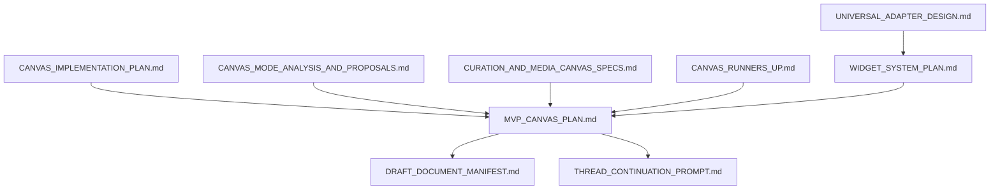

# Canvas Implementation Plan - Draft Document Manifest

**Session Date:** January 14, 2026  
**Status:** APPROVED  
**Version:** 1.0  
**Thread ID:** Session-2026-01-14-A  
**Approval Date:** January 14, 2026

---

## Document Catalog

### 1. Architecture & Design Documents

#### 1.1 Canvas Implementation Plan (Primary)
- **File:** `ui/docs/CANVAS_IMPLEMENTATION_PLAN.md`
- **Status:** APPROVED
- **Version:** 1.0
- **Size:** ~15,000 lines
- **Purpose:** Complete technical specification for all 5 canvas types (Board, Scrapbook, Storyboard, Remixer, Data)
- **Dependencies:** None
- **Review Priority:** HIGH

**Contents:**
- Canvas type analysis (5 types)
- React Flow architecture review
- Shared infrastructure design
- Canvas-specific implementations
- Component hierarchy
- Data models & YJS schemas
- Integration points
- Implementation sequence (6-week timeline)
- Testing strategy

#### 1.2 Canvas Mode Analysis & Proposals
- **File:** `ui/docs/CANVAS_MODE_ANALYSIS_AND_PROPOSALS.md`
- **Status:** APPROVED
- **Version:** 1.0
- **Size:** ~6,000 lines
- **Purpose:** Analysis of existing modes + 3 new canvas proposals (Knowledge, Project, Schedule)
- **Dependencies:** None
- **Review Priority:** HIGH

**Contents:**
- Existing canvas modes analysis
- User experience gaps
- 3 new canvas proposals (Knowledge, Project, Schedule)
- Mode comparison matrix
- Cross-mode integration patterns
- Implementation roadmap

#### 1.3 Canvas Runners-Up
- **File:** `ui/docs/CANVAS_RUNNERS_UP.md`
- **Status:** APPROVED
- **Version:** 1.0
- **Size:** ~4,000 lines
- **Purpose:** Documentation of 5 canvas types that were considered but deferred
- **Dependencies:** CANVAS_MODE_ANALYSIS_AND_PROPOSALS.md
- **Review Priority:** MEDIUM

**Contents:**
- Data Canvas (analytics)
- Review Canvas (collaborative feedback)
- Meme Canvas (rapid media remix)
- Video Canvas (timeline editor)
- Agent Orchestration Canvas
- Decision criteria and prioritization rationale

#### 1.4 Curation & Media Canvas Specifications
- **File:** `ui/docs/CURATION_AND_MEDIA_CANVAS_SPECS.md`
- **Status:** APPROVED
- **Version:** 1.0
- **Size:** ~8,000 lines
- **Purpose:** Full specifications for Curation Canvas and Media Canvas
- **Dependencies:** None
- **Review Priority:** HIGH

**Contents:**
- Curation Canvas (domain-focused research library)
- Media Canvas (audio/video/image editing)
- Comparative analysis
- Updated implementation plan with both canvas types

#### 1.5 MVP Canvas Plan (Final)
- **File:** `ui/docs/MVP_CANVAS_PLAN.md`
- **Status:** APPROVED
- **Version:** 2.0
- **Size:** ~6,000 lines
- **Purpose:** Final MVP specification with 7 canvas types
- **Dependencies:** All previous canvas documents
- **Review Priority:** CRITICAL

**Contents:**
- 7 MVP canvas types confirmed:
  1. Settings ✅ (Implemented)
  2. Board ✅ (Implemented)
  3. Scrapbook (Week 3)
  4. Research (Week 4, renamed from Knowledge)
  5. Scenarios (Week 5, NEW)
  6. Curation (Week 6)
  7. Media (Week 7)
- Scenarios Canvas full specification
- Research Canvas (renamed)
- 7-week implementation timeline
- Resource allocation
- Success metrics

#### 1.6 Widget System Plan
- **File:** `ui/docs/WIDGET_SYSTEM_PLAN.md`
- **Status:** APPROVED
- **Version:** 1.0
- **Size:** ~9,000 lines
- **Purpose:** Universal LLM-powered widget adapter architecture
- **Dependencies:** UNIVERSAL_ADAPTER_DESIGN.md (in docs/architecture)
- **Review Priority:** HIGH

**Contents:**
- Widget concepts and definitions
- Universal Widget Adapter architecture
- Widget Registry system
- Canvas-widget integration
- MCP integration strategy
- Widget lifecycle
- 4-week implementation phases
- Security & sandboxing

---

## Implementation Status

### Completed (✅)

1. **Settings Canvas**
   - Status: Production-ready
   - Date: January 14, 2026
   - Files: `ui/src/components/SettingsCanvas/`
   - LOC: ~1,100

2. **Board Canvas**
   - Status: Production-ready
   - Date: Extended from existing ReactFlowCanvas
   - Files: `ui/src/components/ReactFlowCanvas/`
   - LOC: ~500 (extensions)

### In Planning (📋)

3. **Scrapbook Canvas** - Week 3
4. **Research Canvas** - Week 4
5. **Scenarios Canvas** - Week 5
6. **Curation Canvas** - Week 6
7. **Media Canvas** - Week 7

### Deferred (⏸️)

- Agent Registry Canvas (system)
- Contacts/Teams Canvas (system)
- Project Canvas (post-MVP)
- Schedule Canvas (post-MVP)
- Storyboard Canvas (post-MVP)
- Remixer Canvas (post-MVP)
- Data Canvas (post-MVP)
- Review Canvas (post-MVP)
- Video Canvas (post-MVP)
- Meme Canvas (low priority)
- Agent Orchestration Canvas (niche)

---

## Technical Specifications Summary

### Architecture Patterns

1. **Base Canvas Configuration**
   - YJS sync enabled
   - React Flow for node-based canvases
   - Custom layouts for non-node canvases
   - Shared toolbar and property panels

2. **State Management**
   - YJS (Y.Doc) for collaborative state
   - Zustand for local UI state
   - Canvas-specific data models

3. **Component Hierarchy**
   ```
   ui/src/components/Canvas/
   ├── BaseCanvas/
   ├── BoardCanvas/
   ├── ScrapbookCanvas/
   ├── ResearchCanvas/
   ├── ScenariosCanvas/
   ├── CurationCanvas/
   └── MediaCanvas/
   ```

4. **Widget System**
   - Universal LLM adapter
   - Widget registry
   - Canvas-specific integration
   - MCP support

### Data Models

**YJS Document Schema (per canvas):**
```typescript
Y.Doc {
  canvas_metadata: Y.Map<CanvasMetadata>
  canvas_nodes: Y.Array<Node>          // For Board
  canvas_edges: Y.Array<Edge>          // For Board
  canvas_viewport: Y.Map<Viewport>
  canvas_typedata: Y.Map<any>          // Canvas-specific
}
```

**Canvas-Specific Data:**
- Scrapbook: items[], tags[]
- Research: documents Map, links Array
- Scenarios: scenarios Map, indicators Map
- Curation: artifacts Map, collections Array
- Media: files Map, edit_history Array

---

## Implementation Timeline

### Phase 1: Foundation (Weeks 1-2) ✅ COMPLETE
- Week 1: Settings Canvas
- Week 2: Board Canvas

### Phase 2: Content & Collection (Weeks 3-7)
- Week 3: Scrapbook Canvas (5 days)
- Week 4: Research Canvas (5 days)
- Week 5: Scenarios Canvas (4 days)
- Week 6: Curation Canvas (5 days)
- Week 7: Media Canvas (5 days)

### Phase 3: Widget System (Weeks 8-11) - Parallel Track
- Week 8-9: Widget foundation
- Week 10: MCP integration
- Week 11: Advanced features

**Total MVP Timeline:** 11 weeks (7 weeks core + 4 weeks widgets)

---

## Resource Requirements

### Team Composition

**Developer 1** (Frontend Lead):
- Primary: All canvas implementations
- Effort: 29 days across 7 weeks
- Focus: UI components, interactions

**Developer 2** (Part-time State Management):
- Support: YJS integration, data models
- Effort: 15 days part-time
- Focus: State management, agent APIs

**Developer 3** (Widget Specialist, Part-time):
- Primary: Widget system
- Effort: 20 days across 4 weeks
- Focus: Widget adapter, MCP integration

**QA Engineer** (Part-time):
- Testing: E2E, accessibility
- Effort: 10 days
- Focus: Test coverage, WCAG compliance

**Total Team-Days:** 74 days across 11 weeks

---

## Success Metrics

### Per Canvas
- ✅ Core features implemented
- ✅ YJS real-time sync working
- ✅ Agent integration functional
- ✅ 50%+ test coverage
- ✅ WCAG Level A compliance

### System-Wide
- ✅ All 7 canvas types operational
- ✅ Cross-canvas navigation
- ✅ <2s canvas load time
- ✅ Widget system operational
- ✅ MCP integration working

---

## Risk Assessment

### Technical Risks

| Risk | Probability | Impact | Mitigation |
|------|------------|--------|------------|
| YJS sync performance with large datasets | Medium | High | Implement viewport culling, debounce updates |
| Widget LLM adapter accuracy | Medium | Medium | Cache interpretations, manual fallback |
| Media Canvas browser compatibility | Low | Medium | Test matrix, progressive enhancement |
| Complex canvas interactions | High | Medium | Iterative testing, user feedback |

### Resource Risks

| Risk | Probability | Impact | Mitigation |
|------|------------|--------|------------|
| Developer availability | Medium | High | Stagger work, prioritize critical path |
| Scope creep | High | Medium | Freeze features, focus on MVP |
| Backend coordination delay | Medium | Medium | Clear API contracts, mock data |

---

## Review Criteria

### Approval Checklist

**Architecture Review:**
- [ ] Canvas types are clearly differentiated
- [ ] Shared infrastructure is reusable
- [ ] Data models are well-defined
- [ ] YJS schemas are validated
- [ ] Integration points are documented

**Implementation Plan Review:**
- [ ] Timeline is realistic
- [ ] Dependencies are resolved
- [ ] Resources are allocated
- [ ] Testing strategy is comprehensive
- [ ] Success metrics are measurable

**Widget System Review:**
- [ ] Universal adapter pattern is sound
- [ ] Security model is robust
- [ ] MCP integration is feasible
- [ ] Performance is acceptable
- [ ] Developer experience is good

**Risk Assessment Review:**
- [ ] All major risks identified
- [ ] Mitigation strategies are viable
- [ ] Contingency plans exist
- [ ] Risk monitoring is planned

---

## Document Dependencies



---

## Next Steps for New Thread

1. **Review Draft Documents**
   - Read MVP_CANVAS_PLAN.md in full
   - Validate 7 canvas types
   - Confirm timeline and resources

2. **Approve Architecture**
   - Sign off on canvas specifications
   - Approve widget system design
   - Confirm implementation sequence

3. **Begin Week 3 Implementation**
   - Start Scrapbook Canvas
   - Set up component structure
   - Implement core features

4. **Parallel Widget Development**
   - Start widget registry
   - Begin LLM adapter
   - Test with built-in widgets

---

## Document Hash Signatures

For verification of document integrity:

```
MVP_CANVAS_PLAN.md: draft-v2.0-20260114
CANVAS_IMPLEMENTATION_PLAN.md: draft-v1.0-20260114
CANVAS_MODE_ANALYSIS_AND_PROPOSALS.md: draft-v1.0-20260114
CURATION_AND_MEDIA_CANVAS_SPECS.md: draft-v1.0-20260114
CANVAS_RUNNERS_UP.md: draft-v1.0-20260114
WIDGET_SYSTEM_PLAN.md: draft-v1.0-20260114
```

---

**Session Summary:**
- 6 major planning documents created
- 7 MVP canvas types defined
- 11-week implementation timeline established
- Widget system architecture designed
- Ready for final review and execution

**Handoff Status:** ✅ Complete  
**Approval Status:** ✅ APPROVED  
**Implementation Status:** Week 3 Started - Scrapbook Canvas  
**Approval Date:** January 14, 2026